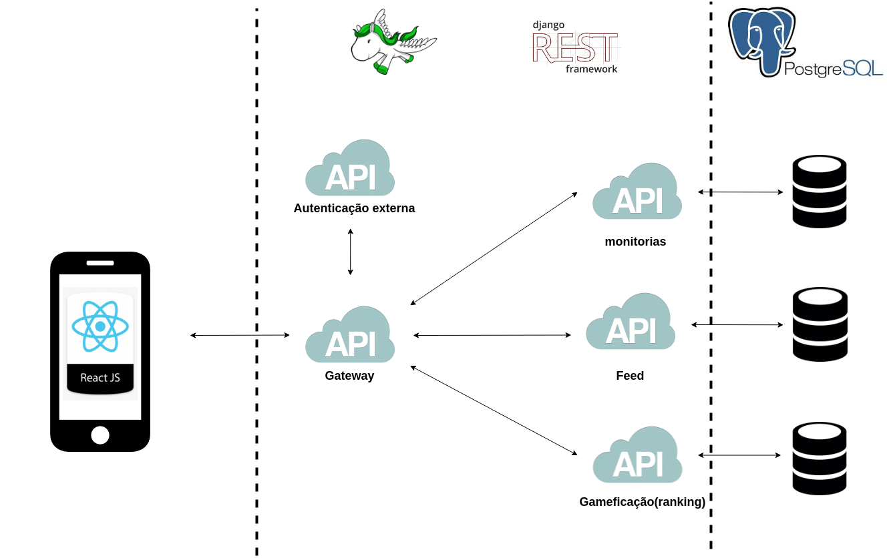
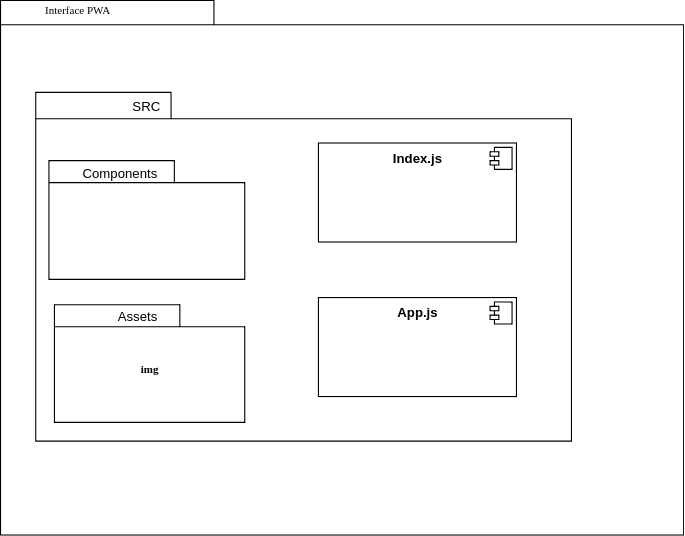
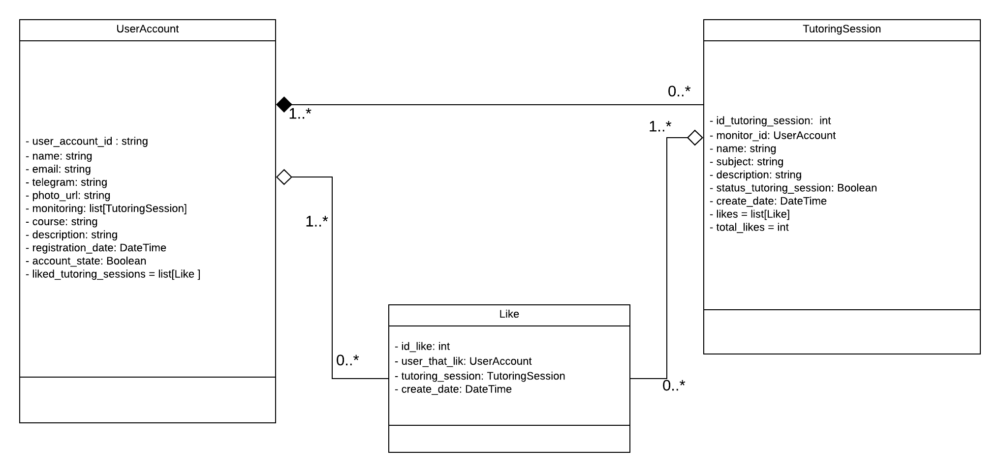
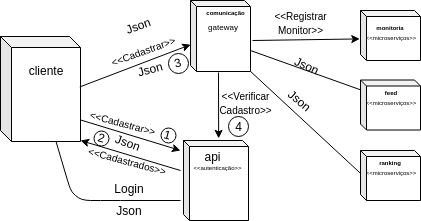
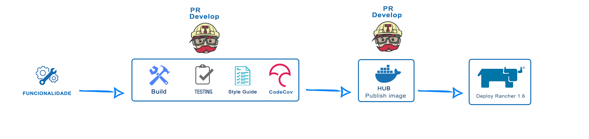

 

## 1. Introdução

 

### Objetivo

 

Este documento visa esclarecer as principais características  arquiteturais do +Monitoria, com o objetivo de elucidar como será modelada toda a arquitetura do sistema, garantindo uma facilidade de visualização da estrutura e dos requisitos para os desenvolvedores.

 

### Escopo

 

O +Monitoria é um produto de software que contará com uma interface Web Progressiva (PWA) e uma estrutura de microsserviços responsável pela implementação das regras de negócios, com objetivo de facilitar as monitorias na FGA.

Neste documento são apresentadas as descrições do modelo arquitetural, sua composição e requisitos de integração.

  

Além disso este documento tem como objetivo orientar toda equipe de MDS e EPS no desenvolvimento do produto, oferecendo diretrizes quanto às tecnologias a serem utilizadas neste projeto, além de seu padrão de utilização.

 

### Visão Geral

 

Neste documento estão descritos os seguintes pontos, respectivamente: Representação Arquitetural, Backlog, Metas e Restrições de Arquitetura, Visão Lógica, Visão de Implantação, Visão da Implementação, Tamanho e Desempenho, Qualidade e Pipeline.

 

## 2. Representação Arquitetural

 

A arquitetura do +Monitoria, pode ser considerada uma arquitetura híbrida pois utiliza princípios de três padrões arquiteturais,sendo eles: Cliente-Servidor, MVC e Microsserviços. Também será utilizada uma api para autenticação externa visando abstrair a complexidade da implementação de um sistema de autenticação, a api definida para tal finalidade foi a firebase autentication.

 

### Cliente Servidor

 

O principal relacionamento do projeto é implementado como um cliente-servidor. O cliente é representado pela Interface PWA, que irá realizar requisições na API Gateway, que é o servidor central do projeto.

 

### API Gateway

 

A API Gateway é a API central do projeto, uma fachada entre o frontend e os microsserviços. É responsável por validar as requisições vindas da Interface PWA redirecionando aos microsserviços apenas requisições autenticadas.

 

### Interface PWA

 

A interface de usuário do sistema, deverá se adequar ao PWA e será construida utilizando o ReactJS.

 

### Microsserviços

 

Microsserviços são responsáveis por desenvolver sistemas mais flexíveis e com manutenção simples. A utilização de bancos dedicados para cada microsserviço é uma boa prática, que pode ser adotada neste padrão arquitetural, tornando o sistema escalonável e independente, ademais também é uma boa prática possuir a api gateway para fornecer ponto de acesso aos microsserviços.

 

### Model-View-Controller

 

Padrão de arquitetura de software para implementar interfaces com o usuário. Ele divide um determinado aplicativo de software em três camadas interconectadas: o modelo (Model), a visão (View) e o controlador (Controller).

- **Model -** Responsável por tratar as regras de negócio. Obter os dados e os traduzir em informações para serem exibidas pela View.

- **View -**
É camada de interface com usuário e responsável pela interação com a Model.

- **Controller -** Responsável por gerenciar as camadas Model e View.

Na arquitetura MVC do +Monitoria as camadas Model e Controller estão representadas dentro dos microserviços e a camada View é representada pela interface PWA.

 

### Django Rest Framework

 

O DRF é um extensão do Django Framework e é utilizado para a construção de APIs em plataforma Web. Com esse, é possível criar um backend independente, através de serviços, podendo ser acessado por uma aplicação mobile ou web através de requisições do tipo REST. Uma arquitetura REST opera através de métodos de protocolo HTTP; como GET, POST, PUT, DELETE, entre outros.

A arquitetura do Django é baseada na arquitetura MVC, no entanto é descrita como MVT (Model-View-Template), o DRF provoca uma adaptação nessa arquitetura (utiliza apenas Model-View) visando disponibilizar uma API REST. Uma boa prática utilizada no DRF é representar cada funcionalidade através de um app interno, para melhor modularização do sistema.

A model do DRF é a camada responsável por gerir, modelar e persistir os dados. Tem como principais funções controlar o estado dos dados, responder a instruções para mudança de estado dos dados e cuidar das regras de negócio da aplicação.

A view do DRF é a camada encarregada por interpretar entradas vindas de outros sistemas (através de endpoints), distribuindo comandos que geram atualização, busca de dados ou requisições em outras partes do próprio sistema ou de outro sistema que esteja sendo consumido, podendo fazer uso das classes definidas na camada de modelo (model).

 

### Postgres

 

O PostgreSQL é um banco de dados objeto relacional, ele será responsável por armazenar os dados do projeto.

 

### ReactJS

 

O React é, como seus próprios criadores descrevem, “uma biblioteca JavaScript declarativa, eficiente e flexível para a criação de interfaces de usuário (UI)”. Ele permite criar seus próprios componentes. Numa aplicação em React, você deve quebrar os diferentes elementos dela em pequenos componentes reutilizáveis para transformar em uma componente maior. Essa técnica é chamada de Component Driven Development.

 

### FireBase

 

Firebase é um produto da Google, um conjunto de tecnologias disponíveis em diversas linguagens: Java, Swift, Objective-C, Python, JavaScript (incluindo Node.js), Go, Unity e C++. Será utilizado uma das ferramentas desse produto, o Firebase Authentication. Essa ferramenta fornece serviços de back-end, SDKs fáceis de usar e bibliotecas de IU prontas para autenticar usuários. A autenticação se dará por meio de email/senha e via Facebook.

 

### Diagrama de Relações

 

 

- **Autenticação Externa** - Deve abstrair a complexidade da construção de um serviço de autenticação utilizando uma API externa para tal fim.

- **API Gateway** - Fornece um ponto de acesso único à sua aos microsserviços.

- **Microsserviço de Feed** - Responsável por manter feed's de novidades e atualizações gerados de acordo com o perfil dos usuários.

- **Microsserviço de Monitorias** - Responsável por gerenciar tudo que diz respeito a perfil do usuário, consequentemente sendo responsável por cuidar de toda lógica que envolve as monitorias.

- **Microsserviço de Gamificação** - Responsável gerenciar toda a parte gamificada do produto, incluindo processamento de um ranking, cálculo de pontuações e distribuição de recompensas.

- **Banco de Dados Monitorias** - Responsável por armazenar os dados do Microsserviço de Monitorias.

- **Banco de Dados Feed** - Responsável por armazenamento os dados do microsserviço de Feed.

- **Bancos de Dados Gamificação** - Responsável por armazenamento os dados do microsserviço de Gamificação.

- **Interface PWA** - Responsável por disponibilizar a interface do usuário.

 

## 3. Backlog

 

O backlog representa a acumulação de trabalho, é uma espécie de estoque relativo ao produto que ainda não foi desenvolvido, sendo assim entende-se como uma listagem de pedidos em espera.

Especificamente neste documento, mesmo que de forma superficial e pouco eficiente, o Backlog supre a ausência de uma especificação dos casos de uso ou da descrição dos cenários de utilização.

Os épicos levantados para o projeto são:

- **EPIC01 - Sistema de Monitorias:**  

O projeto deve conter um microsserviço gerenciador de monitorias e suas dependências, capaz de registrar, filtrar, editar, curtir e pesquisar monitorias. Além disso, a comunicação entre aluno e monitor deve ser intermediada pelo mesmo.

    
- **EPIC02 - Contas de Usuário:**  

O projeto deve conter um microsserviço gerenciador de usuários, possibilitando a visualização e edição de seus dados cadastrados.

- **EPIC03 - Feedbacks:** 

O projeto deve conter uma funcionalidade para gerar de feedbacks. O usuário será informado sobre o término de suas ações, páginas inexistentes na aplicação, e também poderá visualizar um loading spinner toda vez que uma ação estiver em execução.

Para mais informações visite o [Backlog](doc-backlog-2.0.md) completo.

 

## 4. Metas e Restrições de Arquitetura

 

Uma das principais metas é se encaixar como um Progressive Web APP, através dos seguintes pré-requisitos:

- Poder ser utilizado independentemente do browser ou do dispositivo.

- Funcionar também sem conexão com a internet (apesar que de forma limitada).

- Enviar notificações por push.

- Permitir que o usuário adicione um ícone na tela inicial do seu smartphone.

- Ser atualizado de forma automática.

- Oferecer uma experiência semelhante a de um aplicativo nativo.

O Ambiente de desenvolvimento deverá ser o terminal de uma distribuição Linux com auxílio de um ambiente de virtualização Docker e um editor de texto, neste ambiente deve ser utilizada a linguagem de programação Python junto ao framework Django Rest além do framework javascript ReactJS que nos permitirá gerar uma interface agradável ao usuário.

O padrão de arquitetura de microsserviços deverá ser utilizado para proporcionar uma composição, manutenibilidade e reutilização de código que é essencial, levando em consideração que a equipe é grande e tem conhecimentos diversos, conclui-se que seguir tal padrão é fundamental para o sucesso do projeto.

 

## 5. Visão Lógica

 

Visualização arquitetural (visão lógica) fornece uma base para compreensão da estrutura e a organização do design do sistema. Descrevendo os requisitos comportamentais e a decomposição do sistema em um conjunto de abstrações.

 

### Interface PWA

 

Diagrama de pacotes.

 

### Microsserviço de Monitorias

 

Diagrama de classes.

 

## 6. Visão de Implantação

 

Diagrama de implementação.

 

O diagrama de implantação é responsável por estabelecer a relação entre os recursos de infraestrutura e artefatos do sistema, em outras palavras, ele mapeia as necessidades do software a ser implantado.O diagrama de implantação mostra um diagrama de estados para tratar da autenticação, com os seguintes passos:

- **Passo 1:** O usuário poderá cadastrar-se por meio de uma api de autenticação.
- **Passo 2:** Retorna os usuários Cadastrados para login.
- **Passo 3:** Envia os dados do cadastro para api de comunicação.
- **Passo 4:** Verifica os dados recebidos do usuário com os dados que estão salvos na api de autenticação.
- **Passo 5:** Registra em monitoria os dados do monitor.

 

## 7. Visão de Implementação

 

### Microsserviços

 

No projeto, centro de cada serviço possui seus APPs. Cada app é composto pelos seguintes arquivos:

- **models.py** - implementa a camada model e as validações personalizadas dos dados que serão guardados no banco de dados.

- **views.py** - implementa a camada view, que é responsável pela interação com a model e por processar todos os dados advindos da API do GitHub.

- **urls.py** - endpoints que permitem acesso às views.

- **serializers.py** - responsável por serializar dados, convertê-los de objeto para JSON e também por validá-los de acordo com os dados da modelo.

- **tests.py** - arquivo onde serão escritos todos os testes realizados dentro do APP.

 

### Interface PWA

 

No projeto, a interface PWA será construída utilizando ReactJS, que tem sua estrutura composta por os seguintes arquivos:

- **App.js** - Possui o componente raiz do aplicativo.

- **index.js** - Ponto de entrada tradicional dos nós da aplicação, indica o que será renderizado e onde ocorrerá a renderização.

- **Assets** - Guarda os arquivos estáticos.

- **Components** - Guarda as componentes.

 

## 8. Tamanho e desempenho

 

O produto deve ser simples e eficiente. Por ter uma interface PWA utilizará scripts de execução em segundo plano, arquivos JavaScript, que armazenam em cache os ativos e permitem desempenho mais alto. As principais vantagens de se utilizar PWA são retenção e economia. O produto deve fazer uso criterioso do armazenamento em cache para que mesmo com uma conexão ruim, ou inconstante, o usuário consiga utilizar o app.

Apesar de precisar de requisições externas para a comunicação, essa aplicação não tende a sofrer muitas quedas de desempenho, inclusive pode ser usado em sistemas com menor poder de processamento e memória.

Os microsserviços independentes, se construídos corretamente, não afetam uns aos outros. Isso significa que, se um elemento falhar, o restante da aplicação permanece em funcionamento, diferentemente do modelo monolítico.

 

## 9. Qualidade

 

A arquitetura organiza a aplicação em microsserviços, isso faz com que a compreensão e manutenção do sistema seja facilitada para os desenvolvedores. Serão utilizados frameworks adequados para o que é requisitado no projeto, sendo Django REST para os microsserviços de Regra de Negócio e ReactJS para a interface PWA, ambos são altamente utilizados pela comunidade de desenvolvedores.

O banco de dados Postgres é um software multi-plataforma altamente escalável. O software garantirá a segurança dos dados informados pelo usuário, além de disponibilizar ferramentas simples, funcionais e intuitivas.

 

## 10. Pipeline

 

O pipeline define as fases do processo de construção e implementação do software. A integração contínua executa as tarefas do pipeline automaticamente. Utilizamos no nosso projeto os ambientes de homologação e de produção. Em ambos os ambientes, a aplicação é construída (build), testada (testing) através de testes automatizados, verificada se está de acordo com a folha de estilo (style guide) e verificada se a cobertura de testes está de acordo com um limite pré-determinado. Ao final desse processo, a aplicação está pronta para o deploy.

#### Pipeline Release 1

 

 

Passos utilizados:

- **Build** - Constrói a aplicação, garantindo sua execução.

- **Testing** - Realiza a execução de testes automatizados.
  
- **Style Guide** - Verifica se o código está de acordo com a folha de estilo.

- **CodeCov** - Verifica se a cobertura de testes do código atingiu nível pŕe-definido.

<!-- reescrevr docker hub -->

- **Docker Hub** - Após passar por todas etapas da integração contínua irá publicar a imagen no Docker Hub.

<!-- reescrever ranch( não precisa ser um topico) -->

 

## 11. Referências Bibliográficas

 

>Documentação oficial do Django. Disponível em:
https://docs.djangoproject.com/pt-br/1.11/

>Página "Padrões Arquiteturais MVC x Arquitetura Django da wiki de fga-gpp-mds. Disponível em: https://github.com/fga-gpp-mds/00-Disciplina/wiki/Padr%C3%B5es-Arquiteturais

> Conceito de PWA. Disponível em:
https://www.opus-software.com.br/o-que-e-pwa/
> API Gateway em arquitetura de microsserviços. Disponível em:
https://imasters.com.br/apis-microsservicos/api-gateway-em-arquitetura-de-microservices-com-node-js

> External authentication services. Disponível em:
https://docs.microsoft.com/pt-br/aspnet/web-api/overview/security/external-authentication-services

> QueroCultura documento de arquitetura. Disponível em:
https://github.com/fga-eps-mds/2017.2.i/Documento-de-Arquitetura

> CabecaVoleiJoelhoPe documento de Arquitetura. Disponível em:
https://github.com/2018-2-Desenho/CabecaVoleiJoelhoPe/wiki/Documento-de-Arquitetura

> Documentação Django. Disponível em:
https://djangobook.com/mdj2-django-structure/

> Documentação ReactJS. Disponível em:
https://reactjs.org/

> Django REST Framework - HTML & Forms. Disponível em :
https://www.django-rest-framework.org/topics/html-and-forms/

> MVC, MTV e Django. Disponível em :
http://pyman.blogspot.com/2007/04/o-mvc-o-mtv-e-o-django.html

> Criando uma API REST utilizando Django REST Framework. Disponível em :
https://medium.com/@marcosrabaioli/criando-uma-api-rest-utilizando-django-rest-framework-parte-1-55ac3e394fa

> Diagramas Estruturais da UML: Diagrama de Implantação. Disponível em :
http://micreiros.com/diagrama-de-implantacao/

> MVC. Disponível em:
https://tableless.com.br/mvc-afinal-e-o-que/

> Padrão MVC | Arquitetura Model-View-Controller. Disponível em:
https://www.portalgsti.com.br/2017/08/padrao-mvc-arquitetura-model-view-controller.html
___

 

## Histórico de Revisão

 

| Data | Versão | Descrição | Autor(es) |
|:--:|:--:|:--:|:--:|
| 02/04/2019 | 0.1 |  Abertura do Documento|João Pedro, Lucas Alexandre, Moacir Mascarenha |
| 03/04/2019 | 0.2 |  Adição dos tópicos: Representação da Arquitetura, Metas e Restrições de Arquitetura, Visões Arquiteturais e Referências Bibliográficas| João Pedro, Lucas Alexandre, Mateus Estanislau, Moacir Mascarenha, Renan Cristyan |
| 04/04/2019 | 0.3 | Adição dos tópicos: Tamanho e Desempenho; Qualidade;  Atualizado: Representação da arquitetura | João Pedro, Lucas Alexandre |
| 04/04/2019 | 0.4 | Adição o tópico: Visão de implementação; Atualizado: PWA | Matheus Estanislau |
| 07/04/2019 | 0.5 | Revisão de vários tópicos e adição de outros | João Pedro, Lucas Alexandre, Lucas Macêdo, Matheus Estanislau, Matheus Rodrigues, Moacir Mascarenha, Renan Cristyan |
| 21/04/2019 | 0.6 | Adição do pipeline | Matheus Rodrigues |
| 26/04/2019 | 0.7 | Refatorado Representação arquitetural | João Pedro |
| 26/04/2019 | 0.8 | Refatorado os tópicos 2 e 3 | João Pedro, Lucas Alexandre, Renan Cristyan |
| 26/04/2019 | 0.9 | Atualizado tópico 5, refatorado diagrama de transição | João Pedro, Lucas Alexandre, Renan Cristyan |
| 27/04/2019 | 1.0 | Atualizado tópico 2 e 5 | João Pedro, Lucas Alexandre, Mateus Estanislau |
| 29/04/2019 | 1.1 | Revisão, criação e atualização de vários tópicos | Lucas Macêdo |
| 29/04/2019 | 1.2 | Documento Refatorado | João Pedro, Lucas Alexandre, Mateus Estanislau, Renan Cristyan e Lucas Alexandre|
| 01/05/2019 | 1.3 | Refatorado Pipeline |Mateus Estanislau, Moacir Mascarenha, Renan Cristyan|
| 02/05/2019 | 1.4 | Ajustado Pipeline |Matheus Rodrigues|
|28/05/2019| 1.5|Atualizado diagrama de classes|Moacir Mascarenha|
|28/05/2019|1.6|Atualizado diagrama de classes|Moacir Mascarenha|
|14/06/2019|1.7|Atualizado Backlog|João Pedro, Lucas Alexandre, Moacir Mascarenha|

