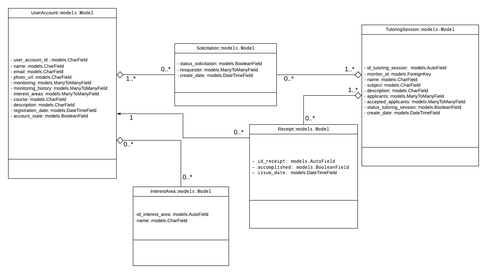
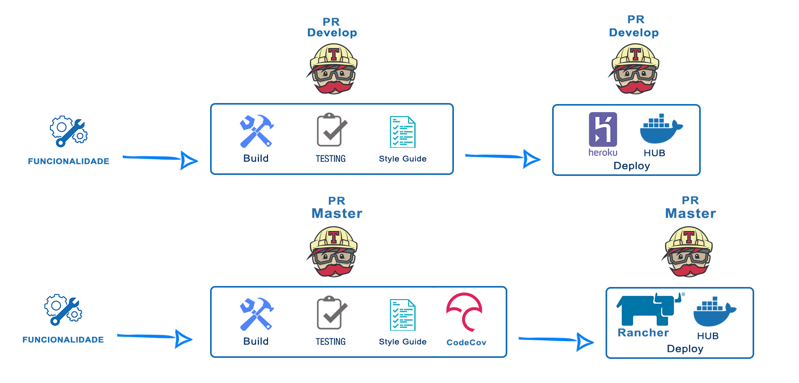

 

## 1. Introdução

 

### 1.1. Objetivo

 

    Este documento visa esclarecer as principais características  arquiteturais do +Monitoria, com o objetivo de elucidar como será modelada toda a arquitetura do sistema. garantindo uma facilidade de visualização da estrutura e dos requisitos para os desenvolvedores. 

### 1.2. Escopo

 

    O +Monitoria é um produto de software que contará com uma interface Web Progressiva (PWA) e uma estrutura de microsserviços responsável pela implementação das regras de negócios, com objetivo de facilitar as monitorias na FGA.

    Neste documento são apresentadas as descrições do modelo arquitetural, sua composição e requisitos de integração.

    

 
    Além disso este documento tem como objetivo orientar toda equipe de MDS e EPS no desenvolvimento do produto, oferecendo diretrizes quanto às tecnologias a serem utilizadas neste projeto, além de seu padrão de utilização.

### 1.3. Visão Geral

 

Neste documento estão contidos os seguintes pontos, respectivamente: representação da arquitetura, metas e restrições de arquitetura, visão dos casos de uso, visão lógica, visão da implementação, tamanho e desempenho.

## 2. Representação Arquitetural

 

A arquitetura padrão do +Monitoria será hibrida por conta da mescla de arquiteturas usadas. Será utilizada a arquitetura cliente-servidor para visão geral, sendo cliente a interface do produto e servidor todos os outros serviços necessarios. Também será utilizada a arquitetura de microsserviços para uma melhor ecalabilidade do software. Os bancos serão separados por opção de uma boa pratica na aquitetura de microserviços, ademais será utilizado a arquitetura Model View Controler (MVC) por se adequar ao projeto, sendo Model os microserviços, View a interface e Controler a Api Gateway. A Api Gateway é uma api usada como um ponto de acesso único para os microsserviços. Usamos de uma api externa Firebase para abstração da complexidade da autenticação.
 

### 2.1 Arquitetura Cliente / Servidor

 

O modelo cliente-servidor, é uma arquitetura que distribui as tarefas entre os fornecedores de um recurso ou serviço, designados como servidores, e os requerentes dos serviços, designados como clientes.

Um servidor é o host que executa diversos serviços ou aplicações que utilizam seus recursos com os clientes. O cliente não compartilha qualquer de seus recursos, mas solicita dados ou funçoẽs do servidor. Os clientes iniciam sessões e se comunicam com os servidores que aguardam requisições de entrada. Na arquitetura Cliente / Servidor do mais monitoria o cliente está representado através da interface feita em REACTJS e o servidor é representado através dos microsserviços feitos em Django REST Framework.

### 2.2 Representação Interna dos Microsserviços

 

### Microsserviços de Regra de Negócio

### Django REST Framework

Os microsserviços voltados às regras de negócio do produto serão feitos com Django Rest Framework. O Django Rest Framework é uma biblioteca para o Framework Django que disponibiliza funcionalidades para implementar APIs Rest de forma extremamente rápida. As APIs são desenvolvidas seguindo o padrão Model - View, que é descrito logo abaixo:

**Model:**

Nessa camada é implementada o banco de dados ou o modelo objeto-relacional. Tem como principais objetivos controlar o estado dos dados, responder a instruções para mudança de estado dos dados e controlar as transações com o banco de dados da aplicação.

**View:**

 Encarrega-se de interpretar entradas vindas de outros sistemas, distribuindo comandos como autorização, busca de dados ou requisições em outros sistemas, fazendo uso das classes definidas no modelo (Model). Será responsável por gerenciar requisições http, protocolo este de comunicação de rede.

### Postgres

O PostgreSQL é um banco de dados objeto relacional, ele será responsável por armazenar os dados do projeto.

### Interface PWA

### ReactJS

O React é, como seus próprios criadores descrevem, “uma biblioteca JavaScript declarativa, eficiente e flexível para a criação de interfaces de usuário (UI)”. Ele permite criar seus próprios componentes. Numa aplicação em React, você deve quebrar os diferentes elementos dela em pequenos componentes reutilizáveis para transformar em uma componente maior. Essa técnica é chamada de Component Driven Development.

### Microsserviços de Autenticação

### FireBase

Firebase é um produto da Google, um conjunto de tecnologias disponíveis em diversas linguagens: Java, Swift, Objective-C, Python, JavaScript (incluindo Node.js), Go, Unity e C++. Será utilizado uma das ferramentas desse produto, o Firebase Authentication. Essa ferramenta fornece serviços de back-end, SDKs fáceis de usar e bibliotecas de IU prontas para autenticar usuários no +Monitoria. A autenticação se dará por meio de senhas, email e Facebook.
 

### 2.3 Diagrama de Relações

 

- **API de Autenticação Externa** - Deve abstrair a complexidade da construção de um serviço de autenticação utilizando uma API externa para tal fim. (Ex: Telegram, Facebook, Google)

- **API Gateway** - Fornece um ponto de acesso único à sua arquitetura de microsserviços.

- **Microsserviço Feed** - Responsável por manter feed's de novidades e atualizações gerados de acordo com os perfis dos usuários.

- **Microsserviço Monitorias** - Responsável por gerenciar tudo que diz respeito a perfil do usuário, consequentemente sendo responsável por cuidar de toda lógica que envolve as monitorias.

- **Microsserviço Gamificação** - Responsável gerenciar toda a parte de gamificada do produto, incluindo processamento de um ranking, cálculo de pontuações e distribuição de recompensas.

- **Banco de dados Monitorias** - Responsável por armazenar os dados do microsserviço monitorias.

- **Banco de dados Feed** - Responsável por armazenamento os dados do microsserviço Feed.

- **Bancos de dados Gamificação** - Responsável por armazenamento os dados do microsserviço Ranking.

- **Interface PWA** - Constrói a interface para o usuário e realiza requisições através da API Gateway.

## 3. Backlog

 

- **EPIC01 - Interface PWA:** O produto deve oferecer uma interface web progressiva com usabilidade agradável, visual atraente e um bom desempenho.

- **EPIC02 - Microsserviço Gerenciador de Monitorias:** O produto deve conter um microsserviço que gerencie tudo que diz respeito a perfil do usuário, consequentemente sendo responsável por cuidar de toda lógica que envolve as monitorias.

- **EPIC03 - Microsserviço Gateway:** O produto deve conter um microsserviço responsável por intermediar a comunicação entre todos os outros microsserviços, além de cuidar da interação com uma API externa de autenticação.

- **EPIC04 - Microsserviço de Gamificação:** O produto deve conter um microsserviço responsável gerenciar toda a parte de gamificada do produto, incluindo processamento de um ranking, cálculo de pontuações e distribuição de recompensas.

- **EPIC05 - Microsserviço Gerador de Feed:** O produto deve conter um microsserviço responsável por manter feed's de novidades e atualizações gerados de acordo com os perfis dos usuários.

Para mais informações visite o [Backlog](doc-backlog.md).

## 4. Metas e Restrições de Arquitetura

 

Uma das principais metas e restrições é se encaixar como um Progressive Web APP, através dos seguintes requisitos:

- Poder ser utilizado independentemente do browser ou do dispositivo. O sistema será funcional em navegadores de internet, entretanto atualmente está mais otimizado para o Google Chrome.
- Funcionar também sem conexão com a internet (apesar que de forma limitada).
- Enviar push notifications.
- Permitir que o usuário adicione um ícone na tela do smartphone.
- Ser atualizado de forma automática.
- Oferecer uma experiência semelhante a de um aplicativo nativo.

O Ambiente de desenvolvimento será o terminal de uma distribuição Linux com auxílio do ambiente de virtualização Docker e um editor de texto, neste ambiente faremos uso da linguagem de programação Python junto ao framework Django Rest além do framework javascript ReactJS que nos permitirá gerar uma interface agradável ao usuário.

O padrão de microsserviços proporciona uma composição, manutenibilidade e reutilização de código que é essencial, levando em consideração que a equipe é grande e tem conhecimentos diversos, conclui-se que seguir um padrão é fundamental para o sucesso do projeto.

## 5. Visões Arquiteturais

 

### 5.1. Visão Lógica

 

Podemos dividir a visão lógica dos nossos microsserviços em Microsserviços de Regra de Negócio que são responsáveis por implementar as funcionalidades e API Gateway, responsável por mediar a comunicação entre os serviços. Além disso, a Interface PWA é responsável por prover uma interface para o usuário fazer uso das funcionalidades.

### Microsserviços de Regra de Negócio

É possível distribuir a visão lógica do Django Rest em 2 campos: model e view.

- Model - A model é a representação dos objetos, permitindo obter informações do banco de dados sem conhecer a complexidade de tal. Essa camada contém tudo sobre os dados: como acessar, validar, comportamentos e relações entre dados.

- View - Responsável por alimentar o banco de dados por intermédio da Model e receber dados da API externa. Encarrega-se de interpretar entradas vindas de outros sistemas, distribuindo comandos como autorização, busca de dados ou requisições em outros sistemas, fazendo uso das classes definidas no modelo (Model). Será responsável por gerenciar requisições http, protocolo este de comunicação de rede.

### Interface PWA

Responsável pelo desenvolvimento de interface o usuário e foca na utilização de componentes para que que seja possível aumentar o máximo do reuso na sua aplicação.

### 5.2. Diagrama de implantação

 

O diagrama de implantação é o diagrama estrutural responsável por estabelecer a relação entre os recursos de infraestrutura e artefatos do sistema, em outras palavras, ele mapeia as necessidades do software a ser implantado

### 5.3. Visão de Implementação

 

Do ponto de vista da implementação, os Microsserviços de Regra de Negócio e a API Gateway serão APIs feitas com Django Rest. Através das Views e dos Serializers o Django REST implenta os metodos HTTP pra construir as APIs.
Já o Microsserviço da Interface PWA será uma aplicação web progressiva feita com ReactJS.

#### 5.3.1 Diagrama de Classe

 

### Microsserviços de Regra de Negócio

Para realizar a implementação do microsserviço desenvolveremos app Django Rest, teremos uma estrutura Model - View juntamente com uma "Serializers" e uma "Urls".

Descrição da distribuição do Django Rest Framework:

- Arquivo Views.py - Arquivo responsável por controlar o fluxo de informações.
- Arquivo Serializers.py - Arquivo responsável por serializar as instâncias em representações do tipo Json.
- Arquivo Urls.py - Arquivo responsável por conectar e configurar os URLs da API.
- Arquivo Models.py - Arquivo responsável por gerenciar e executar a comunicação com o banco de dados além de definir entidades e validações.

### Interface PWA

Para realizar a implementação da interface desenvolveremos app ReactJS, teremos uma estrutura App.js juntamente com uma index.js e a pasta src, aonde estará todas as components.

Descrição da distribuição no ambiente React:

- Arquivo App.js - Ponto inicial da aplicação, também é capaz de referenciar componentes do projeto.
- index.js - Fazer com que retorne um elemento JSX da app.
- src - As pastas components e assets.
- assets - Todos os arquivos png.
- Components - Todas as components das telas e a pasta de teste.

## 6. Tamanho e desempenho

 

O produto deve ser simples e eficiente. Por ter uma interface PWA utilizará scripts de execução em segundo plano, arquivos JavaScript, que armazenam em cache os ativos e permitem desempenho mais alto. As principais vantagens de se utilizar PWA são retenção e economia. O produto deve fazer uso criterioso do armazenamento em cache para que mesmo com uma conexão ruim, ou inconstante, o usuário consiga usar o app.

Apesar de precisar de requisições externas para a comunicação, essa aplicação não tende a sofrer muitas quedas de desempenho, inclusive pode ser usado em sistemas com menor poder de processamento e memória.

Os microsserviços independentes, se construídos corretamente, não afetam uns aos outros. Isso significa que, se um elemento falhar, o restante da aplicação permanece em funcionamento, diferentemente do modelo monolítico.

## 7. Qualidade

 

A arquitetura organiza a aplicação em microsserviços, isso faz com que a compreensão e manutenção do sistema seja facilitada para os desenvolvedores. Serão utilizados frameworks adequados para o que é requisitado no projeto, sendo Django REST para os microsserviços de Regra de Negócio e ReactJS para a interface PWA, ambos são altamente utilizados pela comunidade de desenvolvedores.

O banco de dados Postgres é um software multi-plataforma altamente escalável. O software garantirá a segurança dos dados informados pelo usuário, além de disponibilizar ferramentas simples, funcionais e intuitivas.

## 8. Pipeline

 

O objetivo do pipeline é automatizar o processo de entrega de software em produção de forma rápida, ao mesmo tempo garantindo sua estabilidade, qualidade e resiliência.

 

    Em nosso projeto foram utilizados dois sistemas de pipeline o primeiro dedicado a Develop e o sugundo dedicado para a master.
    A sequencia de passos utilizados na integração da Develop é o build, que garante a compilação das funcionalidades, depois é realizad

    Os passos que serão utilizados na integração da Develop são: 1º Build: que garante a compilação das funcionalidades. 2º Testing: assegura que o software está contemplando todas as funcionalidades esperadas e que estas estão funcionando corretamente. 3º StyleGuide: Verifica se as linhas de código estão seguindo os padrões de programação. 4º: Code-Cov: Realiza a medição da cobertura de linhas de codigo testados e garante que existe uma quantidade suficiente de linhas testadas.

## 9. Referências Bibliográficas

 

>Documentação oficial do Django. Disponível em:
https://docs.djangoproject.com/pt-br/1.11/

>Página "Padrões Arquiteturais MVC x Arquitetura Django da wiki de fga-gpp-mds. Disponível em: https://github.com/fga-gpp-mds/00-Disciplina/wiki/Padr%C3%B5es-Arquiteturais

> Conceito de PWA. Disponível em:
https://www.opus-software.com.br/o-que-e-pwa/
> API Gateway em arquitetura de microsserviços. Disponível em:
https://imasters.com.br/apis-microsservicos/api-gateway-em-arquitetura-de-microservices-com-node-js

> External authentication services. Disponível em:
https://docs.microsoft.com/pt-br/aspnet/web-api/overview/security/external-authentication-services

> QueroCultura documento de arquitetura. Disponível em:
https://github.com/fga-eps-mds/2017.2.i/Documento-de-Arquitetura

> CabecaVoleiJoelhoPe documento de Arquitetura. Disponível em:
https://github.com/2018-2-Desenho/CabecaVoleiJoelhoPe/wiki/Documento-de-Arquitetura

> Documentação Django. Disponível em:
https://djangobook.com/mdj2-django-structure/

> Documentação ReactJS. Disponível em:
https://reactjs.org/

> Django REST Framework - HTML & Forms. Disponível em :
https://www.django-rest-framework.org/topics/html-and-forms/

> MVC, MTV e Django. Disponível em :
http://pyman.blogspot.com/2007/04/o-mvc-o-mtv-e-o-django.html

> Criando uma API REST utilizando Django REST Framework. Disponível em :
https://medium.com/@marcosrabaioli/criando-uma-api-rest-utilizando-django-rest-framework-parte-1-55ac3e394fa

> Diagramas Estruturais da UML: Diagrama de Implantação. Disponível em : http://micreiros.com/diagrama-de-implantacao/

___

 

## Histórico de Revisão

 

| Data | Versão | Descrição | Autor(es) |
|:--:|:--:|:--:|:--:|
| 02/04/2019 | 0.1 |  Abertura do Documento|João Pedro, Lucas Alexandre, Moacir Mascarenha |
| 03/04/2019 | 0.2 |  Adição dos tópicos: Representação da Arquitetura, Metas e Restrições de Arquitetura, Visões Arquiteturais e Referências Bibliográficas| João Pedro, Lucas Alexandre, Mateus Estanislau, Moacir Mascarenha, Renan Cristyan |
| 04/04/2019 | 0.3 | Adição dos tópicos: Tamanho e Desempenho; Qualidade;  Atualizado: Representação da arquitetura | João Pedro, Lucas Alexandre |
| 04/04/2019 | 0.4 | Adição o tópico: Visão de implementação; Atualizado: PWA | Matheus Estanislau |
| 07/04/2019 | 0.5 | Revisão de vários tópicos e adição de outros | João Pedro, Lucas Alexandre, Lucas Macêdo, Matheus Estanislau, Matheus Rodrigues, Moacir Mascarenha, Renan Cristyan |
| 21/04/2019 | 0.6 | Adição do pipeline | Matheus Rodrigues |
| 26/04/2019 | 0.7 | Refatorado Representação arquitetural | João Pedro |
| 26/04/2019 | 0.8 | Refatorado os tópicos 2 e 3 | João Pedro, Lucas Alexandre, Renan Cristyan |
| 26/04/2019 | 0.9 | Atualizado topico 5, refatorado diagrama de transição | João Pedro, Lucas Alexandre, Renan Cristyan |
| 27/04/2019 | 0.9 | Atualizado topico 2 e 5 | João Pedro, Lucas Alexandre, Mateus Estanislau |

  <!-- 7- explicar pipeline--> 
