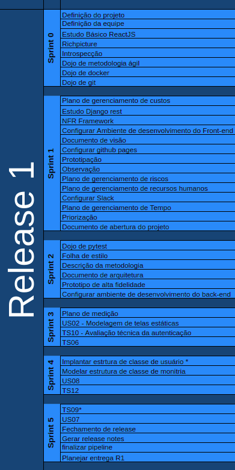
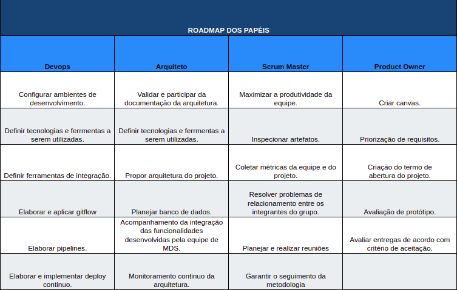

## 1. Introdução

Este plano é uma adaptação inspirada no plano de gerenciamento de cronograma descrito pelo Guia PMBOK®.

Para a realização do plano foi feito o backlog do produto para definir o planejamento do desenvolvimento do projeto, sendo ele dividido no periodo de tempo de 1 semana, chamado de sprint.

Para determinar o que seria entregue em cada sprint, foi feito um roadmap geral dividido em duas releases, e como teriamos papéis com atividades constantes ao longo de todo o projeto, também foi feito um roadmap de cada papél.

## 2. Backlog do Produto

O backlog é um artefato que representa a acumulação de trabalho, é uma espécie de estoque relativo ao produto que ainda não foi desenvolvido, sendo assim entende-se como uma listagem de pedidos em espera.

Backlog do produto dispónivel [aqui.](doc-backlog)

## 3. Roadmap Geral

## 4. Roadmap dos Papéis

## 5. Referências Bibliográficas

> PMI. Um guia do conhecimento em gerenciamento de projetos. Guia PMBOK 5a. ed. - EUA: Project Management Institute, 2013.

## Histórico de Versões
|Data|Versão|Descrição|Responsável|
|----|------|---------|-----------|
|12/04/2019| 0.1 | Abertura do documento| Lucas Siqueira, Lucas Macêdo, Matheus Rodrigues, Caio Oliveira
|12/04/2019| 0.2 | Adição da introdução| Lucas Siqueira

