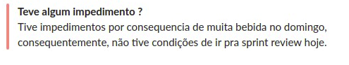
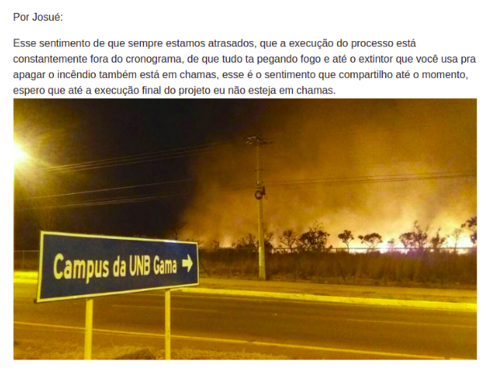

## 1. Introdução 

O documento de postmortem tem como objetivo relatar as experiências vivências no projeto, decidimos então por dividir o documento levantando tópicos que englobam acontecimentos que tiveram grandes impactos ao decorrer do projeto.

## 2. Definição de escopo

Desde o começo do projeto o escopo foi um problema, com a mudança na disciplina não tínhamos um cliente, a ideia principal da disciplina de desenvolver um chat bot não agradou a equipe, então buscamos utilizar a ideia do projeto realizado na disciplina de Tópicos especiais em jogos, onde seria uma comunidade para disponibilizar as monitorias utilizando técnicas de gameficação, porém existia apenas um plano de gamificação e poucas ideias quanto ao problema a ser solucionado e ao produto a ser feito, então demos início a elicitação dos requisitos, a fim de definir nosso escopo.

Aplicamos algumas técnicas, inicialmente fizemos um richpicture para identificar o que havia de entendimento do que seria o projeto, posteriormente a equipe de EPS realizou uma introspecção, onde foi levantado praticamente todo o escopo para o projeto. A equipe de MDS fez uma observação participativa de outros aplicativos, para levantar novos requisitos e ver outras soluções para o problema que nós estávamos procurando resolver. 

Após esse levantamento inicial, foi feito o protótipo, onde definimos o design e as telas do produto. Concluímos que o escopo inicialmente englobaria: Gerenciamento de contas de usuário, gerenciamento de monitorias e gameficação, buscando utilizar princípios de redes sociais.

## 3. Definição da metodologia

Seguindo o que é feito na disciplina a um longo tempo, utilizamos de recursos de diferentes metodologías para definir a nossa. Utilizamos as seguintes metodologías como base: Scrum, Kanbam, Xp e alguns conceitos oriundos do R.U.P.

> Mais detalhes em: https://fga-eps-mds.github.io/2019.1-MaisMonitoria/docs/doc-descricao-metodologia

## 4. Definição das tecnologias

As tecnologias utilizadas no projeto foram decididas a partir de discursões entre os membros do grupo, visando a produtividade. Para a configuração e gerenciamento de containers, utilizamos as ferramentas Docker e Docker Compose, visto que possuíamos, apesar de pouco, um certo conhecimento em relação a esta tecnologia. Em relação a análise de código, utilizamos as ferramentas Code Climate e CodeCov, onde o Code Climate nos gerava as métricas necessarias a respeito da saúde do código e o CodeCov sobre a cobertura de testes, as duas ferramentas também possuem interfaces intuitivas e amigáveis. Para a criação da interface do webapp, optamos pelo ReactJS, pois observamos as vantagens que nos traria no desenvolvimento de um PWA. Na escolha da tecnologia para o desenvolvimento das nossas APIs decidimos utilizar o Django Rest, visto que boa parte do grupo já possuia um certo conhecimento a respeito do framework Django e esta ferramenta atenderia ao proprósito do projeto. O Firebase é uma ferramenta que abstrai a complexidade da autenticação no webapp, preferimos utilizar uma API externa para tal ao invés de implementar uma solução para esse quesito. O Travis foi escolhido como ferramenta de integração contínua, onde automatiza todo nosso Pipeline. A DigitalOcean é o provedor em nuvem que usamos no projeto, visto que possuímos crédito na plataforma e a mesma atendia as necessidades do projeto. O Rancher é a tecnologia que orquestra os nossos containers na nuvem e possui uma interface intuitiva. Para a comunicação do grupo, decidimos utilizar o Slack, pois o mesmo facilitava a inserção de bots que automativam algumas tarefas como: responder as Dailys, acompanhar os commits feitos no GitHub e as builds no travis. Para a codificação, usamos o editor VS Code, pois nos auxiliava para a programação em pares. Já na parte de versionamento e hospedagem de repositório, o Git e o Github foram utilizados, visto que eram quesitos da diciplina de EPS/MDS e que possuiam integração com outras plataformas como o Code Climate e o Travis. Por fim, o ZenHub foi usado para o gerenciamento da equipe, mostrando o andamento das tarefas de cada membro.

> Mais detalhes sobre as ferramentas, disponíveis em: https://fga-eps-mds.github.io/2019.1-MaisMonitoria/docs/plano-gcs#4-ferramentas

## 5. Definição da arquitetura

Como sugerido pela professora Carla optamos por utilizar uma arquitetura orientada a microsserviços, ao analisar nosso escopo observamos que ele não era grande e complexo o sufiente para que fosse necessário utilizar tal arquitetura, no entanto visando o aprendizado e o desafio técnico mantivemos a decisão inicial. Após isso procuramos ajuda na internet, com colegas de trabalho, colegas de faculdade e com professores, no intuito de seguir as melhores práticas possiveis dentro da arquitetura, evitar erros bobos e descobrir boas tenologias para utilizar. Uma vez definida e modelada nossa arquitetura macro, focamos na arquitetura interna dos nossos serviços, que foi modelada de acordo com as tecnologias, frameworks e linguagens que escolhemos utilizar, novamente buscamos ajuda com a mesma intenção de utlizar as melhores práticas possiveis e evitar erros clichês. 

## 6. Capacitação da equipe 

No dia 18/03/2019 demos início aos treinamentos, começamos com git, onde foi dividido em 2 partes, uma teórica, para entenderem a importância do versionamento do código e como o git funciona, focando em já mostrar para eles o que seria a nossa política de branchs e commits, e outra parte prática, para exercitar a programação orientada a objetos com o que foi visto anteriormente.No dia 19/03/2019 realizamos o treinamento para apresentar e explicar a metodologia definida e também um treinamento explicando a utilização do docker no nosso projeto.

Após a definição das outras tecnologias, disponibilizamos dois cursos para que a equipe de MDS se capacitasse para desenvolver o projeto, um curso comprado na plataforma udemy de Django Rest e um curso gratuito de Reactjs na plataforma rocketseat. 

Em seguida, realizamos um treinamento a cerca de testes unitários em python, tentando mostrar a importância de testar o código e como realizar a codificação dos testes, utilizando exemplos e prática.

> Mais detalhes disponíveis no plano de gerenciamento de recursos humanos:
https://fga-eps-mds.github.io/2019.1-MaisMonitoria/docs/plano-grh 

## 7. Início a codificação

Infelizmente mesmo após o periodo de capacitação, a equipe de MDS não atingiu o nível técnico necessário para contribuir de forma independente e eficiente no desenvolvimento, o que acabou obrigando a equipe de EPS a ter que acompanhar muito de perto os membros de MDS e na maioria das vezes codificar por eles as issues. Esse fato acabou sobrecarregando a equipe de EPS princialmente nas proximidades da R1 e de certa forma acomodou os membros de MDS uma vez que a equipe de EPS estava sempre cobrindo o deficit no desenvolvimento do código. 

## 8. Entrega da R1

Tivemos a notícia de que apenas a equipe de MDS poderia apresentar, o que nos pegou de surpresa, então iniciamos a preparação para essa entrega, com a equipe de MDS inicialmente dispersa e assustada com a notícia,  a equipe sem ter uma visão alinhada do projeto, tivemos diversas reuniões e ainda sim havia dificuldade de consenso em relação ao produto, então propomos um roteiro para ser seguido e realizamos vários treinamentos e “tira dúvidas” durante a semana que antecedeu a R1, o que surtiu efeito, a equipe se mostrou confiante na apresentação e teve um bom desempenho.

O feedback em geral foi bom, porém tivemos pontos negativos, onde existiam falhas na documentação acerca do produto, onde não definimos bem o que realmente era o produto, e quanto ao desenvolvimento onde a principal crítica foi que a equipe de MDS foi pouco participativa na realização do código.

> Mais informações disponíveis no documento de review da release 1: 
https://fga-eps-mds.github.io/2019.1-MaisMonitoria/docs/release1-review

## 9. Mudanças no escopo

Durante as aulas da professora Carla, em diversos momentos foi discutido o escopo dos projetos em geral, sempre recomendando a diminuição do mesmo, seguindo essa recomendação, analisando a produtividade da equipe e o tempo útil da disciplina, notamos que o escopo inicial era inviável, e iniciamos a refatoração dele.

Retiramos todo o módulo de gameficação, que englobava o sistema de ranking, avaliações e recompensas, também cortamos a funcionalidade de solicitar uma monitoria, adicionamos no lugar uma funcionalidade recomendada pela professora Carla de favoritar uma monitoria, para buscar atender esse problema de uma maneira simplificada, deixando visível para todos os usuários que favoritaram a monitoria, e para o usuário que á favoritou, uma aba de favoritos para facilitar o acesso a mesma. 

Após o corte no escopo, fizemos uma refatoração no nosso backlog, onde tentamos corrigir o que foi possível dos erros cometidos anteriormente e deixar nele apenas o que fosse ser possível de entregar ao fim do projeto.

## 10. Amadurecimento da equipe

Acredito que a métrica do velocity tinha como objetivo motivar a equipe, onde a quantidade de story points feitas por sprint tenderia a ser maior, como uma espécie de desafio para aumentar a motivação e a produtividade do time, porém para o nosso contexto isso não ocorreu. 

E como foi citado anteriormente, a equipe de MDS mostrava uma dependência muito grande da equipe de EPS para realizar suas atividades, o que estava gerando uma sobrecarga em cima de EPS, e consequentemente uma desmotivação de toda equipe. 

Para solucionar esse problema, utilizamos uma técnica de persuasão, onde consiste em propor um desafio possível, no qual após a realização deste desafio, fosse adquirido confiança e ânimo para o time. Planejamos na [sprint 8](https://fga-eps-mds.github.io/2019.1-MaisMonitoria/docs/sprint8-review) um risco controlado, com atividades mais fáceis de serem realizadas, e os pareamentos para as issues de codificação apenas membros de MDS podendo buscar ajuda de EPS apenas no último dia da sprint.

Como resultado, inicialmente a equipe de MDS se mostrou preocupada e com um certo medo de não conseguirem sozinhos, de forma um pouco tardia, porém ainda sim dentro do tempo planejado tivemos a conclusão de todas as atividades da sprint, e para as próximas a equipe estava mais confiante, acreditando em si mesmo para realizar as issues propostas, sem ter os mesmos pensamentos iniciais: “Não sei fazer”, “Não consigo”. Sem dúvidas essa foi a decisão que mais impactou na realização de todo o processo de desenvolvimento do produto, após essa sprint a equipe de MDS estava mais participativa, o entendimento do problema aumentou e consequentemente junto a produtividade de toda a equipe. 

## 11. Bugs encontrados nos testes de usabilidade

Os testes de usabilidade ocorreram tardiamente, devido a algumas inconstâncias existentes no ambiente de homologação, no dia 07/06/2019 iniciamos os testes, e neles encontramos bugs desconhecidos, onde a aplicação estava criando monitorias e likes sozinha, e não era possível editar o perfil do usuário devido a um erro no uso da foto. Os problemas foram resolvidos e a realização dos testes de usabilidade foi extremamente importante para garantir a qualidade das funcionalidades existentes e coletar feedbacks para melhorar cada vez mais o produto, logo se tivéssemos realizando esses testes de forma mais constante ao longo do projeto, teríamos um produto ainda melhor no fim.

> Teste de usabilidade 2.0, disponível em: 
https://fga-eps-mds.github.io/2019.1-MaisMonitoria/docs/doc-teste-usabilidade-2.0

## 12. Testes no frontend

Ao início da codificação do frontend as telas estavam estáticas, sem muitas ações, para elas o teste de renderização a partir do uso de snapshots conseguia cobrir quase que todas as linhas de código, porém com o aumento das funcionalidades e da complexidade do código, os snapshots sozinhos não eram suficientes para cobrir o necessário, então foi proposto para a equipe de MDS a realização do estudo destes testes, e durante esse período aceitamos os pull requests sem se preocupar com o testes no frontend, com a ideia de que eles seriam realizados posteriormente, o que foi um grande erro, pois a equipe de MDS se acomodou e não realizou os estudos dos testes, apenas ignoraram essa tarefa. De forma tardia, tentamos buscar solução para esse problema, a equipe conversou com a professora Bruna e foi recomendado um monitor para buscarmos ajuda, e não tivemos resposta, sendo assim infelizmente não foi possível concluir de forma satisfatória os testes do frontend.

## 13. Bar

## 14. Sentimentos quanto a execução do projeto 

### 14.1 Sentimos compartilhados:

Lembramos que ao ler o os sentimentos quanto a execução do projeto no post mortem do nosso grupo de GPP quando fizemos MDS,  ficamos na época com a impressão de que era exagero e o que estava escrito não condizia com a verdade, entretanto o sentimento durante a execução do nosso projeto foi o mesmo, vimos em vários momentos um atraso quanto ao cronograma planejado e a equipe dispersa.

### 14.2 Lucas Siqueira

Além dos sentimentos compartilhados, durante a execução do projeto na definição do escopo, não existir um cliente inicialmente pareceu algo bom, onde seríamos livres para desenvolver o que propomos, porém na prática não ter um cliente fez com que aumentasse a dificuldade no planejamento e na definição do escopo, um risco muito grande para o projeto, onde a equipe durante um período muito grande de tempo esteve desalinhada quanto as ideias do produto, cada um com uma opinião diferente e uma solução diferente para cada problema, o começo foi extremamente desgastante, com muitas reuniões, discussões e com uma equipe de desenvolvimento improdutiva, uma sobrecarga concentrada em alguns membros e um nível alto de estresse. Para a R2 tivemos uma conversa com a professora Carla, onde foi recomendado a busca de conscientizar a equipe de MDS de suas responsabilidades, a partir desse ponto tomamos a melhor decisão durante o processo que está relatada no tópico 10, a partir daí conseguimos levar o projeto ainda não da melhor maneira possível, porém com mais tranquilidade e produtividade, tendo no fim uma solução satisfatória, um produto que atende o problema levantado, onde é possível visualizar um catálogo de monitorias com horários e temas flexíveis, onde qualquer usuário é um monitor que pode disponibilizar seu tempo para ajudar um colega de curso a partir da interação e troca de conhecimento, terminando o projeto com o sentimento de que dava para ser melhor, porém que o dever foi cumprido.

### 14.3 Caio Oliveira

A ideia da professora carla de fazer com que a equipe de EPS tenha uma maior autonomia por não ter cliente parecia atrativa no início do projeto, pois tínhamos uma visão diferente, entretanto os problemas começaram a surgir logo no início do projeto, outro ponto que parecia só ter lado positivo mas trouxe alguns problemas foi a amizade entre os membros da equipe, todos se conheciam desde antes da matéria e todos tinham uma amizade grande, exceto com um membro da equipe, que acarretou em problemas da equipe de MDS não acatar sempre as decisões da equipe de EPS, reuniões improdutivas por excesso de brincadeiras, daí surgiu a famosa citação:

 > Os cara não leva nada a sério.  Macêdo, Lucas 

e o membro que não conhecia o resto da equipe acabava ficando de fora, por vergonha ou timidez, um problema que foi ser resolvido com o amadurecimento da equipe como um todo após a sprint 8 onde deixamos a equipe de MDS mais independente o projeto tomou outro rumo, as historia sendo entregues e a equipe de EPS menos sobrecarregada, ao fim do projeto fico triste com a necessidade da diminuição do escopo porém satisfeito com o resultado, pois a solução encontrada me agradou e resolve o problema proposto, fico feliz com amadurecimento da equipe e pessoal que houve durante o decorrer do projeto. 

### 14.4 Lucas Macedo

"Os cara não leva nada a sério!" essa foi minha frase durante o semestre. Infelizmente ao final do projeto não me senti com a sensação de dever cumprido, fiquei bem insatisfeito com a "arquitetura" do nosso front-end, no começo do projeto eu como arquiteto confiei na equipe de desenvolvimento, que eles utilizariam o que aprenderam durante a capacitação para criar os componentes e organizar nossas páginas de forma correta e utilizando bom senso, no entanto após passado o sufoco da R1 e o começo meio morno da R2 parei para analisar, revisar, etc... o código e a organização do nosso front-end e me deparei com uma grande bagunça, código sem padrão, com algumas replicações, componentes sem função bem definida e uma estrutura de páginas e rotas confusa para não dizer ruim. Tudo isso cai na minha conta, pois acabei aceitando "qualquer coisa" em termos de código e organização durante a R1 por diversos motivos que já foram citados no documento, e depois durante a R2 demorei demais para tomar a atitude de conversar com a equipe de MDS, explicar pra eles quais seriam as melhores práticas e ajuda-los em uma refatoração, uma vez que quando tomei essa decisão ela foi barrada pela equipe de EPS pelos motivos de que o código já estava muito grande e uma refatoração com essas proporções era um risco muito grande para o projeto. No fim, não foi possível cuidar bem do front-end como consgui cuidar das nossas API's, mas fiz o possível para que novos problemas não fossem inseridos no nosso front-end durante a R2.   

### 14.5 Matheus Rodrigues

Calma, ta de boa, o projeto tá pronto, só fazer.

## 15. Conclusão

No início do projeto foram divididos os papéis e as responsabilidades entre a equipe de EPS e ficou estabelecido que a os membros se ajudam entre si, mesmo que não fosse sua responsabilidade, tudo em pról do produto, para que nós tivéssemos o melhor projeto possível, apesar de desavenças e contradições em alguns aspectos, a amizade e as responsabilidades não deixavam o projeto desandar.
A experiência vivida na matéria de EPS trouxe para todos os membros do grupo um grande amadurecimento, seja em relação a tecnologias tanto quanto ao gerenciamento de equipe, onde na reunião final os membros conversaram sobre o projeto como um todo e como os erros cometidos no início do projeto voltariam para nos assombrar seja em relação ao uma decisão arquitetural ou um BUG que passou despercebido no code review.
Ao final do projeto vemos um resultado satisfatório, porém com a impressão que de que se tivéssemos percebido e corrigidos nossos erros antes o resultado poderia ter sido melhor, mas o cansaço e o tempo não nos permitem continuar a implementação do escopo definido no início da matéria.

## Histórico de revisão
|Data                       |Versão |Descrição       	       |Autor(es)    |
|------------------|-----------------|---------------------------------|--------------------|
| 22/06/2019| 0.1 | Tópicos 1, 2, 14.3, 15 | Caio Oliveira  |
| 22/06/2019| 0.2 | Tópicos 2, 3, 6, 8, 9, 10, 11, 12, 13, 14.1, 14.2 | Lucas Siqueira |
| 22/06/2019 | 0.3 | Tópico 4 | Matheus Rodrigues | 
| 22/06/2019 | 0.4 | Tópicos 5, 7 e 14.4 | Lucas Macêdo |
