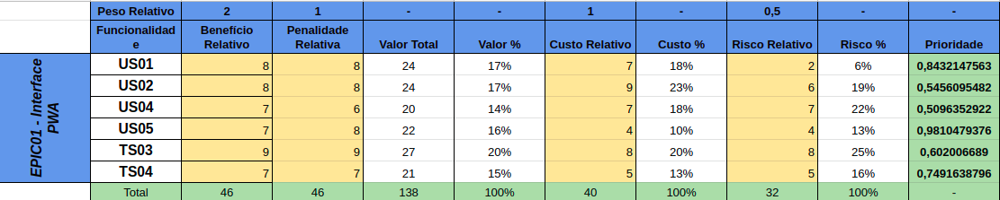
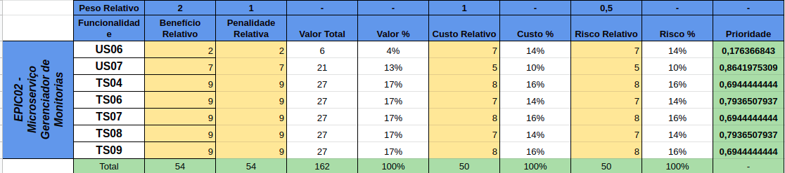
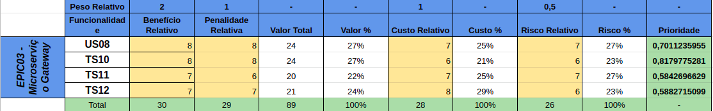
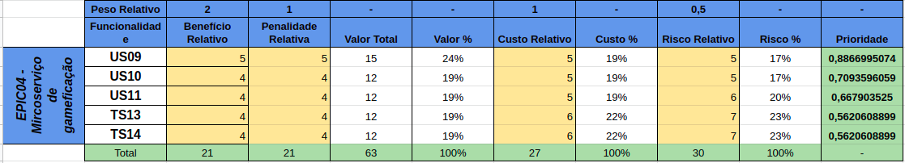
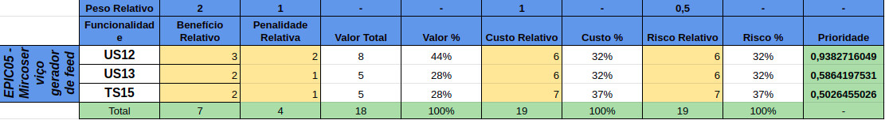

# Introdução

Priorização é usada para ajudar no planejamento do projeto e assim escolher o que deve ser implementado, de acordo com o que agrega mais valor para o produto ou para o cliente.

# Moscow

Moscow é uma técnica de priorização em que se tem 4 diretivas, que dizem a necessidade do requisito para o projeto.

### Legenda

- **Must** = Maior prioridade, requisitos de essenciais para o projeto.
- **Should** = Prioridade secundária, requisitos importantes para o projeto.
- **Could** = Terceiro nível de prioridade, requisitos interessantes para o projeto.
- **Want** = Menor prioridade, requisitos desejáveis para o projeto.

| ID | Nome | Prioridade |
| :--: | :--: | :--: |
| US01 | Prototipação | Must |
| US02 | Modelagem de telas estáticas | Must |
| TS03 | Configurar ambiente de desenvolvimento front-end | Must |
| TS05 | Avaliação da técnica de armazenamento | Must |
| US04 | Implantar sistema de notificações | Must |
| US05 | Disponibilizar adição de ícone | Must |
| TS04 | Configurar ambiente de desenvolvimento back-end | Must |
| TS06 | Modelagem da estrutura de classes e do banco de dados de usuário | Must |
| TS07 | Implantação da estrutura de classes e do banco de dados de usuário | Must |
| TS08 | Modelagem da estrutura de classes e do banco de dados de monitorias | Must |
| TS09 | Implantação da estrutura de classes e do banco de dados de monitorias | Must |
| US08 | Disponibilizar autenticação por API externa | Must |
| TS10 | Avaliação técnica da autenticação | Must |
| TS11 | Gerenciamento de informações no cache | Must |
| TS12 | Gerenciamento de requisição | Must |
| US03 | Implantar armazenamento em cache | Should |
| US07 | Disponibilizar filtros de pesquisa relevantes | Should |
| TS13 | Algoritmo de pontuação | Should |
| US09 | Disponibilizar sistema de ranking | Should |
| TS14 | Algoritmo de distribuição de recompensas | Could |
| US11 | Sistema de recompensas | Could |
| US06 | Implantar pesquisa dinâmico | Want |
| US10 | Atualizações de ranking | Want |
| TS15 | Algoritmo de Geração do Feed | Want |
| US12 | Sistema de feed personalizado | Want |
| US13 | Sistema de seguir usuário | Want |

# First things first
FTF é uma técnica de priorização que leva em conta 4 fatores, benefício, penalidade, custo e risco. Assim a priorização fica mais detalhada, trazendo mais esclarecimento para os envolvidos no projeto.
## Tabelas

> Épico 01 - Interfacce PWA

> Épico 02 - Microsserviço Gerenciador de monitoria

> Épico 01 - Microsserviço gateway

> Épico 04 - Microsserviço de gamificação

> Épico 05 - Microsserviço gerador de feed

todas as tabelas encontram-se disponível em: [Tabelas FTF](https://docs.google.com/spreadsheets/d/1WSlpAsuv4rFWkpX01wvN_n2r_ck3Vuj0PNup1SXLlzM/edit?usp=sharing)
## Histórico de Revisão
| Data | Versão | Descrição | Autor(es) |
|:--:|:--:|:--:|:--:|
| 07/04/2019 | 0.1 | Abertura do documento | Caio Oliveira |
| 07/04/2019 | 0.2 | Desenvolvimento da tabela de Moscow | Caio Oliveira |
| 10/04/2019 | 0.3 | Desenvolvimento das tabelas de FTF | Caio Oliveira |

