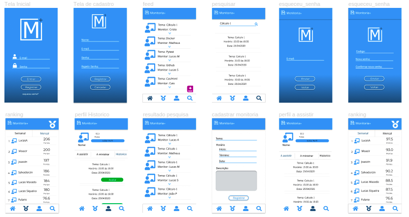
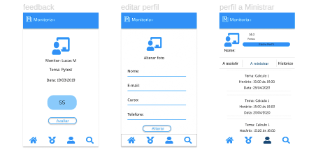
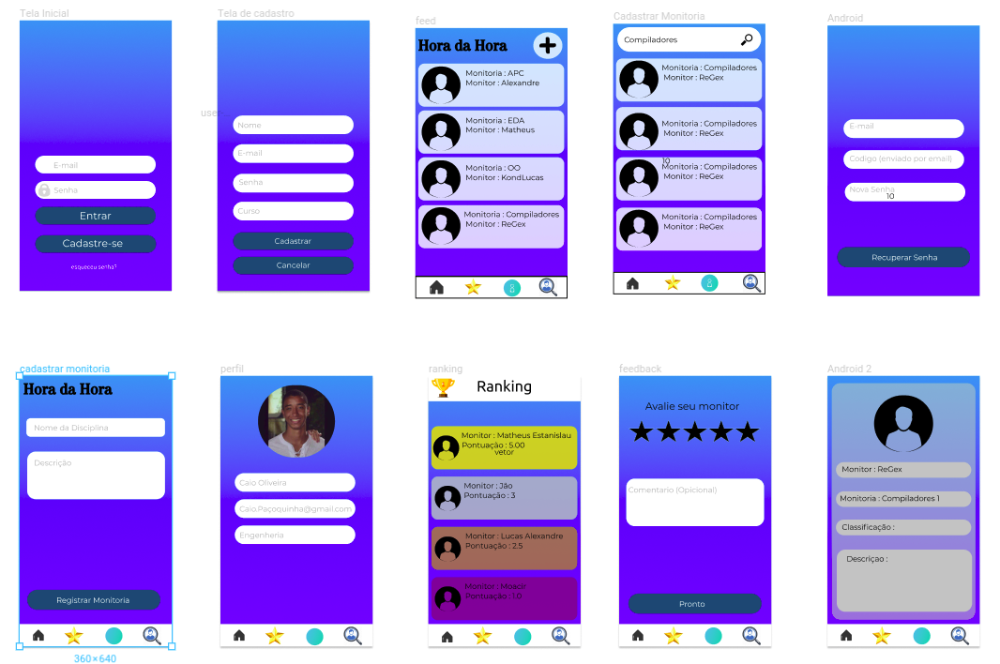

## 1. Introdução

Construir um protótipo é um método para se obter respostas iniciais sobre os requisitos através de um modelo funcional do produto esperado, antes de efetivamente construí-lo. Já que um protótipo é tangível, ele permite que as partes interessadas façam experiências com um modelo do seu produto final ao invés de somente discutirem representações abstratas dos seus requisitos. Os protótipos suportam o conceito de elaboração progressiva em ciclos iterativos de criação de modelos em tamanho natural, experiências de usuários, geração de opiniões e revisão do protótipo[1].

Iniciamos com o projeto de baixa fidelidade produzido através dos levantamentos iniciais da equipe de gerenciamento, após discussões a ferramenta Figma foi selecionada para produzir o protótipo de alta fidelidade.

## 2. Funcionalidades

- Cadastro Perfil
- Login
- Logout
- Cadastro monitoria
- Pesquisar monitoria
- Classificação monitoria
- Ranking
- Recuperar senha
- Acessar monitoria

## 3. Protótipo

### 3.1 Visão Geral Telas

### Versão 2.0

### Versão 1.0

## 4. Teste de Usabilidade

A partir dos testes realizados foram feitas atualizações como, reestilização de todas as telas e botões, adicionando elementos de acordo com as observações feitas pelos usuários testados.

## 5. Link para Protótipo

https://www.figma.com/proto/SUKpGx4jTGXy0o7ZAJMNwDNE/Untitled?node-id=1%3A2&scaling=scale-down

## 6. Referências
>[1] PMI. Um guia do conhecimento em gerenciamento de projetos. Guia PMBOK® 5a. ed. EUA: Project Management Institute, 2013.
>[2] Prototyping QueroMaisConversa. Disponível em https://github.com/QueroMais/QueroMaisConversa/wiki/Prototyping#31-vis%C3%A3o-geral-das-telas
>[3]ferramenta Figma. Disponível em https://www.figma.com

## Histórico de Revisão
| Data | Versão | Descrição | Autor(es) |
|:--:|:--:|:--:|:--:|
| 30/03/2019 | 0.1 | Criação Protótipo | João Pedro, Matheus Cristo | 
| 07/04/2019 | 0.2 | Criação de uma nova versão do Protótipo | Lucas Alexandre, Moacir Mascarenha |

