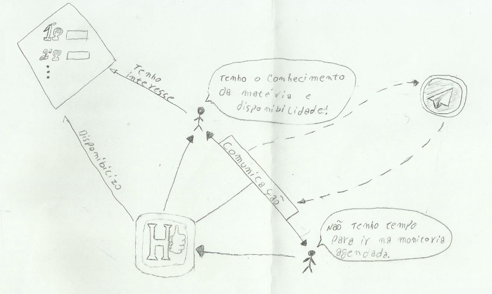

## 1. Introdução

Trata-se de uma modelagem cuja notação permite analisar problemas e expressar ideias. Pode auxiliar na identificação: de processos de negócio e seus requisitos; de atores envolvidos nos processos de negócio e suas responsabilidades; dos relacionamentos entre processos e atores, e de potenciais problemas e conflitos. [1].

## 2. Richpicture

 

 

## 3. Referências

>[1]Slide 10 da aula 04 da disciplina de Requisitos de Software da UnB-Gama - Professores: Milene Serrano e Maurício Serrano

## Histórico de Revisão

| Data | Versão | Descrição | Autor(es) |
|:--:|:--:|:--:|:--:|
| 23/03/2019 | 0.1 | Criação e desenvolvimento do Documento | Lucas Siqueira, Moacir Junior, Matheus Rodrigues e Lucas Alexandre |

