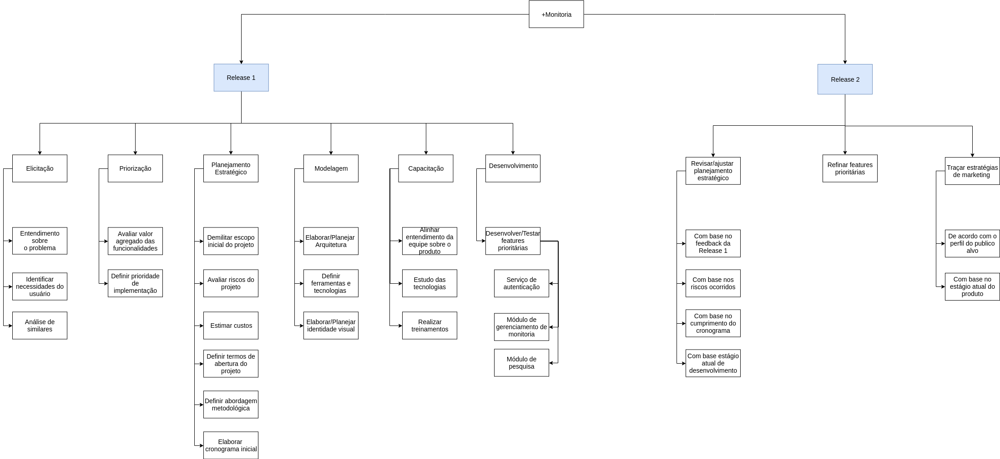
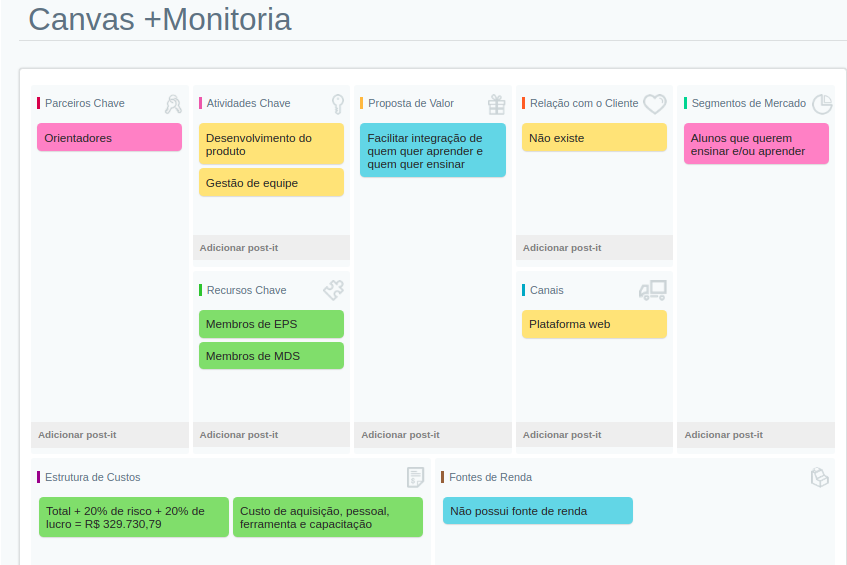

 

## 1. Descrição do Projeto

 

O **+Monitoria** é uma aplicação web progressiva para encontrar monitorias disponibilizada por outros alunos dispostos a ajudar outros alunos que buscam conhecimento.

## 2. Propósito e Objetivos

 

O propósito do **+Monitoria** é facilitar a integração entre os alunos que querem aprender e os que querem ensinar, centralizando informações sobre as monitorias da FGA.

## 3. Justificativa

 

Nos modelos de monitorias atuais os alunos estão presos a um formato que dificulta a integração de quem quer ensinar e quem quer aprender, por motivos de horários ou do número máximo de monitores que uma disciplina pode ter, e por isso o **+Monitoria** visa facilitar essa união, disponibilizando uma maior gama de horários e monitores para que quem deseja aprender tenha mais opções.

## 4. Requisitos de alto nível

 

O objetivo dos requisitos de alto nível tem como objetivo mostrar as características do produto, servido de guia para a declaração de escopo.

- O **+Monitoria** deve ser um aplicativo web progressivo.
- O **+Monitoria** deve utilizar técnicas de gamificação para aumentar o engajamento dos usuários no app.
- O **+Monitoria** deve utilizar princípios de redes sociais para fidelizar usuário ao app.
- O **+Monitoria** deve facilitar integração de quem quer ensinar e quem quer aprender.
- O **+Monitoria** deve oferecer usabilidade agradável e bom desempenho para manter o usuário satisfeito.

## 5. Riscos

 

Os riscos são identificados e planejados para que possa haver um gerenciamento dos riscos ao longo do projeto, para mais informações veja o  [plano de riscos](plano-riscos.md).  

## 6. Estimativa de custos

 

A estimativa de custos foi planejada de acordo com o tempo de duração do projeto e leva em conta os custos de aquisição, custos com pessoal, custo de ferramentas, custos de capacitação e uma porcentagem para cobrir eventuais riscos e manter uma margem de lucro segura, para mais informações veja o [plano de custos](plano-custos.md).

## 7. Partes interessadas

 

#### Usuários

- Pessoas dispostas a ensinar.
- Pessoas com vontade de aprender.

#### Equipe
|Nome|Descrição|
|:-------:|:-------:|
|João Pedro Soares |Membro da equipe de desenvolvimento|
|Lucas Alexandre|Membro da equipe de desenvolvimento|
|Matheus de Cristo|Membro da equipe de desenvolvimento|
|Moacir Mascarenha|Membro da equipe de desenvolvimento|
|Renan Cristyan|Membro da equipe de desenvolvimento|
|Caio Oliveira|Product Owner|
|Lucas Macêdo|Arquiteto|
|Lucas Siqueira|Scrum Master|
|Matheus Rodrigues|DevOps|

## 8. Requisitos para aprovação

 

Ter implementados as funcionalidades definidas no escopo.

Atender os requisitos de PWA(lighthouse)

## 9. EAP

 

EAP ou estrutura analítica de projeto é uma forma visual de representar as fases e estruturas necessárias de um projeto.

 

### Versão 2.0

 

Imagem ampliada está disponivel [aqui](https://uploaddeimagens.com.br/images/002/080/087/full/EAP_versao_2.0.png?1556758805).
 
[Versão 1.0](https://fga-eps-mds.github.io/2019.1-MaisMonitoria/docs/assets/EAP.png).

## 10. Canvas

 

Canvas é uma ferramenta que demonstra as principais informações de um projeto, para que seja possível a melhor visualização o modelo de negócio.
 

  

## 11. Referências

 

 > PMI. *Um guia do conhecimento em gerenciamento de projetos.* Guia PMBOK® 5a. ed. - EUA: Project Management Institute, 2013

> Fga-eps-mds a disciplina Disponível em:  <[https://github.com/fga-eps-mds/A-Disciplina](https://github.com/fga-eps-mds/A-Disciplina)>

> Draw io disponível em: [https://www.draw.io/](https://www.draw.io/)

> Sebrae canvas disponível em: [https://sebraecanvas.pr.sebrae.com.br](https://sebraecanvas.pr.sebrae.com.br)

> Quero Cultura plano de gerenciamento de projeto disponível em: <[https://github.com/fga-eps-mds/2017.2-QueroCultura/wiki/Plano-de-Gerenciamento-do-Projeto](https://github.com/fga-eps-mds/2017.2-QueroCultura/wiki/Plano-de-Gerenciamento-do-Projeto)>
___

## Histórico de Revisão

 

| Data | Versão | Descrição | Autor(es) |
|:--:|:--:|:--:|:--:|
| 02/04/2018 | 0.1 | Criação do documento | Caio Oliveira, Lucas Macêdo, Lucas Siqueira e Matheus Rodrigues |
| 02/04/2018 | 0.2 | Desenvolvimento dos tópicos | Caio Oliveira, Lucas Macêdo, Lucas Siqueira e Matheus Rodrigues|
| 03/04/2018 | 0.3 | Canvas | Caio Oliveira, Lucas Macêdo, Lucas Siqueira e Matheus Rodrigues |
| 05/04/2018 | 0.4 | EAP | Caio Oliveira, Lucas Macêdo, Lucas Siqueira e Matheus Rodrigues |

