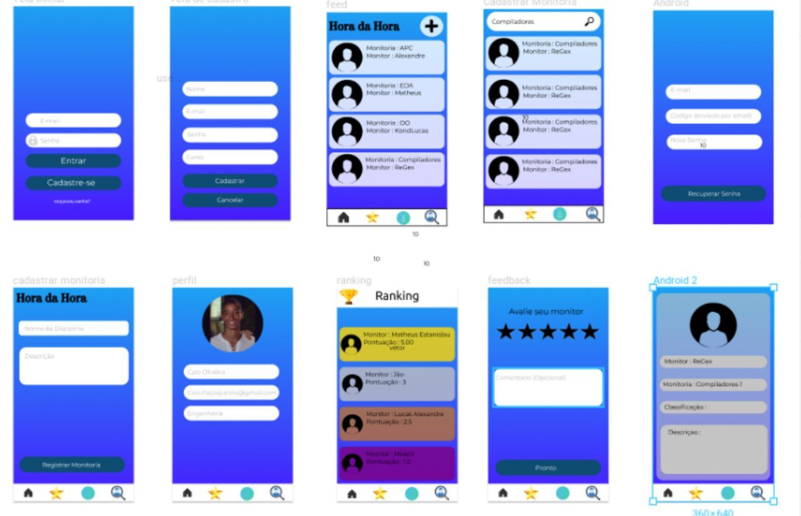
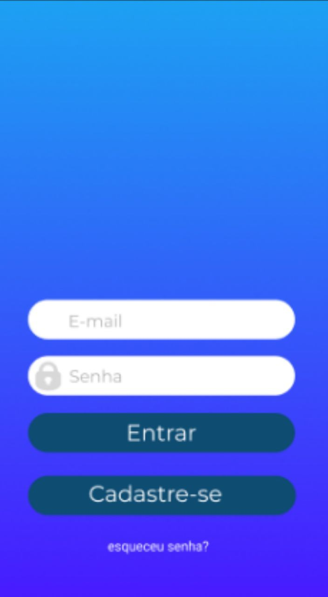
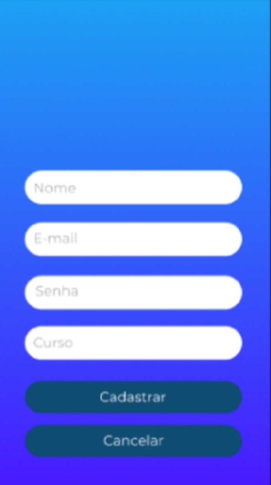
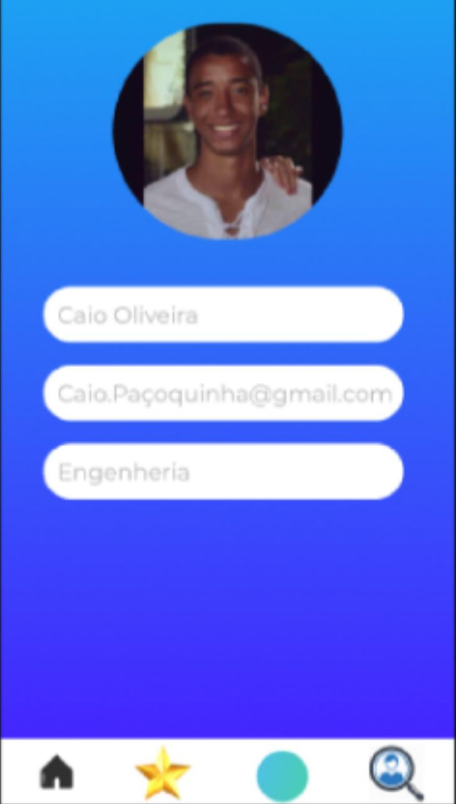
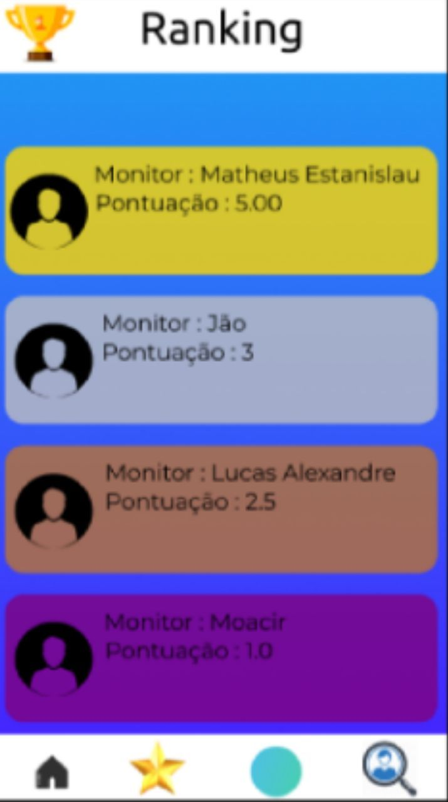
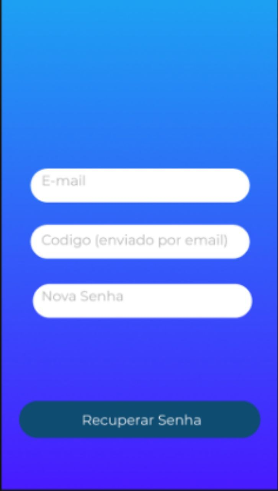

## 1. Introdução

Construir um protótipo é um método para se obter respostas iniciais sobre os requisitos através de um modelo funcional do produto esperado, antes de efetivamente construí-lo. Já que um protótipo é tangível, ele permite que as partes interessadas façam experiências com um modelo do seu produto final ao invés de somente discutirem representações abstratas dos seus requisitos. Os protótipos suportam o conceito de elaboração progressiva em ciclos iterativos de criação de modelos em tamanho natural, experiências de usuários, geração de opiniões e revisão do protótipo[1].

Iniciamos com o projeto de baixa fidelidade produzido através dos levantamentos iniciais da equipe de gerenciamento, após discussões a ferramenta Figma foi selecionada para produzir o protótipo de alta fidelidade.

## 2. Funcionalidades
- Cadastro Perfil
- Login
- Logout
- Cadastro monitoria
- Pesquisar monitoria
- Classificação monitoria
- Ranking
## 3. Protótipo

### 3.1 Visão Geral Telas

### 3.3 Login

### 3.4 Cadastro

### 3.5 feed

### 3.6 perfil

### 3.7 Cadastrar Monitoria

### 3.8 Monitoria

### 3.9 Feedback

### 3.10 Ranking

### 3.11 Recuperar Senha

## 4. Link para Protótipo

https://www.figma.com/proto/SUKpGx4jTGXy0o7ZAJMNwDNE/Untitled?node-id=1%3A2&scaling=scale-down
## 5. Referências

