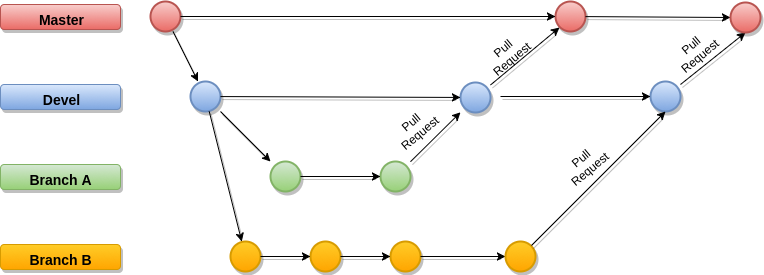

<br>

## 1. Introdução

<br>

<p align = "justify">O presente documento tem como finalidade abordar os procedimentos de gerência e configuração de software a serem seguidos no projeto.</p>

## 2. Políticas

<br>

### Política de Commits

<p align = "justify">Os <i>commits</i> devem ser atômicos e seu comentário deve descrevê-lo de forma sucinta. O texto deve descrever o que foi produzido, de forma resumida e em português, sem acentuação, com o tempo verbal no particípio. Além disso, deve conter o número de sua <i>issue</i> correspondente, no seguinte formato:

**Repositorio de Documentação**

```[#<id da issue>] <Texto começando com letra maiúscula, verbo no particípio, e com final>.```

**Exemplo:**

```[#1] Criado Documento de Arquitetura.```

**Outos Repositorios**

```[<Tag da issue>] <Texto começando com letra maiúscula, verbo no particípio, e com final>.```

**Exemplo:**

```[US00] Criada estrutura de usuário.```


### Política de Branches


<br>

<p align = "justify">O repositório do projeto terá uma <i>branch</i> principal, sendo ela a <i>branch</i> estável, a <i>master</i>. Haverá também uma <i>branch</i> denominada <i>devel</i> destinada a ser <i>branch</i> de desenvolvimento.</p>

<p align = "justify">A <i>master</i> será a <i>branch</i> estável do projeto, sendo ela proveniente da <i>devel</i> por meio de aprovação de <i>pull request</i> ao fim de cada <i>release</i>. Nenhum membro será autorizado a fazer <i>commits</i> diretamente na <i>master</i> ou na <i>devel</i>.</p>

<p align = "justify">As <i>branches</i> auxiliares são destinadas a implementação de funcionalidades, realização de histórias técnicas e conserto de <i>bugs</i>. Cada uma dessas atividades terá sua própria <i>branch</i>, criada a partir da <i>devel</i>, as <i>Hotfix</i> são as branches criadas a partir da master e servem para resolver de forma rápida, os bugs em produção. Terão como padrão de nomenclatura: </p>

``` <Identificador da atividade>-<Nome issue associada a atividade>```

**Exemplos:**

```TS03-Configurar-Ambientes```
```BUG-Duplicação-no-Banco```
```US01-Implementar-Login```

<p align = "justify">Após o fim do desenvolvimento nas <i>branches</i> auxiliares elas devem ser incorporadas a <i>devel</i> por meio de <i>pull request</i>.</p>

### Política de Aprovação do Código

<p align = "justify"> Para a aprovação do código, o <i>pull request</i> deve ser revisado por ao menos 1 membro da equipe de EPS, a nomenclatura da <i>branch</i> e dos <i>commits</i> deve estar de acordo com as definições deste documento, o código deve estar escrito seguindo a folha de estilo, a build não pode apresentar erros, a saúde do código deve atingir o nível mínimo, a cobertura de testes deve atingir o nível mínimo e o <i>pull request</i> deve seguir o template do <i>community</i> .</p>

## 3. Uso de Issues

<br>

<p align = "justify">As <i>issues</i> serão criadas com o objetivo de mapear e descrever todo o trabalho a ser desenvolvido durante o projeto, possibilitando controle e transparência do que está sendo feito. Com isso, conseguiremos manter o rastro de tudo que foi planejado e efetuado.</p>

<p align = "justify">As issues vão conter identificadores e labels, para que se possa indicar sua natureza. Os identificadores definidos para o projeto serão:</p>

* **[EPIC]** - Utilizado para as issues que representam épicos.
* **[US]** - Utilizado para as issues que representam histórias de usuário.
* **[TS]** - Utilizado para as issues que representam histórias técnicas.
* **[FT]** - Utilizado para as issues que representam <i>features</i>.

<p align = "justify"> O formato padrão de nomenclatura para essas issues é: </p>

``` [<Identificador><Número da issue>] <Nome definido pela equipe para issue> ```

**Exemplo:**

```[US01] Prototipação```

* **[REFACTOR]** - Utilizado para <i>issues</i> que representam refatoração.
* **[BUG]** - Utilizado para <i>issues</i> que representam correção de <i>bugs</i>.
* **[DOC]** - Utilizado para as <i>issues</i> que representam tarefas de documentação.
* **[TRAINNING]** - Utilizado para <i>issues</i> que representam atividades de estudo e treinamento.
* **[QUESTION]** - Utilizado para <i>issues</i> que representam perguntas que a comunidade deseja fazer aos mantenedores.
* **[SUGGESTION]** - Utilizado para <i>issues</i> que representam sugestões que a comunidade deseja fazer aos mantenedores.

<p align = "justify"> O formato padrão de nomenclatura para essas <i>issues</i> é: </p>

``` [<Identificador>] <Nome definido para a issue pela equipe> ```

**Exemplo:**

```[BUG] Duplicação no Banco```

## 4. Ferramentas

<br>

| Ferramenta | Descrição |
|:----:|:---------:|
| Git | Ferramenta de versionamento |
| GitHub | Ferramenta de hospedagem de repositórios |
| ZenHub | Ferramenta de gerenciamento de equipe |
| ReactJS | Ferramenta de criação de interface de usuário |
| Django Rest | Ferramenta para criação de API's | 
| Docker | Ferramenta de virtualização e configuração de ambiente por meio de containers | 
| Docker Compose | Ferramenta de gerenciamento de containers Docker | 
| Code Climate | Ferramenta de análise estática de código | 
| Travis CI | Ferramenta de integração contínua | 
| Heroku | Ferramenta de deploy em homologação | 
| DigitalOcean | Ferramenta de deploy em produção | 
| CodeCov | Ferramenta de análise de cobertura de testes |
| VS Code | Ferramenta de edição de código fonte |
| Slack | Ferramenta de comunicação do grupo |
| FireBase | Ferramenta utilizada para abstrair a complexidade da autenticação |
| Rancher | Ferramenta utilizada para orquestrar os conteiners |
 
 ### Integração das Ferramentas

<p align = "justify">O GitHub e o Docker tem um papel central na integração das ferramentas, considerando o seguinte pipeline, o desenvolvedor sobe seu ambiente isolado de desenvolvimento criado com containers Docker facilmente através do gerenciamento e orquestração dos containers proporcionado pelo Docker Compose, gera código fonte em python e javascript através do editor de texto VS Code, controla o versionamento utilizando Git e sempre que possível sincronizar o trabalho realizado localmente com o repositório remoto hospedado no GitHub. A partir deste ponto entram em cena Travis e Code Climate, pois após cada alteração no repositório remoto o Travis gera uma nova build do projeto e o Code Climate realiza uma análise estática do código fonte. Além de realizar a build, o Travis também possui outras funções que em alguns casos fazem parte da build e em outros casos são eventos pós build ou pré build, como executar todos os testes automatizados e enviar as informações sobre os testes para o Coveralls verificar a cobertura de testes, automatizar o deploy no Heroku ou Digital Ocean e comunicar qualquer problema que ocorra no processo de build impedindo que código quebrado se junte as versões estáveis do projeto. Por fim, e novamente através do GitHub, o Slack e o ZenHub disparam notificações ou realizam ações com base em atualizações no repositório remoto, logicamente além das funções descritas acima Slack e ZenHub também ajudam na comunicação e gerência da equipe através de algumas ações manuais feitas pelos membros, no entanto no caso do Slack ainda existem alguns bots que são usados para automatizar certas atividades.</p>

## 5. Referências

<br>

> PMI. *Um guia do conhecimento em gerenciamento de projetos.* Guia PMBOK® 5a. ed. - EUA: Project Management Institute, 2013

> Semantic Versioning 2.0.0 . Semantic Versioning Specification (SemVer). Disponível em <[http://semver.org/](http://semver.org/)>

> **PlataformaJogosUnB**. Plano de Gerenciamento de Configuração de Software. Disponível em <[https://github.com/fga-gpp-mds/2017.1-PlataformaJogosUnB/wiki/Plano-de-Gerenciamento-de-Configura%C3%A7%C3%A3o-de-Software](https://github.com/fga-gpp-mds/2017.1-PlataformaJogosUnB/wiki/Plano-de-Gerenciamento-de-Configura%C3%A7%C3%A3o-de-Software)>

## Histórico de Revisão

| Data | Versão | Descrição | Autor(es) |
|:--:|:--:|:--:|:--:|
| 26/03/2019 | 0.1 | Criação do Documento e adição dos tópicos Introdução, Políticas e Uso de Issues | Lucas Macêdo |
| 26/03/2019 | 0.2 | Adição do tópico Ferramentas | Lucas Macêdo e Matheus Rodrigues |
| 27/03/2019 | 0.3 | Adição do sub-tópico Integração das Ferramentas | Lucas Macêdo |
| 21/04/2019 | 0.4 | Ajuste tópico de branches | Matheus Rodrigues |


