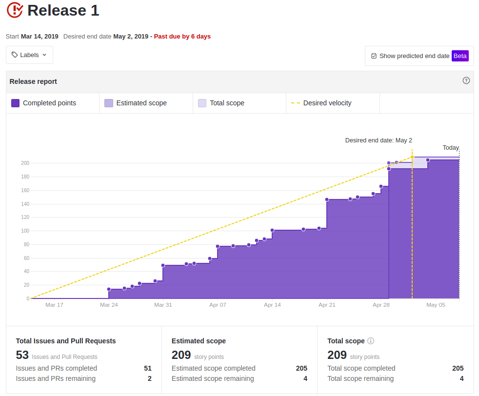
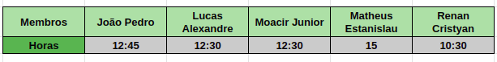

 

## 1. Introdução

 

No dia 2 de maio de 2019 ocorreu o encerramento e apresentação da primeira release do projeto, com a conclusão dessa primeira entrega é possível avaliar e analisar os acontecimentos e indicadores coletados ao longo desse período, tendo em vista melhorar o que tivemos de feedback na apresentação e não repetir os mesmos erros para a segunda entrega.

 

## 2. Quadro de conhecimento

 

### 2.1 Início da Release

 

### 2.2 Fim da Release

 

## 3. Burndown

 

 

## 4. Velocity

 

 

## 5. Riscos Ocorridos

 

**Sprint 1**
- R07 - Entregas atrasadas
- R11 - Falta de salas na faculdade para encontros

**Sprint 2**
- R07 - Entregas atrasadas
- R08 - Dependência das atividades

**Sprint 3**
- R01 - Dificuldade com as tecnologias
- R07 - Entregas atrasadas
- R13 - Conflito com entregas de outras disciplinas

**Sprint 4**
- R01 - Dificuldade com as tecnologias
- R07 - Entregas atrasadas
- R08 - Dependência das atividades
- R12 - Pareamentos não efetivos
- R13 - Conflito com entregas de outras disciplinas

**Sprint 5**
- R01 - Dificuldade com as tecnologias

 

Para ver de forma detalhada os riscos levantados [clique aqui](https://fga-eps-mds.github.io/2019.1-MaisMonitoria/docs/plano-riscos)

## 6. Horas Trabalhadas pela Equipe de MDS

 

Durante a release 1 foi coletada as horas semanais dedicadas pela equipe de MDS, com objetivo de monitorar e conscientizá-los da importância de se doarem por pelo menos 10 horas semanais no desenvolvimento do projeto.

 

### 6.1 Media de horas trabalhadas

 

 

Para ver de forma detalhada [clique aqui](https://docs.google.com/spreadsheets/d/1yBnuT8wWNx-nCBy-0Fkb_lTpzFNIELjKy_ZYGeLr-QU/edit?usp=sharing)

 

## 7. Commits ao Longo da Release

 

Os commits englobam a soma da contribuição na branch develop durante cada sprint, nos seguintes repositórios: [Documentação*](https://github.com/fga-eps-mds/2019.1-MaisMonitoria), [Front-end](https://github.com/fga-eps-mds/2019.1-MaisMonitoria-FrontEnd), [API Gateway](https://github.com/fga-eps-mds/2019.1-MaisMonitoria-api), [API Monitorias](https://github.com/fga-eps-mds/2019.1-MaisMonitoria-ApiMonitorias), desconsiderando a sprint 6 que teve como foco a preparação para apresentação da R1.

> Para o repositório de documentação foi considerada a branch master, pois nele não existe uma branch develop.
 

| Integrante | Sprint 1| Sprint 2 |Sprint 3| Sprint 4 | Sprint 5 |
|----------------   |-------    |-------    |------------ |------- |-------
| Lucas Siqueira        | 13 | 19 | 16 | 16 | 9 |
| Lucas Macedo          | 8 | 6 | 2 | 23 | 15 |
| Caio Oliveira         | 5 | 6 | 7 | 15 | 13 |
| Matheus Rodrigues     | 35 | 5 | 20 | 33 | 36 |
| João Pedro     	   | 6 | 1 | 6 | 11 | 16 |
| Matheus Cristo 	   | 5 | 2 | 8 | 6 | 10 |
| Moacir         	   | 4 | 3 | 6 | 8 | 9 |
| Renan Cristyan        | 4 | 1 | 6 | 6 | 11 |
| Lucas Alexandre       | 8 | 4 | 8 | 12 | 9 |

 

## 8. Análise do Scrum Master

 

Escolhido o tema do projeto, iniciamos nossa primeira release, começamos com treinamentos e estudos para se familiarizar com as possíveis tecnologias que usariá-mos para o desenvolvimento do produto, em seguida focamos na elicitação dos requisitos e no planejamento para o projeto, durante essa fase tivemos muita dificuldade no entendimento do produto devido ao grande escopo levantado e a equipe ainda estar muito dispersa.

Definido o backlog do produto, a próxima fase foi de prototipação, priorização, definição das tecnologias e da arquitetura a ser usada. Nessa fase tivemos uma tomada muito grande de decisões importantes, como: mudança do nome do produto, escolha da logo, definir o que é mais relevante para o projeto, entre outras. A prototipação foi um ponto muito positivo, pois nela tivemos um entendimento maior do produto e também vimos a viabilidade do mesmo. Com as tecnologias definidas foi iniciada a configuração do ambiente e do pipeline do devops. Quanto a arquitetura ocorreu  dificuldade da equipe de MDS no entendimento tanto da arquitetura interna do que seria utilizado quanto da arquitetura do projeto, porém com um grande esforço do nosso arquiteto acreditamos que as dúvidas foram sanadas e o entendimento foi alinhado.

Em seguida fomos para o início do desenvolvimento do produto, percebemos que a equipe de MDS, mesmo com os cursos realizados, dojos e outros estudos, não estava conseguindo produzir sozinhos o que foi proposto, logo foi decidido aumentar o acompanhamento da equipe de EPS no desenvolvimento, o que acabou acarretando em uma sobrecarga de atividades para os membros de EPS, e tornando a equipe de MDS muito dependente, podendo observar que a equipe de EPS teve mais commits que a de MDS, porém isso se deu também devido a falta de familiaridade com a prática de commitar atômicamente por parte da equipe de MDS.

Analisando o burndown da release, vimos que nas sprints finais tivemos muito mais pontos planejados, pois o tempo estava se esgotando e ainda estava faltando muito do planejado, com o tempo as dívidas foram diminuindo e as entregas foram acontecendo, logo ocorreu um avanço muito grande no comprometimento da equipe com as entregas, algo que não vinha acontecendo ao longo das outras sprints. Esse aumento no número de atividades fica ainda mais evidente no velocity, onde a sprint 4 e 5 ocorreu uma sobrecarga em relação à linha média de pontos entregues, em seguida, a sprint 6 tivemos menos pontos planejados, tendo em foco a preparação para a apresentação e finalização desta release, porém após a apresentação ocorreu um "relaxamento" da equipe, não concluindo a tempo todas as atividades propostas para a mesma.

A metodologia conseguiu ser seguida como descrita em seu [documento](https://fga-eps-mds.github.io/2019.1-MaisMonitoria/docs/doc-descricao-metodologia), nos ritos ágeis a equipe inicialmente se mostrou disperça, porém com o tempo foi se adaptando, tornando as reunião mais efetivas. Analisando o quadro de conhecimento percebe-se um avanço significativo de toda a equipe, porém ainda não estamos com o conhecimento bem alinhado, vemos que existem tópicos em que existe uma disparidade no nível de conhecimento.

Os riscos ocorridos ao longo da release com exceção das entregas atrasadas foram normais e bem lidados pela equipe, porém a sprint 4 ocorreu um aumento grande de ricos, algo que aconteceu devido a complexidade que englobou as atividades da sprint, além de fatores externos como a proximidade de provas e entregas de trabalhos de outras disciplinas.

Concluindo que a release 1 foi importante para entender o produto, delimitar o escopo, planejar o projeto como um todo, configurar todo o ambiente, assim como a integração contínua e dar início ao deploy, para posteriormente iniciar o desenvolvimento seguindo a priorização do nosso Product Owner. Também foi importante com a análise dos riscos e da release como um todo entender as limitações do nosso time para conseguir ter sucesso na próxima release.

