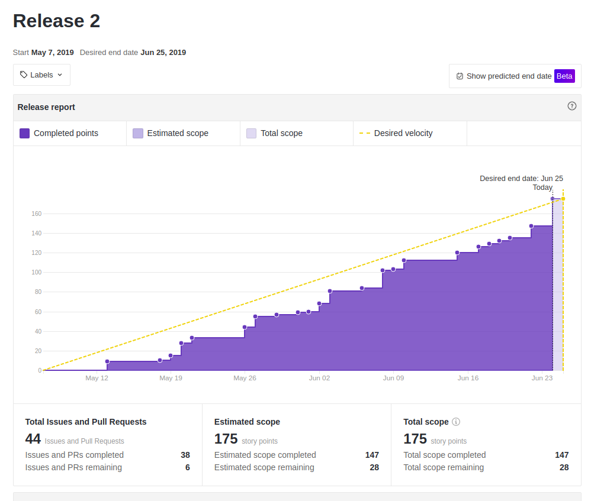
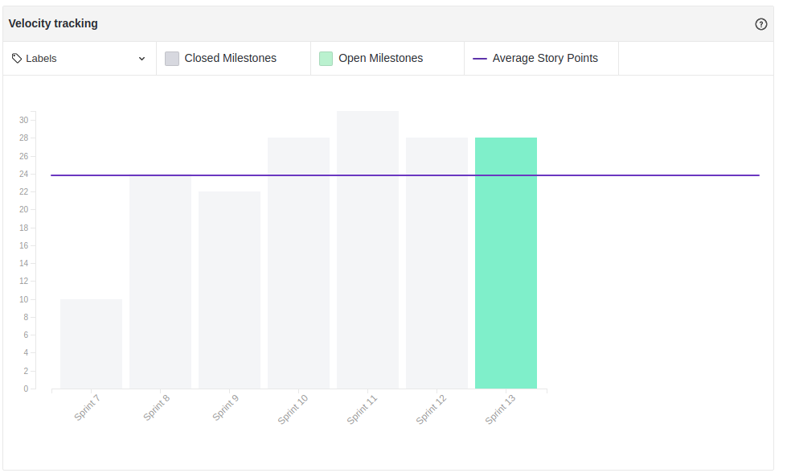

 

## 1. Introdução

 

No dia 25 de junho de 2019 ocorreu o encerramento e apresentação da segunda release do projeto, com a conclusão dessa entrega, tivemos o encerramento do projeto, neste documento será feito a documentação dos indicadores dessa release.
 

## 2. Quadro de conhecimento

 

### 2.1 Início da Release

 

### 2.2 Fim da Release

 

## 3. Burndown

 

 

## 4. Velocity

 

 

## 5. Riscos Ocorridos

 

[**Sprint 7**](https://fga-eps-mds.github.io/2019.1-MaisMonitoria/docs/sprint7-review)
- R01 - Dificuldade com as tecnologias
- R04 - Falta de comunicação
- R07 - Entregas atrasadas
- R12 - Pareamentos não efetivos
- R13 - Conflito com entregas de outras disciplinas
- R14 - Indisponibilidade de membros da equipe

[**Sprint 8**](https://fga-eps-mds.github.io/2019.1-MaisMonitoria/docs/sprint8-review)
- R14 - Indisponibilidade de membros da equipe

[**Sprint 9**](https://fga-eps-mds.github.io/2019.1-MaisMonitoria/docs/sprint9-review)
- R07 - Entregas atrasadas

[**Sprint 10**](https://fga-eps-mds.github.io/2019.1-MaisMonitoria/docs/sprint10-review)
- R07 - Entregas atrasadas
- R12 - Pareamentos não efetivos

[**Sprint 11**](https://fga-eps-mds.github.io/2019.1-MaisMonitoria/docs/sprint11-review)
- R07 - Entregas atrasadas

[**Sprint 12**](https://fga-eps-mds.github.io/2019.1-MaisMonitoria/docs/sprint12-review)
- R07 - Entregas atrasadas
- R13 - Conflito com entregas de outras disciplinas

[**Sprint 13**](https://fga-eps-mds.github.io/2019.1-MaisMonitoria/docs/sprint13-review)
- R13 - Conflito com entregas de outras disciplinas

 

Para ver de forma detalhada os riscos levantados [clique aqui](https://fga-eps-mds.github.io/2019.1-MaisMonitoria/docs/plano-riscos)

## 6. Post Mortem

> Post Mortem disponível em: https://fga-eps-mds.github.io/2019.1-MaisMonitoria/docs/doc-postmortem

