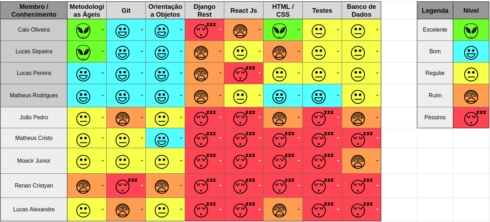

 

## 1. Resumo

 

- Período: 14/03 - 24/03
- Scrum master: Lucas Siqueira
- Product Owner: Caio Oliveira
- Devops: Matheus Rodrigues
- Arquiteto: Lucas Macêdo

 

## 2. Sprint Backlog

 

Tarefas|Pontos
--|--
|[Dojo de Git](https://github.com/fga-eps-mds/2019.1-hora-da-hora/issues/1) | 3
|[Dojo de Metodologia ágil](https://github.com/fga-eps-mds/2019.1-hora-da-hora/issues/2) | 1
|[Dojo de Docker](https://github.com/fga-eps-mds/2019.1-hora-da-hora/issues/3) | 3
|[Introspecção](https://github.com/fga-eps-mds/2019.1-hora-da-hora/issues/4) | 1
|[Estudo básico de ReactJS](https://github.com/fga-eps-mds/2019.1-hora-da-hora/issues/5) | 5
|[Richpicture](https://github.com/fga-eps-mds/2019.1-hora-da-hora/issues/6) | 1

Total de Pontos: 14

## 3. Quadro de conhecimento antes do início da sprint

 

 

## 4. Quadro de pareamento

 

Tarefas|Responsáveis
--|--
|[Dojo de Git](https://github.com/fga-eps-mds/2019.1-hora-da-hora/issues/1) | Lucas Siqueira, Lucas Macedo, MDS
|[Dojo de Metodologia ágil](https://github.com/fga-eps-mds/2019.1-hora-da-hora/issues/2) | Lucas Siqueira, Lucas Macedo, MDS
|[Dojo de Docker](https://github.com/fga-eps-mds/2019.1-hora-da-hora/issues/3) | Matheus Rodrigues, MDS
|[Introspecção](https://github.com/fga-eps-mds/2019.1-hora-da-hora/issues/4) | EPS
|[Estudo básico de ReactJS](https://github.com/fga-eps-mds/2019.1-hora-da-hora/issues/5) | MDS
|[Richpicture](https://github.com/fga-eps-mds/2019.1-hora-da-hora/issues/6) | Moacir Junior, Lucas Alexandre, Lucas Siqueira, Matheus Rodrigues

