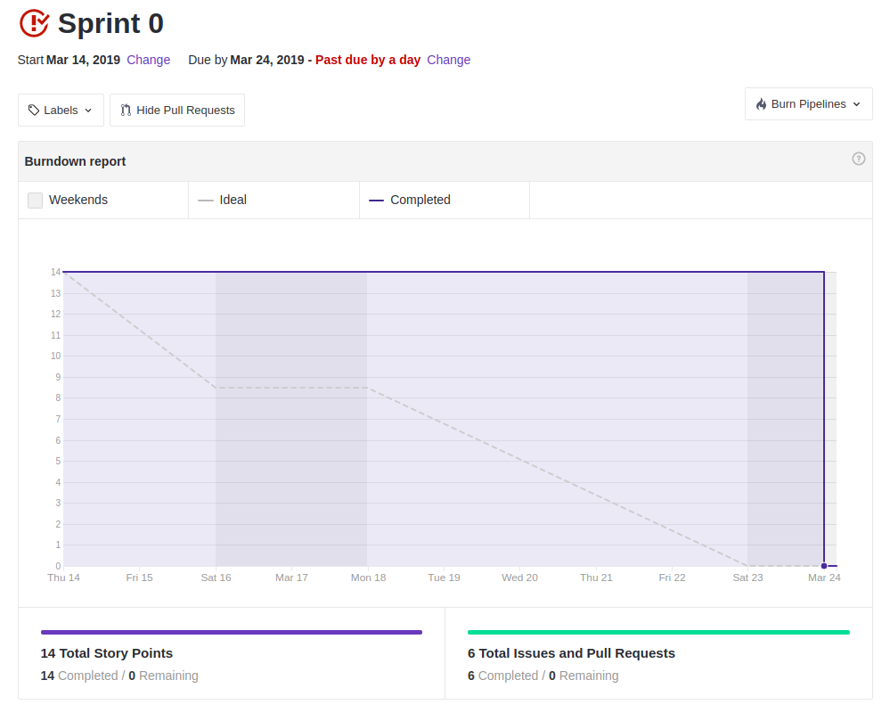
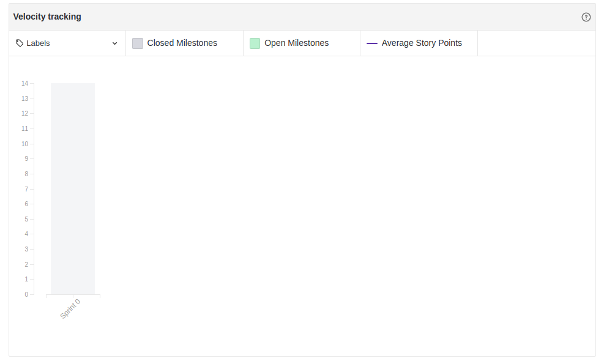

## 1. Resumo

- Período: 14/03 - 24/03
- Scrum master: Lucas Siqueira
- Product Owner: Caio Oliveira
- Devops: Matheus Rodrigues
- Arquiteto: Lucas Macedo

## 2. Resultados da sprint

### 2.1 Fechamento da Sprint

Tarefas|Status|Pontos
--|--|--
|[Dojo de Git](https://github.com/fga-eps-mds/2019.1-hora-da-hora/issues/1) | Concluído | 3
|[Dojo de Metodologia ágil](https://github.com/fga-eps-mds/2019.1-hora-da-hora/issues/2) | Concluído | 1
|[Dojo de Docker](https://github.com/fga-eps-mds/2019.1-hora-da-hora/issues/3) | Concluído | 3
|[Introspecção](https://github.com/fga-eps-mds/2019.1-hora-da-hora/issues/4) | Concluído | 1
|[Estudo básico de ReactJS](https://github.com/fga-eps-mds/2019.1-hora-da-hora/issues/5) | Concluído | 5
|[Richpicture](https://github.com/fga-eps-mds/2019.1-hora-da-hora/issues/6) | Concluído | 1

**Ponto Planejados:** 14

**Pontos Concluídos:** 14

### 2.2 Retrospectiva

|Membro|Pontos Positivos|Pontos Negativos|Sugestões de melhoria|
|---|------|-----|---|
|Lucas Siqueira|Comunicação efetiva, definição do projeto, inicio da elicitação de requisitos e dojos efetivos | Equipe não está focada durante as reuniões|Diminuir as brincadeiras desnecessárias durante as reuniões|
|Lucas Pereira|Comunicação efetiva, definimos requisitos para o produto tendo assim uma boa visão sobre o escopo e os dojos pareceram efetivos | Planejamos várias coisas e botamos poucas em prática| Otimizar o tempo botando em prática o que é planejado |
|Caio Oliveira| - | - | - |
|Matheus Rodrigues|Entendimento do projeto e alinhamento do conhecimento entre os integrantes| Reuniões prolongadas por conta da perda de foco| Concentração da equipe|
|Moacir Junior|Adquirir noção básica de react, git, scrum, docker, e entendi o projeto |Falta de foco nas reuniões |Nenhuma|
|João Pedro|Adquiri noção básica de react, git, scrum, docker, e entendi o projeto |Falta de foco nas reuniões causando perda de tempo | sugestão de melhoria|
|Matheus Cristo|Adquiri noção básica de react, git, scrum, docker, e entendi o projeto | Nenhuma| Nenhuma|
|Renan Cristyan|Adquiri novos conhecimentos durante a sprint, relativos a git, metodologia agil, reactjs e docker | Nenhum| Nenhuma|
|Lucas Alexandre| Me matriculei na disciplina, adquiri noção básica de react, git, scrum, docker, e entendi o projeto | Demora para fazer a matrícula na disciplina, falta de foco nas reuniões causando perda de tempo.| Passar a reunião de sábado de manhã para a tarde. |

## 4. Quadro de conhecimento ao fim da sprint
 

 

## 4. Burndown

 

 

## 5. Velocity

 

 

## 6. Feedback do Scrum Master

Devido ao fato de ser a primeira sprint e as ideias acerca do projeto não estarem definidas, esta sprint foi focada em treinamentos e ao início do levantamento de requisitos

A principal dificuldade encontrada foi a indefinição do 5 membro da equipe de MDS, pois o membro Lucas Alexandre teve muita dificuldade para realizar a matrícula na disciplina, visto que a turma já estava cheia, porém com muita insistência conseguiu realizar a matrícula na disciplina via coordenador.

O burndown dessa sprint não relata de fato o que ocorreu durante a sprint, pois começamos a cadastrar as atividades como issue nos últimos dias da sprint, porém pode-se notar que todas as tarefas planejadas foram cumpridas.

Em relação às práticas ágeis, foram aplicadas parcialmente nesta sprint, visto que os membros da equipe de MDS ainda não tinham conhecimento da metodologia, ao longo da semana ocorreram reuniões via hangout e presencial, e planilha de horas para a equipe de MDS  que foram importantes para o conhecimento do que estava sendo feito por cada membro, com ela percebemos que a equipe de MDS parece comprometida com o projeto, visto que todos cumpriram com pelo menos as 10 horas planejadas.

 

