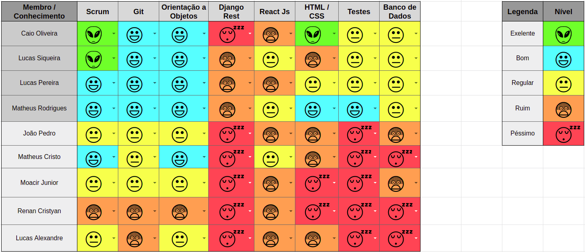

 

## 1. Resumo

 

- Período: 25/03 - 31/03
- Scrum master: Lucas Siqueira
- Product Owner: Caio Oliveira
- Devops: Matheus Rodrigues
- Arquiteto: Lucas Macêdo

 

## 2. Sprint Backlog

 

Tarefas|Pontos
--|--
|[Observação](https://github.com/fga-eps-mds/2019.1-Hora-Da-Hora/issues/8) | 2
|[Documento de Visão](https://github.com/fga-eps-mds/2019.1-Hora-Da-Hora/issues/9) | 3
|[Estudo django rest](https://github.com/fga-eps-mds/2019.1-Hora-Da-Hora/issues/10) | 5
|[NFR](https://github.com/fga-eps-mds/2019.1-Hora-Da-Hora/issues/11) | 5
|[Prototipação](https://github.com/fga-eps-mds/2019.1-Hora-Da-Hora/issues/12) | 3
|[Documento de Abertura do Projeto](https://github.com/fga-eps-mds/2019.1-Hora-Da-Hora/issues/13) | 2
|[Configurar Github Pages](https://github.com/fga-eps-mds/2019.1-Hora-Da-Hora/issues/14) | 1
|[Priorização](https://github.com/fga-eps-mds/2019.1-Hora-Da-Hora/issues/16) | 1
|[Plano de GCS](https://github.com/fga-eps-mds/2019.1-Hora-Da-Hora/issues/17) | 2
|[Plano de GRH](https://github.com/fga-eps-mds/2019.1-Hora-Da-Hora/issues/18) | 1
|[Plano de Tempo](https://github.com/fga-eps-mds/2019.1-Hora-Da-Hora/issues/19) | 2
|[Plano de Custos](https://github.com/fga-eps-mds/2019.1-Hora-Da-Hora/issues/20) | 2
|[Plano de Riscos](https://github.com/fga-eps-mds/2019.1-Hora-Da-Hora/issues/21) | 2
|[Configurar Slack](https://github.com/fga-eps-mds/2019.1-Hora-Da-Hora/issues/7) | 1
|[Configurar Ambiente de Desenvlvimento do Front-End](https://github.com/fga-eps-mds/2019.1-Hora-Da-Hora/issues/15) | 8

Total de Pontos: 40

## 3. Quadro de conhecimento antes do início da sprint

 

 

## 4. Quadro de pareamento

 

Tarefas|Responsáveis
--|--
|[Observação](https://github.com/fga-eps-mds/2019.1-Hora-Da-Hora/issues/8) | Moacir Junior, Renan Cristyan
|[Documento de Visão](https://github.com/fga-eps-mds/2019.1-Hora-Da-Hora/issues/9) | MDS
|[Estudo django rest](https://github.com/fga-eps-mds/2019.1-Hora-Da-Hora/issues/10) | MDS
|[NFR](https://github.com/fga-eps-mds/2019.1-Hora-Da-Hora/issues/11) | Lucas Siqueira, Lucas Alexandre, Lucas Macedo, Matheus Rodrigues
|[Prototipação](https://github.com/fga-eps-mds/2019.1-Hora-Da-Hora/issues/12) | João Pedro, Matheus Estanislau
|[Documento de Abertura do Projeto](https://github.com/fga-eps-mds/2019.1-Hora-Da-Hora/issues/13) | Caio Oliveira 
|[Configurar Github Pages](https://github.com/fga-eps-mds/2019.1-Hora-Da-Hora/issues/14) | Caio Oliveira
|[Priorização](https://github.com/fga-eps-mds/2019.1-Hora-Da-Hora/issues/16) | Caio Oliveira
|[Plano de GCS](https://github.com/fga-eps-mds/2019.1-Hora-Da-Hora/issues/17) |  Lucas Macedo, Matheus Rodrigues
|[Plano de GRH](https://github.com/fga-eps-mds/2019.1-Hora-Da-Hora/issues/18) | Lucas Siqueira
|[Plano de Tempo](https://github.com/fga-eps-mds/2019.1-Hora-Da-Hora/issues/19) | EPS
|[Plano de Custos](https://github.com/fga-eps-mds/2019.1-Hora-Da-Hora/issues/20) | EPS
|[Plano de Riscos](https://github.com/fga-eps-mds/2019.1-Hora-Da-Hora/issues/21) | Lucas Siqueira, Caio Oliveira
|[Configurar Slack](https://github.com/fga-eps-mds/2019.1-Hora-Da-Hora/issues/7) | Caio Oliveira
|[Configurar Ambiente de Desenvlvimento do Front-End](https://github.com/fga-eps-mds/2019.1-Hora-Da-Hora/issues/15) | Matheus Rodrigues, Lucas Macedo

