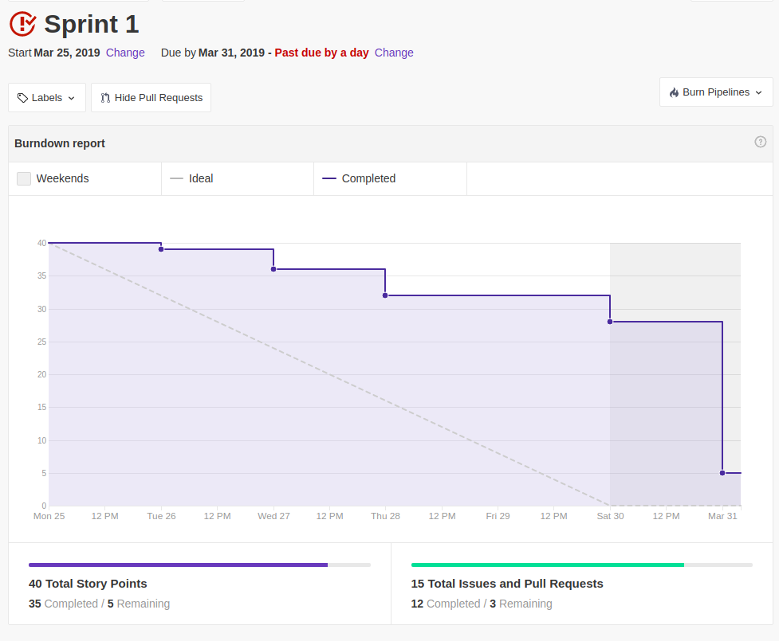
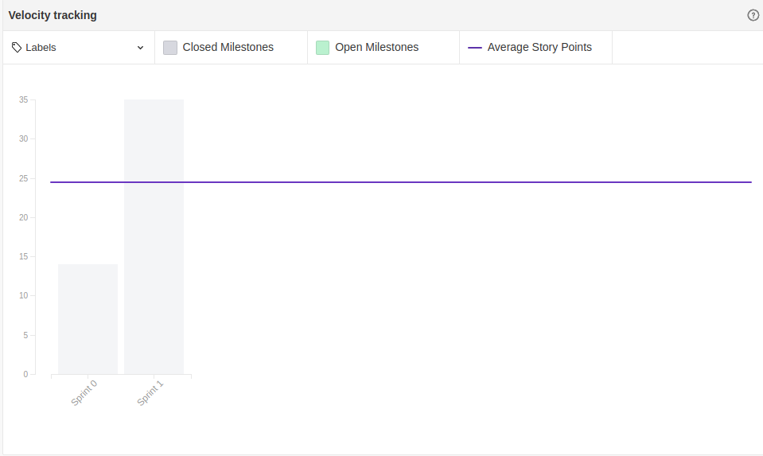

 

## 1. Resumo

 

- Período: 25/03 - 31/03
- Scrum master: Lucas Siqueira
- Product Owner: Caio Oliveira
- Devops: Matheus Rodrigues
- Arquiteto: Lucas Macedo

 

## 2. Resultados da sprint

 

### 2.1 Fechamento da Sprint

 

Tarefas|Status|Pontos
--|--|--
|[Observação](https://github.com/fga-eps-mds/2019.1-Hora-Da-Hora/issues/8)| Concluida | 2
|[Documento de Visão](https://github.com/fga-eps-mds/2019.1-Hora-Da-Hora/issues/9)| Concluida | 3
|[Estudo django rest](https://github.com/fga-eps-mds/2019.1-Hora-Da-Hora/issues/10)| Concluida | 5
|[NFR](https://github.com/fga-eps-mds/2019.1-Hora-Da-Hora/issues/11)| Concluida | 5
|[Prototipação](https://github.com/fga-eps-mds/2019.1-Hora-Da-Hora/issues/12)| Concluida | 3
|[Documento de Abertura do Projeto](https://github.com/fga-eps-mds/2019.1-Hora-Da-Hora/issues/13)| Não concluida | 2
|[Configurar Github Pages](https://github.com/fga-eps-mds/2019.1-Hora-Da-Hora/issues/14)| Concluida| 1
|[Priorização](https://github.com/fga-eps-mds/2019.1-Hora-Da-Hora/issues/16)| Não concluida | 1
|[Plano de GCS](https://github.com/fga-eps-mds/2019.1-Hora-Da-Hora/issues/17)| Concluida | 2
|[Plano de GRH](https://github.com/fga-eps-mds/2019.1-Hora-Da-Hora/issues/18)| Concluida | 1
|[Plano de Tempo](https://github.com/fga-eps-mds/2019.1-Hora-Da-Hora/issues/19)| Não concluida | 2
|[Plano de Custos](https://github.com/fga-eps-mds/2019.1-Hora-Da-Hora/issues/20)| Concluida | 2
|[Plano de Riscos](https://github.com/fga-eps-mds/2019.1-Hora-Da-Hora/issues/21)| Concluida | 2
|[Configurar Slack](https://github.com/fga-eps-mds/2019.1-Hora-Da-Hora/issues/7)| Concluida | 1
|[Configurar Ambiente de Desenvlvimento do Front-End](https://github.com/fga-eps-mds/2019.1-Hora-Da-Hora/issues/15)| Concluida | 8

**Ponto Planejados:** 40

**Pontos Concluídos:** 35

### 2.2 Retrospectiva

 

|Membro|Pontos Positivos|Pontos Negativos|Sugestões de melhoria|
|---|------|-----|---|
|Lucas Siqueira| Muito documento entregue, a equipe de MDS mais comprometida no projeto. | Bot da daily não funcionou corretamente, dívidas referentes a equipe de EPS, devido a mal planejamento da sprint. |Planejar melhor as próximas sprints|
|Lucas Pereira| Muitos planos entregues, conseguimos iniciar a configuração do ambiente. | Planejamos equivocadamente muitas tarefas para a sprint porque achamos que precisam rapidamente. |Aumentar o comprometimento dos membros de EPS|
|Caio Oliveira| Muitos documentos entregues e inicio da configuração do ambiente | Falta de proatividade da equipe de MDS, dívidas da equipe de EPS |Equipe de MDS ser mais independente|
|Matheus Rodrigues| O entendimento a respeito do projeto aumentou por parte de MDS, o time se mostra bem interessado. | Dívidas da equipe de EPS e algumas decisões que já deveriam ter sido tomadas, não foram resolvidas | A equipe não demorar em tomar decisões importantes |
|Moacir Junior| Aprendi a noção baśica de django rest e aumentei o conhecimento sobre o projeto. | Curso muito repetitivo em algumas partes, faltou comunicação efetiva entre os membros de mds. |Prestar atenção e se comunicar com seus pareamentos.|
|João Pedro| Aprendi a noção básica de django rest, consegui usar bem o que foi ensinado nos dojos da sprint passada.  | Curso cansativo e repetitivo, e falta de comunicação entre a equipe de MDS |Ter mais comprometimento e atenção nas tarefas|
|Matheus Cristo| - | - | - |
|Renan Cristyan| Durante essa sprint tive mais colaboração em relação a sprint passada, e foi legal ter essa noção de django rest | Pouco tempo para a realização do curso. |Nenhuma|
|Lucas Alexandre| Aprendi a noção básica de django rest, aprendi a modelar requisitos não funcionais, todos os EPS me ajudaram quando solicitado. | Muitos problemas na configuração do ambiente durante a realização do curso e o git hub pages poderia ser melhor. |Nenhuma.|

## 3. Quadro de conhecimento ao fim da sprint
 

## 4. Burndown
 

 

## 5. Velocity

 

 

## 6. Feedback do Scrum Master

 

Essa sprint foi de extrema importância para definição do projeto, nela conseguimos aplicar diversas técnicas para levantar requisitos. Porém foi uma sprint com muitas tarefas, o que ocasionou em dívidas.

Para essa sprint também iniciamos o ritual das dailys via slack, inicialmente teve 2 membros do time que não participaram de maneira ativa nas dailys durante a semana, porém com o hábito esse problema será resolvido, o resto da equipe mostrou um engajamento muito bom para esse rito.

Analisando o burndown é possível perceber que a equipe conseguiu realizar entregas constantemente ao longo da sprint, porém creio que devido á um mal planejamento de algumas tarefas não conseguimos entregar tudo o que o foi planejado, porém a equipe como um todo demonstrou estar comprometida com o projeto.

Em relação ao quadro de conhecimento é notável o avanço da equipe de desenvolvimento em relação aos seus estudos, mesmo sendo uma melhora pequena, pode-se perceber que  as realizações dos ritos ágeis, a prática de git e os estudos estão sendo efetivos. 

