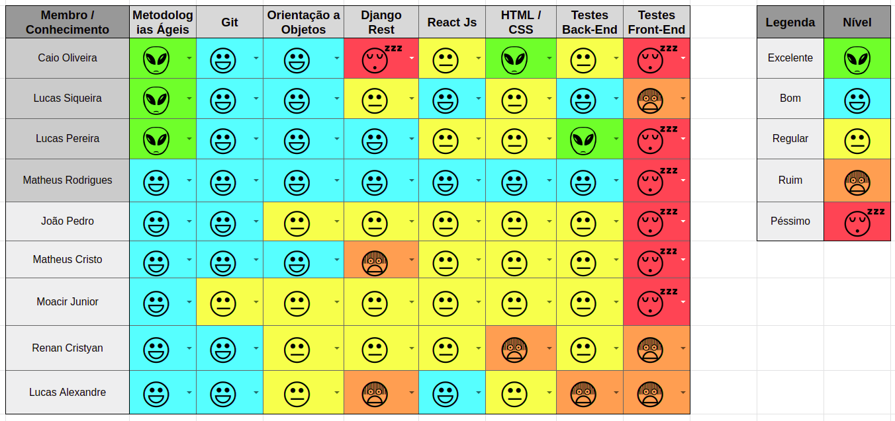

 

## 1. Resumo

 

- Período: 28/05 - 03/06
- Scrum master: Lucas Siqueira
- Product Owner: Caio Oliveira
- Devops: Matheus Rodrigues
- Arquiteto: Lucas Macêdo

 

## 2. Sprint Backlog

 

Tarefas|Pontos
--|--
|[Priorização do Feed](https://github.com/fga-eps-mds/2019.1-MaisMonitoria/issues/148) | 2
|[Refatorar Feedback do Esqueceu Senha](https://github.com/fga-eps-mds/2019.1-maismonitoria/issues/150) | 2
|[Refatorar Configuração dos Repositórios](https://github.com/fga-eps-mds/2019\.1-MaisMonitoria/issues/154) | 3
|[Refatorar Backlog](https://github.com/fga-eps-mds/2019.1-MaisMonitoria/issues/153) | 5
|[Fotos de Perfil](https://github.com/fga-eps-mds/2019.1-MaisMonitoria/issues/152) | 3
|[Página Não Encontrada](https://github.com/fga-eps-mds/2019.1-MaisMonitoria/issues/151) | 5
|[Loading Spinners](https://github.com/fga-eps-mds/2019.1-MaisMonitoria/issues/149) | 3
|[Tela de Perfil](https://github.com/fga-eps-mds/2019.1-MaisMonitoria/issues/147) | 5
|[Documentos do Scrum Master Sprint10](https://github.com/fga-eps-mds/2019.1-MaisMonitoria/issues/146) | 1
|[Like em Monitoria](https://github.com/fga-eps-mds/2019.1-MaisMonitoria/issues/143) | 1
|[*Deploy Contínuo](https://github.com/fga-eps-mds/2019.1-MaisMonitoria/issues/138) | 5
|[*Teste de Usabilidade](https://github.com/fga-eps-mds/2019.1-maismonitoria/issues/139) | 3

Total de pontos de dividas anteriores: 8 

Total de Pontos: 45

## 3. Quadro de conhecimento antes do início da sprint

 

 

## 4. Quadro de pareamento

 

Tarefas|Responsáveis
--|--
|[Priorização do Feed](https://github.com/fga-eps-mds/2019.1-MaisMonitoria/issues/148) | Lucas Alexandre, Moacir Junior
|[Refatorar Feedback do Esqueceu Senha](https://github.com/fga-eps-mds/2019.1-maismonitoria/issues/150) | João Pedro, Matheus Estanislau
|[Refatorar Configuração dos Repositórios](https://github.com/fga-eps-mds/2019\.1-MaisMonitoria/issues/154) | Lucas Macedo, Matheus Rodrigues
|[Refatorar Backlog](https://github.com/fga-eps-mds/2019.1-MaisMonitoria/issues/153) | Lucas Siqueira, Caio Oliveira, Lucas Macedo
|[Fotos de Perfil](https://github.com/fga-eps-mds/2019.1-MaisMonitoria/issues/152) | Matheus Estanislau, Renan Cristyan
|[Página Não Encontrada](https://github.com/fga-eps-mds/2019.1-MaisMonitoria/issues/151) | Lucas Alexandre, Renan Cristyan
|[Loading Spinners](https://github.com/fga-eps-mds/2019.1-MaisMonitoria/issues/149) | Renan Cristyan
|[Tela de Perfil](https://github.com/fga-eps-mds/2019.1-MaisMonitoria/issues/147) | Lucas Alexandre, Moacir Junior
|[Documentos do Scrum Master Sprint 10](https://github.com/fga-eps-mds/2019.1-MaisMonitoria/issues/146) | Lucas Siqueira
|[Like em Monitoria](https://github.com/fga-eps-mds/2019.1-MaisMonitoria/issues/143) | João Pedro, Matheus Estanislau
|[*Deploy Contínuo](https://github.com/fga-eps-mds/2019.1-MaisMonitoria/issues/138) | Matheus Rodrigues
|[*Teste de Usabilidade](https://github.com/fga-eps-mds/2019.1-maismonitoria/issues/139) | Caio Oliveira

