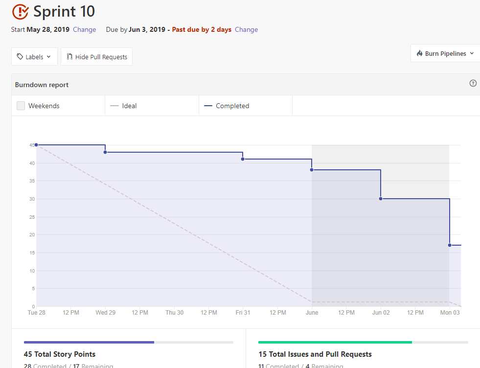
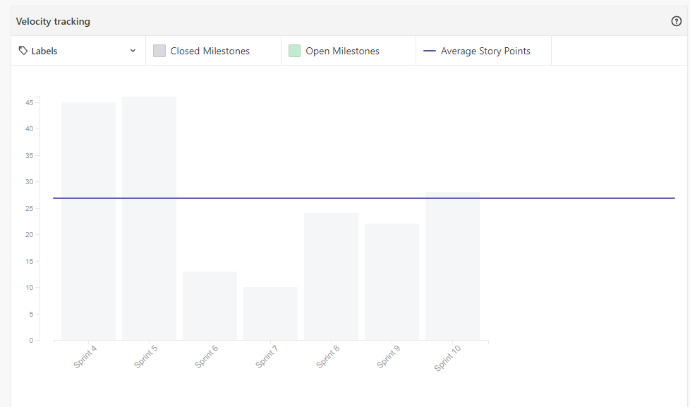
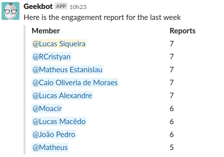

 

## 1. Resumo

 

- Período: 28/05 - 03/06
- Scrum master: Lucas Siqueira
- Product Owner: Caio Oliveira
- Devops: Matheus Rodrigues
- Arquiteto: Lucas Macêdo

 

## 2. Resultados da sprint

 

### 2.1 Fechamento da Sprint

 

Tarefas|Status|Pontos
--|--|--
|[Priorização do Feed](https://github.com/fga-eps-mds/2019.1-MaisMonitoria/issues/148)| Concluida | 2
|[Refatorar Feedback do Esqueceu Senha](https://github.com/fga-eps-mds/2019.1-maismonitoria/issues/150)| Concluida | 2
|[Refatorar Configuração dos Repositórios](https://github.com/fga-eps-mds/2019\.1-MaisMonitoria/issues/154)| Não concluída | 3
|[Refatorar Backlog](https://github.com/fga-eps-mds/2019.1-MaisMonitoria/issues/153)| Concluida | 3
|[Fotos de Perfil](https://github.com/fga-eps-mds/2019.1-MaisMonitoria/issues/152)| Não concluida | 3
|[Página Não Encontrada](https://github.com/fga-eps-mds/2019.1-MaisMonitoria/issues/151)| Concluida | 2
|[Loading Spinners](https://github.com/fga-eps-mds/2019.1-MaisMonitoria/issues/149)| Concluida | 3
|[Tela de Perfil](https://github.com/fga-eps-mds/2019.1-MaisMonitoria/issues/147)| Concluida | 5
|[Documentos do Scrum Master Sprint10](https://github.com/fga-eps-mds/2019.1-MaisMonitoria/issues/146)| Concluida | 1
|[Like em Monitoria](https://github.com/fga-eps-mds/2019.1-MaisMonitoria/issues/143)| Não concluida | 8
|[Tela de Edição de Monitoria](https://github.com/fga-eps-mds/2019.1-MaisMonitoria/issues/144)| Concluida | 5
|[*Deploy Contínuo](https://github.com/fga-eps-mds/2019.1-MaisMonitoria/issues/138)| Concluida | 5
|[*Teste de Usabilidade](https://github.com/fga-eps-mds/2019.1-maismonitoria/issues/139)| Não concluida | 3

**Pontos Planejados:** 45

**Pontos Concluídos:** 28

**Bugs Resolvidos:**

[Botão de Login](https://github.com/fga-eps-mds/2019.1-MaisMonitoria/issues/132)

[Foto do Usuário](https://github.com/fga-eps-mds/2019.1-MaisMonitoria/issues/142)

### 2.2 Retrospectiva

 

|Membro|Pontos Positivos|Pontos Negativos|Sugestões de melhoria|
|---|------|-----|---|
|Lucas Siqueira| Entregas mais frequentes ao longo da sprint. | Não comprimento de todas as tarefas da sprint. | Realizar os testes de usabilidade. |
|Lucas Macêdo| Nenhum. | Os critérios de aceitação dos PRs estão ruins. | Fazer uma revisão mais crítica e construtiva dos PRs, revisar mais rápido. Buscando melhorar a qualidade do produto. |
|Caio Oliveira| Entregas contínuas. | Dívidas. | Nenhuma. |
|Matheus Rodrigues| Nenhum. | Não cumprimento de todas as tarefas. | Dar feedbacks mais rápidos em relação aos PRS. |
|João Pedro| Nenhum. | Demora da revisão dos PRs, pareamento não efetivo por falta de comprometimento. | Nenhuma. |
|Moacir Junior| Nenhum. | Demora na revisão do PR. | Revisar os PR's mais rápido. |
|Matheus Cristo| - | - | - |
|Renan Cristyan| Entrega das issues com antecedência. | Nenhum. | Nenhum. |
|Lucas Alexandre| Entreguei todas as issues com antecedência, sendo agil. | Os critérios de aceitação das issue, as vezes, não é clara. Demora na revisão dos PRs. | Informar melhor o que é pra fazer em relação ao design do projeto. Revisar os PRs com antecedência e dar o feedback mais rápido. |

## 3. Quadro de conhecimento ao fim da sprint

 

## 4. Burndown
 

 

## 5. Velocity

 

 

## 6. Engajamento nas dailys

 

 

## 7. Feedback do Scrum Master

 

### 7.1 Análise dos riscos

 

**R07 - Entregas atrasadas:**
Tivemos quatro dívidas: Teste de Usabilidade, Refatorar Configuração dos Repositórios, Fotos de Perfil, Like em Monitoria.

As ações tomadas foram: Serão adicionadas a próxima sprint, e para o like em monitoria será feita uma alteração no pareamento devido a não efetividade do anterior.

**R12 - Pareamentos não efetivos:**
O pareamento para a issue "Like em Monitoria" não foi efetivo.

As ações tomadas foram: Nenhuma ação foi tomada durante a sprint, porém para a próxima sprint o pareamento será alterado.

### 7.2 Análise geral

 

Nessa sprint tivemos entregas mais constantes ao longo da sprint, porém tivemos dívidas, novamente não foi feito o teste de usabilidade, para a próxima sprint será priorizado e caso o membro delegado para fazer não realizar será feito por outro.

Analisando os indicadores, para o quadro de conhecimento foi feito uma alteração, tiramos a aba de html/css e adicionamos a aba 'material-ui' que é a biblioteca utilizada para a estilização e desenvolvimento do front-end. Quanto ao velocity, nessa sprint tivemos mais pontos planejados, por estarmos entrando na reta final do projeto, apesar das dívidas entregamos um número maior de pontos. Em relação ao burndown, as entregas foram mais constantes. Quanto os ritos ágeis a equipe após uma conversa feita no começo da sprint a equipe se mostrou mais interessada e participativa.

