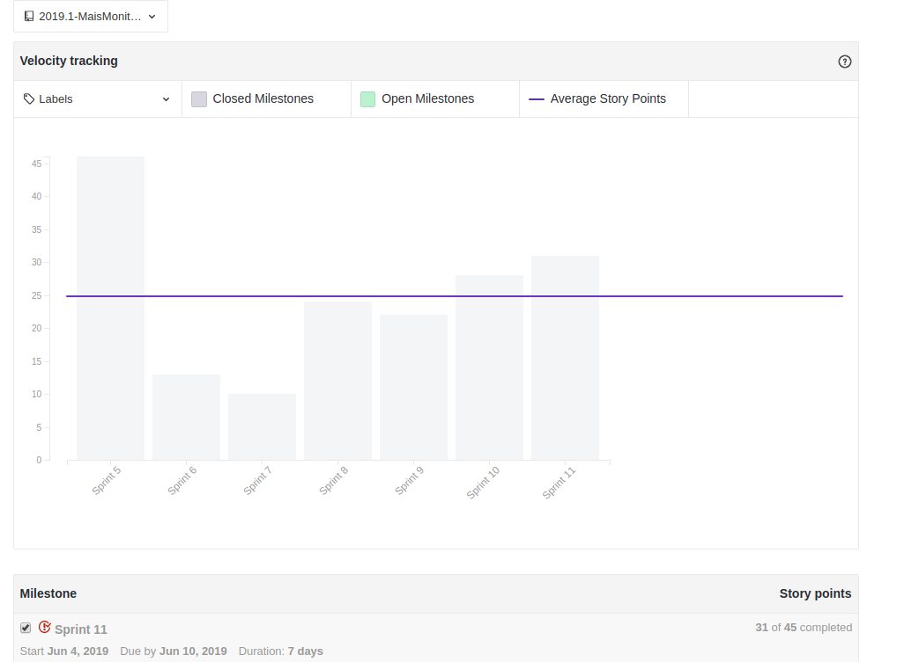
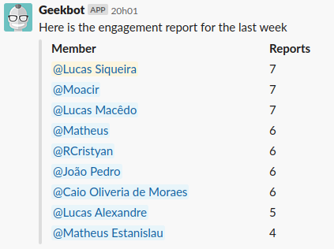

 

## 1. Resumo

 

- Período: 04/06 - 10/06
- Scrum master: Lucas Siqueira
- Product Owner: Caio Oliveira
- Devops: Matheus Rodrigues
- Arquiteto: Lucas Macêdo

 

## 2. Resultados da sprint

 

### 2.1 Fechamento da Sprint

 

Tarefas|Status|Pontos
--|--|--
Tarefas|Pontos
--|--
|[EVM](https://github.com/fga-eps-mds/2019.1-maismonitoria/issues/166)| Concluida | 5
|[Tela de Perfil do Monitor](https://github.com/fga-eps-mds/2019.1-maismonitoria/issues/159)| Concluida | 5
|[Limitar requisições no feed](https://github.com/fga-eps-mds/2019.1-maismonitoria/issues/160)| Concluida | 3
|[Contas no firebase sem cadastro no banco de dados](https://github.com/fga-eps-mds/2019.1-maismonitoria/issues/161)| Não concluida | 3
|[Refatorar Artefatos](https://github.com/fga-eps-mds/2019\.1-MaisMonitoria/issues/162)| Não concluida | 5
|[Refatorar Documento de arquitetura](https://github.com/fga-eps-mds/2019\.1-MaisMonitoria/issues/165)| Não concluida | 3
|[Documentos do Scrum Master Sprint 11](https://github.com/fga-eps-mds/2019.1-MaisMonitoria/issues/164)| Concluida | 1
|[Deploy Contínuo Ambiente de Produção](https://github.com/fga-eps-mds/2019.1-MaisMonitoria/issues/138)| Não concluida | 3
|[*Teste de Usabilidade](https://github.com/fga-eps-mds/2019.1-maismonitoria/issues/163)| Concluida | 3
|[*Refatorar Configuração dos Repositórios](https://github.com/fga-eps-mds/2019\.1-MaisMonitoria/issues/154)| Concluida | 3
|[*Like em Monitoria](https://github.com/fga-eps-mds/2019.1-maismonitoria/issues/143)| Concluida | 8
|[*Fotos de Perfil](https://github.com/fga-eps-mds/2019.1-maismonitoria/issues/152)| Concluida | 3

**Pontos Planejados:** 

**Pontos Concluídos:** 

**Bugs Resolvidos:**

### 2.2 Retrospectiva

 

|Membro|Pontos Positivos|Pontos Negativos|Sugestões de melhoria|
|---|------|-----|---|
|Lucas Siqueira| Testes de usabilidade. | Não comprimento de todas as tarefas da sprint. | Nenhuma. |
|Lucas Macêdo| Nenhum. | Dividas. | Não deixar dividas. |
|Caio Oliveira|  Testes de usabilidade. | Não comprimento de todas as tarefas da sprint. | Nenhuma.|
|Matheus Rodrigues|  Nenhum. | Não comprimento de todas as tarefas da sprint. | Nenhuma. |
|João Pedro| Boa produtividade. | Nenhum. | Nenhuma. |
|Moacir Junior| Nenhum. | Nenhum. | Nenhuma. |
|Matheus Cristo| Melhora na produtividade. | Nenhum. | Nenhuma. |
|Renan Cristyan| Entrega das issues com antecedência. | Nenhum. | Nenhum. |
|Lucas Alexandre| Nenhum. | Nenhum. | Nenhuma. |

## 3. Quadro de conhecimento ao fim da sprint

 

## 4. Burndown
 

 

## 5. Velocity

 

 

## 6. Engajamento nas dailys

 

 

## 7. Feedback do Scrum Master

 

### 7.1 Análise dos riscos

 

**R07 - Entregas atrasadas:**
Tivemos quatro dívidas: Contas no firebase sem cadastro no banco de dados, Refatorar artefatos, Refatorar documento de arquitetura, Deploy Contínuo Ambiente de Produção.

As ações tomadas foram: Serão realocadas nas duas sprints finais.

### 7.2 Análise geral

 

Como principal ponto positivo da sprint, tivemos a realização de testes de usabilidade, onde encontramos alguns bugs que tem impacto grande na usabilidade. Para a reta final do projeto, focaremos em ajustar o produto segundo os feedbacks, visando melhorar o produto a fim de torna-lo o mais apresentavél e usavél possivel.

