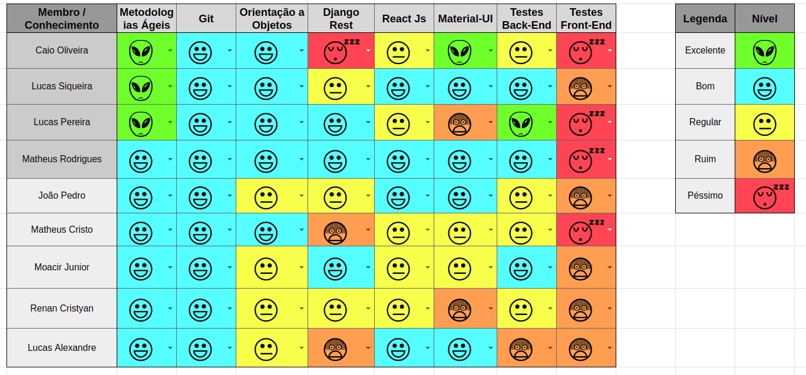

 

## 1. Resumo

 

- Período: 11/06 - 17/06
- Scrum master: Lucas Siqueira
- Product Owner: Caio Oliveira
- Devops: Matheus Rodrigues
- Arquiteto: Lucas Macêdo

 

## 2. Sprint Backlog

 

Tarefas|Pontos
--|--
|[Tela de Perfil na lista de likes](https://github.com/fga-eps-mds/2019.1-maismonitoria/issues/169) | 2
|[Deletar monitoria](https://github.com/fga-eps-mds/2019.1-maismonitoria/issues/171) | 3
|[Refatorar deletar like da monitoria](https://github.com/fga-eps-mds/2019.1-maismonitoria/issues/173) | 5
|[Bug multiplicar likes/monitorias](https://github.com/fga-eps-mds/2019.1-maismonitoria/issues/171) | 5
|[Bug editar perfil](https://github.com/fga-eps-mds/2019.1-maismonitoria/issues/174) | 3
|[Refatorar campos criar/editar monitoria](https://github.com/fga-eps-mds/2019.1-maismonitoria/issues/172) | 3
|[Documentos do Scrum Master Sprint 12](https://github.com/fga-eps-mds/2019.1-MaisMonitoria/issues/175) | 1
|[*Deploy Contínuo Ambiente de Produção](https://github.com/fga-eps-mds/2019.1-MaisMonitoria/issues/138) | 3
|[*Contas no firebase sem cadastro no banco de dados](https://github.com/fga-eps-mds/2019.1-maismonitoria/issues/161) | 3

Total de pontos de dividas anteriores: 30

Total de Pontos: 6

## 3. Quadro de conhecimento antes do início da sprint

 

 

## 4. Quadro de pareamento

 

Tarefas|Responsáveis
--|--
|[Tela de Perfil na lista de likes](https://github.com/fga-eps-mds/2019.1-maismonitoria/issues/169) | Moacir Junior, Renan Cristyan
|[Deletar monitoria](https://github.com/fga-eps-mds/2019.1-maismonitoria/issues/171) | João Pedro, Lucas Alexandre
|[Refatorar deletar like da monitoria](https://github.com/fga-eps-mds/2019.1-maismonitoria/issues/173) | Moacir Junior, Matheus Estanislau
|[Bug multiplicar likes/monitorias](https://github.com/fga-eps-mds/2019.1-maismonitoria/issues/171) | João Pedro, Lucas Alexandre
|[Bug editar perfil](https://github.com/fga-eps-mds/2019.1-maismonitoria/issues/174) | Matheus Estanislau
|[Refatorar campos criar/editar monitoria](https://github.com/fga-eps-mds/2019.1-maismonitoria/issues/172) | Moacir Junior, Renan Cristyan
|[Documentos do Scrum Master Sprint 12](https://github.com/fga-eps-mds/2019.1-MaisMonitoria/issues/175) | Lucas Siqueira
|[Deploy Contínuo Ambiente de Produção*](https://github.com/fga-eps-mds/2019.1-MaisMonitoria/issues/138) | Matheus Rodrigues
|[Contas no firebase sem cadastro no banco de dados*](https://github.com/fga-eps-mds/2019.1-maismonitoria/issues/161) | João Pedro, Renan Cristyan

