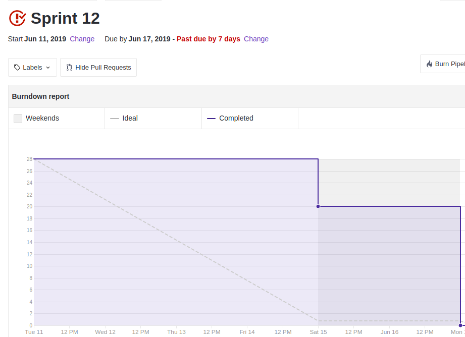
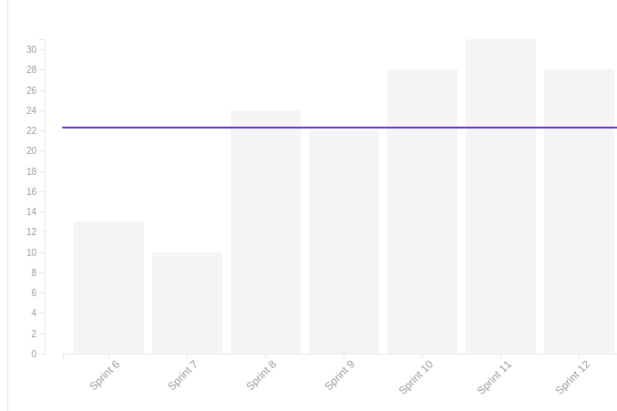

 

## 1. Resumo

 

- Período: 04/06 - 10/06
- Scrum master: Lucas Siqueira
- Product Owner: Caio Oliveira
- Devops: Matheus Rodrigues
- Arquiteto: Lucas Macêdo

 

## 2. Resultados da sprint

 

### 2.1 Fechamento da Sprint

 

Tarefas|Status|Pontos
--|--|--
|[Tela de Perfil na lista de likes](https://github.com/fga-eps-mds/2019.1-maismonitoria/issues/169)| Concluida | 2
|[Deletar monitoria](https://github.com/fga-eps-mds/2019.1-maismonitoria/issues/171)| Concluida | 3
|[Refatorar deletar like da monitoria](https://github.com/fga-eps-mds/2019.1-maismonitoria/issues/173)| Concluida | 5
|[Bug multiplicar likes/monitorias](https://github.com/fga-eps-mds/2019.1-maismonitoria/issues/171)| Concluida | 8
|[Bug editar perfil](https://github.com/fga-eps-mds/2019.1-maismonitoria/issues/174)| Concluida | 3
|[Refatorar campos criar/editar monitoria](https://github.com/fga-eps-mds/2019.1-maismonitoria/issues/172)| Concluida | 3
|[Documentos do Scrum Master Sprint 12](https://github.com/fga-eps-mds/2019.1-MaisMonitoria/issues/175)| Concluida | 1
|[*Deploy Contínuo Ambiente de Produção](https://github.com/fga-eps-mds/2019.1-MaisMonitoria/issues/138) | 3
|[*Contas no firebase sem cadastro no banco de dados](https://github.com/fga-eps-mds/2019.1-maismonitoria/issues/161)| Concluida | 3

**Pontos Planejados:** 31

**Pontos Concluídos:** 28

### 2.2 Retrospectiva

 

|Membro|Pontos Positivos|Pontos Negativos|Sugestões de melhoria|
|---|------|-----|---|
|Lucas Siqueira|  Vai acabar o projeto, bugs resolvidos. |  Falta de tempo hábil por grande parte da equipe.  | Fazer os ajustes finais para entregar o produto |
|Lucas Macêdo| Bug de multiplicar requisições aparentemente resolvido. | Dívida, pessoal ignorando as issues de estudo |  Não deixar dívidas infinitas e ignorar as issues. |
|Caio Oliveira|  - | - | - |
|Matheus Rodrigues|  - | - | - |
|João Pedro| Estamos conseguindo terminar o que foi planejado. |  Demora para entregar as issues, todos ocupados com outras matérias | Tentar entregar as coisas antes. |
|Moacir Junior| Terminando o que foi planejado |  Pessoal de MDS não ter tanta noção para terminar o documento de arquitetura. |  Alguém com mais experiência de EPS ajudar no documento de arquitetura. |
|Matheus Cristo| Bugs resolvidos | Falta de tempo hábil. | Nenhuma. |
|Renan Cristyan| - | - | - |
|Lucas Alexandre| -| - | - |

## 3. Quadro de conhecimento ao fim da sprint

 

## 4. Burndown
 

 

## 5. Velocity

 

 

## 6. Engajamento nas dailys

 

 

## 7. Feedback do Scrum Master

 

### 7.1 Análise dos riscos

 

**R07 - Entregas atrasadas:**
Tivemos uma divida relacionada ao deploy continuo no ambiente de produção, se deu devido a necessidade de um PR para master.

As ações tomadas foram: Será feita na sprint final.

**R13 - Conflito entre entregas da sprint e de tarefas de outras disciplinas.:**
Toda a equipe esteve ocupada durante a sprint com provas e entregas de outras disiciplinas, o que fez com que as entrega fossem feitas tardiamente.

Nenhuma ação foi tomada.

### 7.2 Análise geral

 

Foi uma sprint produtiva, onde conseguimos resolver os bugs encontrados nos testes de usabilidade, e mesmo com pouco tempo disponível por parte da equipe conseguimos concluir quase todas as atividades propostas, mantendo uma base parecida de pontos no velocity. Não tiveram alterações no quadro de conhecimento devido a curva de aprendizado ter chegado em um ponto mais dificíl de ser evoluida.

Para a proxima sprint focaremos em resolver as pendencias finais do projeto e em preparar nossa apresentação final.

