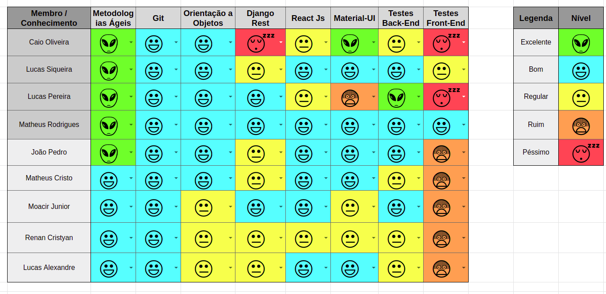
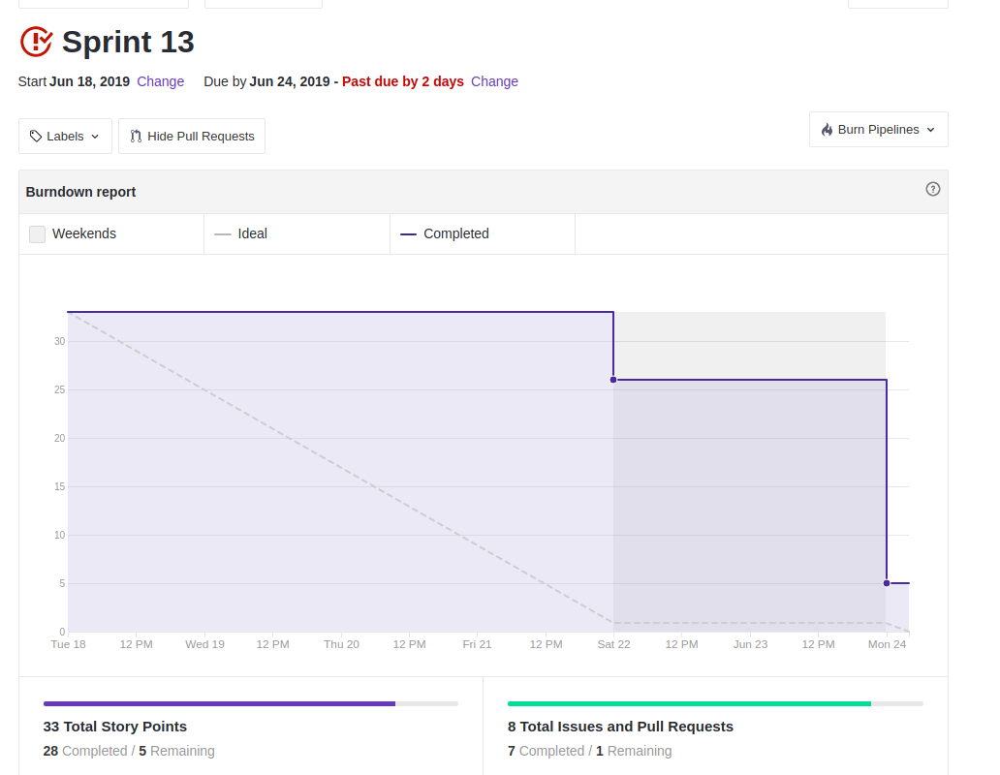
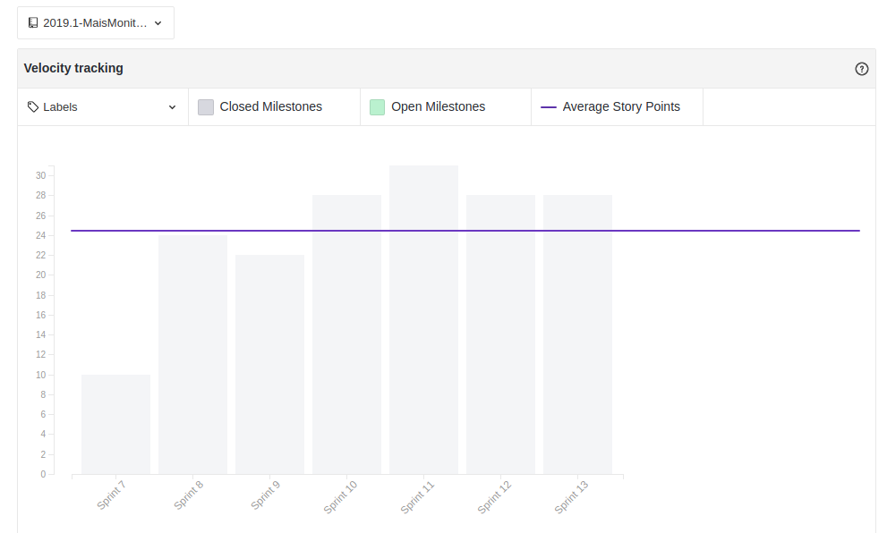

 

## 1. Resumo

 

- Período: 18/06 - 24/06
- Scrum master: Lucas Siqueira
- Product Owner: Caio Oliveira
- Devops: Matheus Rodrigues
- Arquiteto: Lucas Macêdo

 

## 2. Resultados da sprint

 

### 2.1 Fechamento da Sprint

 

Tarefas|Status|Pontos
--|--|--
|[Preparação para R2](https://github.com/fga-eps-mds/2019.1-maismonitoria/issues/180) | Concluida |8
|[Documentos do Scrum Master Sprint 13](https://github.com/fga-eps-mds/2019.1-MaisMonitoria/issues/182)| Concluida | 2
|[Post mortem](https://github.com/fga-eps-mds/2019.1-maismonitoria/issues/177)| Concluida | 5
|[Lançar release notes](https://github.com/fga-eps-mds/2019.1-maismonitoria/issues/178)| Concluida | 2
|[*Deploy Contínuo Ambiente de Produção](https://github.com/fga-eps-mds/2019.1-MaisMonitoria/issues/165)| Concluida | 3
|[*Refatorar artefatos](https://github.com/fga-eps-mds/2019.1-maismonitoria/issues/162)| Não Concluida | 5
|[*Cenarios](https://github.com/fga-eps-mds/2019.1-maismonitoria/issues/120) | Concluida| 5
|[*Refatorar documento de arquitetura](https://github.com/fga-eps-mds/2019.1-maismonitoria/issues/165)| Concluida | 3
**Pontos Planejados:** 33

**Pontos Concluídos:** 28

### 2.2 Retrospectiva

 

|Membro|Pontos Positivos|Pontos Negativos|Sugestões de melhoria|
|---|------|-----|---|
|Lucas Siqueira|  Projeto vai acabar. | Ainda vão ficar issues abertas e o front end não foi devidamente testado. | Nenhuma. |
|Lucas Macêdo| Nenhum. | Os documentos não foram devidamente refatorados, e a preparação para a apresentação deixou a desejar. | Nenhum. |
|Caio Oliveira|  O projeto acabou. | Muitas coisas para entregar em cima da hora. | Nenhuma. |
|Matheus Rodrigues| O projeto acabou. | Nenhum. | Nenhuma. |
|João Pedro| O projeto acabou. | Cansaço, muitas discussões durante o projeto. | Nenhuma. |
|Moacir Junior| O projeto acabou, entregamos o que foi proposto, não vou mais ver a cara do joão e nem responder dailys. | Testes do frontend. |  Nenhuma |
|Matheus Cristo| Entregamos o que foi proposto. | Testes do frontend. | Nenhuma. |
|Renan Cristyan| - | - | - |
|Lucas Alexandre| Nenhum. | A matéria acabou. | Nenhuma. |

## 3. Quadro de conhecimento ao fim da sprint

 

## 4. Burndown
 

 

## 5. Velocity

 

 

## 6. Post Mortem

> Post Mortem disponível em: https://fga-eps-mds.github.io/2019.1-MaisMonitoria/docs/doc-postmortem

