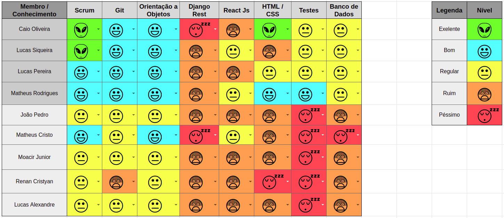

## 1. Resumo

- Período: 01/04 - 07/04
- Scrum master: Lucas Siqueira
- Product Owner: Caio Oliveira
- Devops: Matheus Rodrigues
- Arquiteto: Lucas Macêdo

## 2. Sprint Backlog
Tarefas|Pontos
--|--
|[Descrição da metodologia](https://github.com/fga-eps-mds/2019.1-Hora-Da-Hora/issues/29) | 2
|[Configurar ambiente de desenvolvimento do back-end](https://github.com/fga-eps-mds/2019.1-Hora-Da-Hora/issues/31) | 5
|[Documento de arquitetura](https://github.com/fga-eps-mds/2019.1-Hora-Da-Hora/issues/28) | 8
|[Folha de estilo](https://github.com/fga-eps-mds/2019.1-Hora-Da-Hora/issues/27) | 2
|[Prototipo de alta fidelidade](https://github.com/fga-eps-mds/2019.1-Hora-Da-Hora/issues/30) | 5
|[Documento de Abertura do Projeto](https://github.com/fga-eps-mds/2019.1-Hora-Da-Hora/issues/13) | 2 
|[Refatorar Github Pages](https://github.com/fga-eps-mds/2019.1-Hora-Da-Hora/issues/14) | 5
|[Priorização](https://github.com/fga-eps-mds/2019.1-Hora-Da-Hora/issues/16) | 1
|[Documentos do scrum master sprint 2](https://github.com/fga-eps-mds/2019.1-Hora-Da-Hora/issues/22) | 1
|[Dojo de Pytest](https://github.com/fga-eps-mds/2019.1-Hora-Da-Hora/issues/26) | 3
|[Plano de Tempo](https://github.com/fga-eps-mds/2019.1-Hora-Da-Hora/issues/19) | 2

Total de Pontos: 36

## 3. Quadro de conhecimento antes do início da sprint

 

 

## 4. Quadro de pareamento
Tarefas|Responsáveis
--|--
|[Descrição da metodologia](https://github.com/fga-eps-mds/2019.1-Hora-Da-Hora/issues/29) | Lucas Siqueira, João Pedro
|[Configurar ambiente de desenvolvimento do back-end](https://github.com/fga-eps-mds/2019.1-Hora-Da-Hora/issues/31) | Matheus Rodrigues, Lucas Macedo
|[Documento de arquitetura](https://github.com/fga-eps-mds/2019.1-Hora-Da-Hora/issues/28) | MDS
|[Folha de estilo](https://github.com/fga-eps-mds/2019.1-Hora-Da-Hora/issues/27) | Matheus Estanislau, Renan Cristyan
|[Prototipo de alta fidelidade](https://github.com/fga-eps-mds/2019.1-Hora-Da-Hora/issues/30) | Moacir Junior, Lucas Alexandre, Caio Oliveira
|[Documento de Abertura do Projeto](https://github.com/fga-eps-mds/2019.1-Hora-Da-Hora/issues/13) | Caio Oliveira 
|[Refatorar Github Pages](https://github.com/fga-eps-mds/2019.1-Hora-Da-Hora/issues/14) | Caio Oliveira
|[Priorização](https://github.com/fga-eps-mds/2019.1-Hora-Da-Hora/issues/16) | Caio Oliveira
|[Documentos do scrum master sprint 2](https://github.com/fga-eps-mds/2019.1-Hora-Da-Hora/issues/22) | Lucas Siqueira
|[Dojo de Pytest](https://github.com/fga-eps-mds/2019.1-Hora-Da-Hora/issues/26) | Lucas Macedo, MDS
|[Plano de Tempo](https://github.com/fga-eps-mds/2019.1-Hora-Da-Hora/issues/19) | EPS

