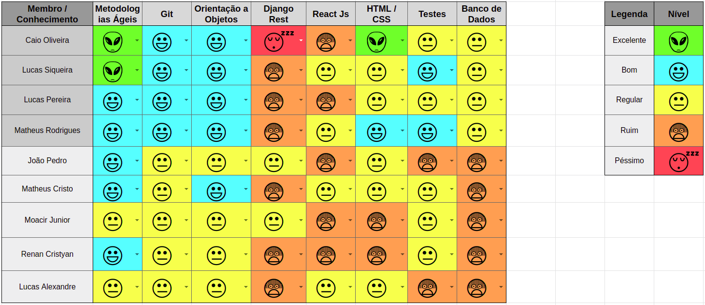
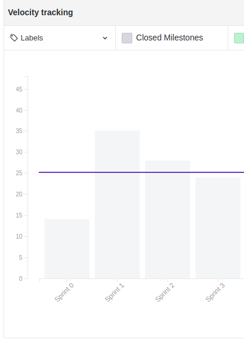
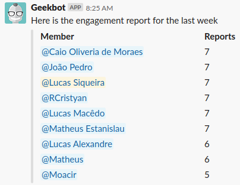

 

## 1. Resumo

 

- Período: 15/04 - 21/04
- Scrum master: Lucas Siqueira
- Product Owner: Caio Oliveira
- Devops: Matheus Rodrigues
- Arquiteto: Lucas Macedo

 

## 2. Resultados da sprint

 

### 2.1 Fechamento da Sprint

 

Tarefas|Status|Pontos
--|--|--
|[Modelagem da estrutura de classes e banco de dados de usuário](https://github.com/fga-eps-mds/2019.1-Hora-Da-Hora/issues/46) | Concluida | 5
|[Avaliação técnica da autenticação](https://github.com/fga-eps-mds/2019.1-Hora-Da-Hora/issues/45) | Concluida | 5
|[Modelagem de telas estáticas](https://github.com/fga-eps-mds/2019.1-Hora-Da-Hora/issues/45) | Não Concluida | 5
|[Realizar revisão textual e de conteúdo dos documentos](https://github.com/fga-eps-mds/2019.1-Hora-Da-Hora/issues/42) | Concluida | 2
|[Refatorar Github Pages](https://github.com/fga-eps-mds/2019.1-Hora-Da-Hora/issues/14) | Concluida | 5
|[Priorização](https://github.com/fga-eps-mds/2019.1-Hora-Da-Hora/issues/16) | Concluida | 1
|[Documentos do scrum master sprint 3](https://github.com/fga-eps-mds/2019.1-Hora-Da-Hora/issues/22) | Concluida | 1
|[Plano de Tempo](https://github.com/fga-eps-mds/2019.1-Hora-Da-Hora/issues/19) | Concluida | 2
|[Plano de Medição](https://github.com/fga-eps-mds/2019.1-Hora-Da-Hora/issues/43) | Concluida | 3

**Ponto Planejados:** 29

**Pontos Concluídos:** 24

### 2.2 Retrospectiva

 

|Membro|Pontos Positivos|Pontos Negativos|Sugestões de melhoria|
|---|------|-----|---|
|Lucas Siqueira| Fechou as dividas anteriores, pareamentos foram efetivos. | Sprint foi planejada de acordo com velocity para não ter dívidas e mesmo assim tivemos dívidas |Aumentar o foco nas reuniões.|
|Lucas Pereira| Fechou as dívidas antigas, pareamentos efetivos, conclusão do layout do pages. | Surgiu a primeira dívida da equipe de MDS, e a equipe de MDS achando que dúvidas são normais, devido às dívidas anteriores de EPS, faltou foco na reunião. |Aumentar o foco durante as reuniões e não deixar mais dívidas.|
|Caio Oliveira| Diminuiram as dividas, amadurecimento da equipe de MDS. | Reunião não foi tão produtiva quanto deveria, deixamos dívidas que poderiam ter sido feitas. |Os MDS aprenderem a buscar as coisas sozinhos.|
|Matheus Rodrigues| A equipe se empenhou para concluir suas histórias e fechar as dívidas anteriores. | Reunião pouco produtiva.| Mais foco nas reuniões.|
|Moacir Junior| Diminuíram as dívidas. | Excesso de piadas durante a reunião. |Mais foco durante as reuniões. |
|João Pedro| Diminuíram as dívidas, maior entendimento das metodologias ágeis, pareamentos efetivos. | Reunião não foi levada tão a sério. |Levar mais a sérios as reuniões.|
|Matheus Cristo| Maior comprometimento da equipe, proatividade da equipe. | Dificuldade no entendimento da documentação para fazer as telas, excesso de piadas. |Ter mais seriedade nas reuniões presenciais.|
|Renan Cristyan| Diminuíram as dívidas, equipe engajada nas atividades. | Fui o que menos contribui nesta semana. |Buscar melhorar na próxima sprint, saber diferenciar a hora das brincadeiras.|
|Lucas Alexandre| Nenhum. | Dificuldade em utilizar o framework. |Parar de zuar nas reuniões.|

## 3. Quadro de conhecimento ao fim da sprint

 

## 4. Burndown
 

 

## 5. Velocity

 

 

## 6. Engajamento nas dailys

 

 

## 7. Feedback do Scrum Master

 

### 7.1 Análise dos riscos

 

**Riscos ocorridos durante a sprint:**

**R01 - Dificuldade com as tecnologias:**

Ocorreu dificuldade na modelagem de telas estáticas no react js, devido a pouco experiência e conhecimento da tecnologia.
As ações tomadas foram: Acompanhamento de perto de um membro de EPS na realização das atividades, e reunião presencial.

**R07 - Entregas atrasadas:**

As entregas atrasadas da sprint passada foram resolvidas, porém nessa sprint tivemos a dívida da modelagem das telas estáticas no react js devido a dificuldade com as tecnologias.

As ações tomadas foram: Adiamento para a próxima sprint, porém mantivemos o pareamento porque eles estudaram e aprenderam melhor a tecnologia.

**R13 - Conflito com entregas de outras disciplinas**

Os membro Lucas Siqueira e Lucas Macedo da equipe de EPS tiveram prova na segunda.

As ações tomadas foram: Tentamos ao máximo depender menos dos últimos dias da sprint para realizar as tarefas, porém ainda sim tivemos que fazer uma reunião presencial no sábado.

### 7.2 Análise geral

 

Nessa sprint, demos início a modelagem das classes e a modelar as telas com o reactjs, devido a ser o começo do uso da tecnologia pela equipe de MDS, eles tiveram dificuldades e foi necessário aumentar o acompanhando de um membro de EPS nesta tarefa, devido à isso, achamos necessário uma reunião presencial, onde o arquiteto junto aos MDS que ajudaram na modelagem das classes aproveitaram para apresentar esta modelagem para toda a equipe.

Analisando o velocity, está sprint foi planejada dentro da pontuação recomendada, porém contou com a dificuldade citada acima, onde ficou divida a tarefa da modelagem das telas estáticas no reactjs. Apesar de não termos conseguido entregar tudo o que foi planejado, para a próxima sprint assumimos o risco de planejar mais pontos, visto que falta apenas duas sprints para a release 1 e ainda tem muito a ser feito até lá.

Quanto ao burndown, nota-se que a equipe não foi muito produtiva nos primeiros dias, porém ocorreu um esforço significativo no final para termos o máximo de tarefas entregues.

Em relação ao quadro de conhecimento percebemos que os MDS que ficaram com a parte das telas no reactjs tiveram um aumento em seu conhecimento das tecnologias utilizadas, e os que ficaram na modelagem das classes estudaram também a viabilidade de implementá-las, logo elevaram seu conhecimento nessa parte. A partir disto o objetivo será nívelalos tentando rodar ao máximo os pareamentos.

Nesta sprint também analisei a planilha de horas que está sendo preenchida pela equipe de MDS, nota-se que todos da equipe estão trabalhando no mesmo ritmo, quase sempre cumprindo às horas semanais planejadas, porém âs vezes estão perdendo tempo com estudos pouco efetivos. Acredito que nas proximas sprints será necessário um esforço maior, visto que planejaremos mais tarefas e está cada vez mais proximo da data da primeira entrega da disciplina.

