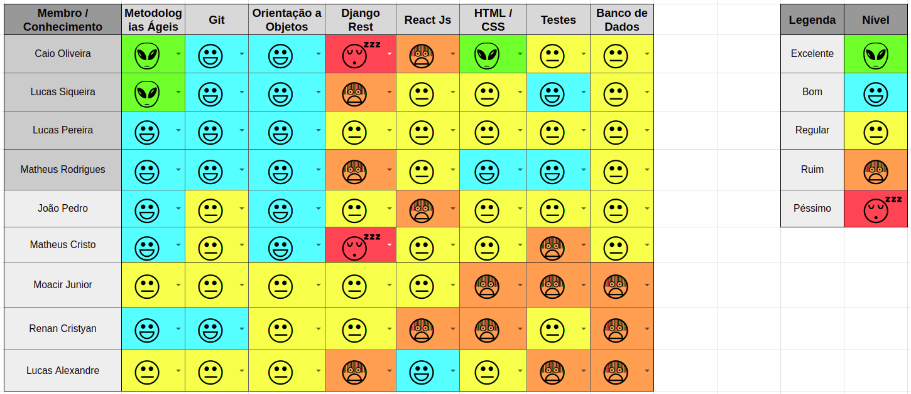
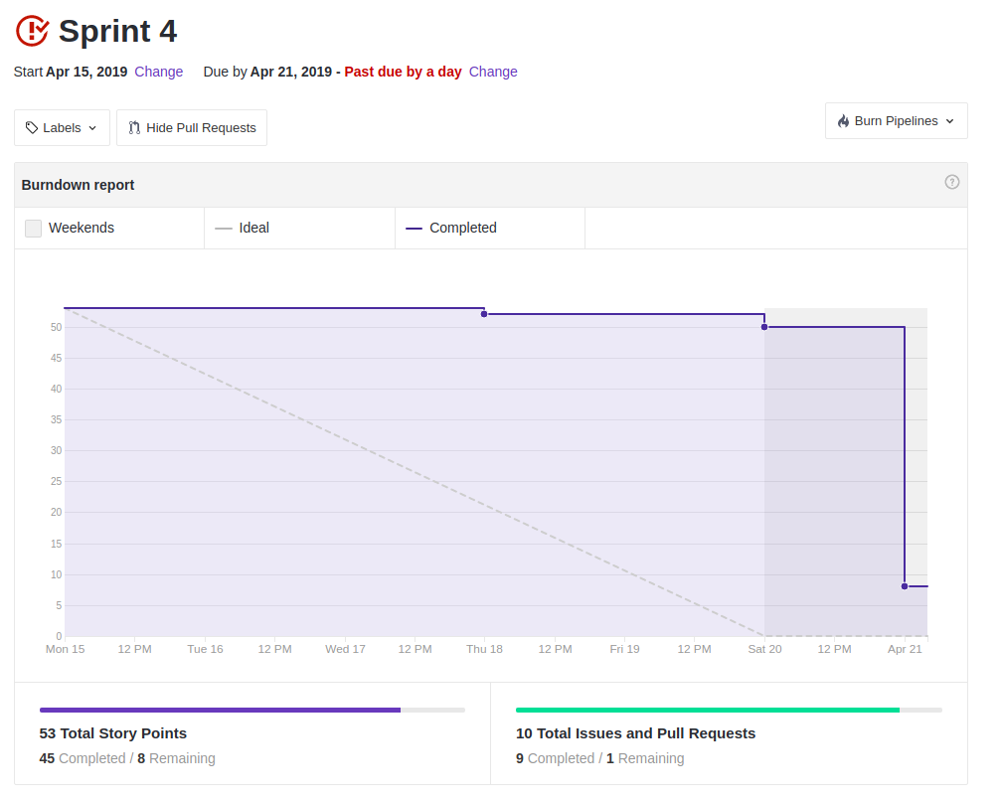
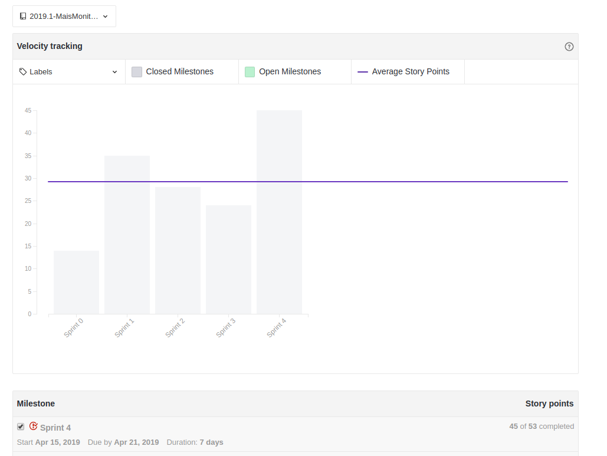
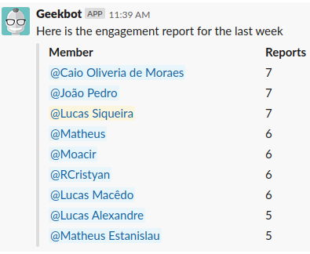

 

## 1. Resumo

 

- Período: 15/04 - 21/04
- Scrum master: Lucas Siqueira
- Product Owner: Caio Oliveira
- Devops: Matheus Rodrigues
- Arquiteto: Lucas Macedo

 

## 2. Resultados da sprint

 

### 2.1 Fechamento da Sprint

 

Tarefas|Status|Pontos
--|--|--
|[Implantação da estrutura de classes e do banco de dados de usuário](https://github.com/fga-eps-mds/2019.1-MaisMonitoria/issues/58)| Concluida | 8
|[Documentos do scrum master sprint 4](https://github.com/fga-eps-mds/2019.1-MaisMonitoria/issues/63)| Concluida | 1
|[Pipeline DevOps](https://github.com/fga-eps-mds/2019.1-MaisMonitoria/issues/62) |Concluida |3
|[Modelagem de telas estáticas](https://github.com/fga-eps-mds/2019.1-Hora-Da-Hora/issues/45)| Concluida | 5
|[Home git pages](https://github.com/fga-eps-mds/2019.1-MaisMonitoria/issues/61) |Concluida |2
|[Community](https://github.com/fga-eps-mds/2019.1-MaisMonitoria/issues/60)| Concluida | 3
|[Modelagem da estrutura de classes e do banco de dados de monitoria](https://github.com/fga-eps-mds/2019.1-MaisMonitoria/issues/59)| Concluida | 5
|[Implantar estrutura de classes e do banco de dados de monitoria](https://github.com/fga-eps-mds/2019.1-MaisMonitoria/issues/57)| Concluida | 13
|[Disponibilizar autenticação por API externa](https://github.com/fga-eps-mds/2019.1-MaisMonitoria/issues/56)| Não concluida | 8
|[Gerenciamento de requisição](https://github.com/fga-eps-mds/2019.1-MaisMonitoria/issues/55)| Concluida | 5

**Ponto Planejados:** 53

**Pontos Concluídos:** 45

### 2.2 Retrospectiva

 

|Membro|Pontos Positivos|Pontos Negativos|Sugestões de melhoria|
|---|------|-----|---|
|Lucas Siqueira| Amadurecimento da equipe de desenvolvimento, tendo a primeira sprint com codificação do backend. | issues concluídas mudando os critérios de aceitação planejados anteriormente, e equipe confiou muito na reunião de sábado e não foi ágil durante a semana. | Ter mais comprometimento e não deixar as coisas para serem feitas em cima da hora. |
|Lucas Macêdo| Iniciamos a e adiantamos bem a codificação do backend. | Tivemos dívidas novamente, foram quebrados critérios de aceitação de algumas issues e não foi possível integrar o front e back por motivos que poderiam ser evitados. | Descrever melhor as issues para não haver novamente falha na integração. |
|Caio Oliveira| Nenhum. | Falta de comprometimento de MDS com as práticas ágeis, falta de atenção nas reuniões, MDS dependendo muito da equipe de EPS. | Independência dos MDS, comprometimento da equipe com o projeto |
|Matheus Rodrigues|  Alguns membros de mds se mostraram preocupados e mostraram disposição para se empenhar mais. | Pouca produtividade ao decorrer da sprint. | Aumentar a disposição em relação aos interesses da disciplina. |
|João Pedro| Aprendizado geral de todos do grupo, pareamento efetivo, muito apoio da equipe de EPS. | Deixou para fazer em cima, mal planejamento de tempo da equipe de MDS, perda da segunda-feira. | Maior comprometimento. |
|Moacir Junior| Aprendemos a trabalhar com o django, aprendemos a entender melhor os erros, pareamento efetivo, apoio muito bom da equipe de EPS. | Dependência circular entre as issues, deveria ter me esforçados mais quando erros apareceram. | Evitar as dependências das atividades. |
|Matheus Cristo| Pareamento engajado, porém não tão eficiente. | Issue mal descrita, orientação deixou a desejar. | Descrever melhor as issues, maior apoio do Product Owner. |
|Renan Cristyan| Início da codificação, sanando muitas dúvidas. | Deixamos muitas coisas para o reunião de sábado. | Nenhuma. |
|Lucas Alexandre| Aprendi a mexer melhor no react e no framework material-ui | Divida. | Mais seriedade nas entregas. |

## 3. Quadro de conhecimento ao fim da sprint

 

## 4. Burndown
 

 

## 5. Velocity

 

 

## 6. Engajamento nas dailys

 

 

## 7. Feedback do Scrum Master

 

### 7.1 Análise dos riscos

 

**Riscos ocorridos durante a sprint:**

Foi assumido o risco de planejar mais pontos que o velocity recomenda, visto que tínhamos apenas duas semanas para a primeira entrega da disciplina.

**R01 - Dificuldade com as tecnologias:**
Nessa sprint ocorreu o desenvolvimento da api monitorias, nela a equipe de MDS apresentou dificuldades com a tecnologia usada.
A dívida da sprint anterior: Modelagem de telas estáticas com reactjs também voltou a gerar dificuldades acerca da tecnologia.

As ações tomadas foram: Acompanhamento maior da equipe de EPS, redução dos critérios de aceitação, visto que com a dificuldade encontrada não seria possível realizar algumas das tarefas do planejamento, porém a parte principal das issues foram concluídas e aprovadas pelo Product Owner.

**R07 - Entregas atrasadas:**
Tivemos como dívida a **US08 - Disponibilizar autenticação por API externa**, isso ocorreu devido ao risco assumido anteriormente, foi gasto muito tempo com as outras tarefas da sprint e não restou tempo para concluí-la.

As ações tomadas foram: Essa dívida será feita para a o próximo sprint, e foi realizado um estudo maior da equipe de EPS, para facilitar o desenvolvimento, o pareamento irá ocorrer uma pequena alteração para dividir melhor as tarefas da próxima sprint entre os membros do grupo.

**R08 - Dependência das atividades:**
A **TS09 - Implantar estrutura de classes e do banco de dados de monitoria** ficou dependendo da conclusão da **TS08- Modelagem da estrutura de classes e do banco de dados de monitoria**.

As ações tomadas foram: Priorizar a modelagem para que fosse concluída o mais rápido possível, pois a TS09 seria planejada para a outra sprint, porém com a proximidade da release 1 foi adiantada.

**R12 - Pareamentos não efetivos:**
O pareamento para a **US02-Modelagem de telas estáticas** não foi efetivo.

As ações tomadas foram: Reunião presencial para aumentar a comunicação entre os envolvidos e maior acompanhamento de um membro de EPS.

**R13 - Conflito com entregas de outras disciplinas:**
Entrega de EDA2 durante essa sprint que envolveu os 4 membros de EPS e 2 de MDS, e entrega de FRC envolvendo 2 membros de EPS.

Nenhuma ação foi tomada.
### 7.2 Análise geral

 

A sprint 4 foi fundamental para o desenvolvimento do que foi planejado no roadmap da release 1, durante a semana ocorreu um amadurecimento da equipe de MDS em relação a codificação da **API Monitorias**, com a dificuldade em relação a tecnologia foi necessário acompanhamento constante da equipe de EPS.

Analisando o velocity, como houve o aumento das tarefas devido a proximidade da primeira entrega, e foi entregue muitos pontos dos planejados, ocorreu um aumento na linha média que determina a "velocidade da equipe".

Em relação ao burndown nota-se que a equipe em geral não fez entregas constantes, isso se deu ao fato de que marcamos uma reunião presencial no sábado, e a equipe confiou muito que tudo seria resolvido nela, sendo assim reduzindo o trabalho realizado durante a semana, o que foi um erro, pois ficou muito trabalho acumulado e nem mesmo no sábado conseguimos finalizá-lo.

Com o quadro de conhecimento ao final da sprint, podemos notar que alguns integrantes de MDS reduziram o seu conhecimento em relação a tecnologias que eles ainda não tiveram oportunidade de trabalhar e aumentaram nas que eles utilizaram no decorrer da sprint, para nivelar melhor o conhecimento da equipe será feito um rodízio sempre que possível entre os pareamentos.

Para a próxima Sprint iremos focar na preparação para a release 1, visando realizar ajustes finos na documentação, realizar os ajustes necessários para tornar o produto o mais apresentável possível. Novamente aceitando correr o risco de planejar um número grande de tarefas.

