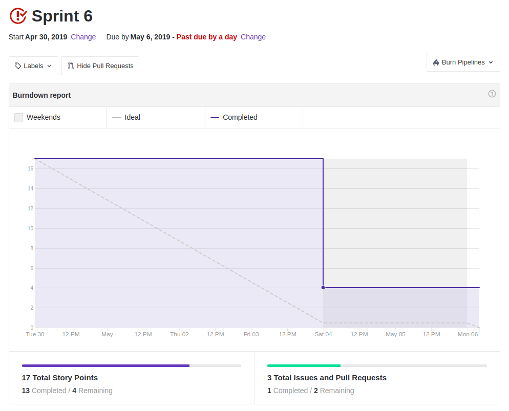
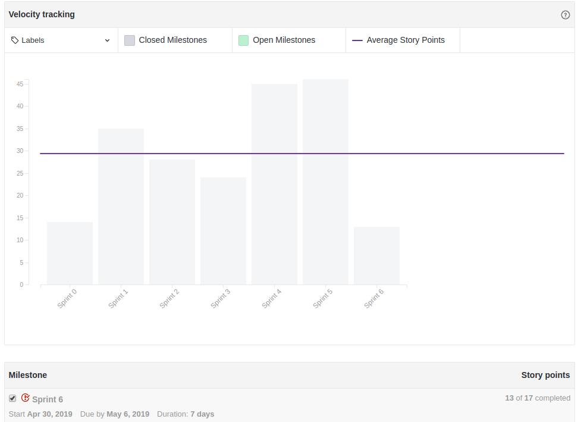
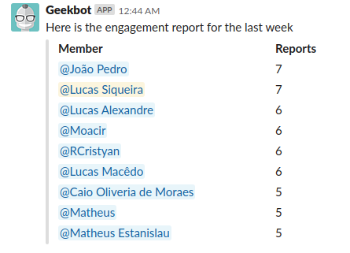

 

## 1. Resumo

 

- Período: 30/04 - 06/05
- Scrum master: Lucas Siqueira
- Product Owner: Caio Oliveira
- Devops: Matheus Rodrigues
- Arquiteto: Lucas Macedo

 

## 2. Resultados da sprint

 

### 2.1 Fechamento da Sprint

 

Tarefas|Status|Pontos
--|--|--
|[Lançar release notes](https://github.com/fga-eps-mds/2019.1-MaisMonitoria/issues/76) | Não Concluida | 3
|[Documentos do scrum master sprint 6](https://github.com/fga-eps-mds/2019.1-MaisMonitoria/issues/77)| Não concluida | 1
|[Preaparação R1](https://github.com/fga-eps-mds/2019.1-MaisMonitoria/issues/75)| Concluida | 13

**Ponto Planejados:** 17

**Pontos Concluídos:** 13

### 2.2 Retrospectiva

 

|Membro|Pontos Positivos|Pontos Negativos|Sugestões de melhoria|
|---|------|-----|---|
|Lucas Siqueira| Descanso depois da R1, boa preparação para R1 e feedback interessante do que foi feito. | Nenhum. | Nenhuma. |
|Lucas Pereira| Nenhum. | Deixou a desejar na R1. | Mais sacrifício para fazer as entregas. |
|Caio Oliveira|  |  |  |
|Matheus Rodrigues|  |  |  |
|João Pedro| Boa apresentação e agora sabemos o que melhorar. | Nenhum. | Focar no que sabemos o que está errado para melhorar. |
|Moacir Junior| Treinamento para a apresentação foi efetivo, ajuda de todos para melhorar a apresentação. | Reclamações pós R1. | Nenhuma. |
|Matheus Cristo| R1 bem sucedida, últimas semanas com um comprometimento maior de toda a equipe. | Muitas falhas nos documentos refatorados e revisados. | Nenhuma. |
|Renan Cristyan| Boa preparação para a R1 e boa apresentação. | Mesmo refatorando os documentos deixamos coisas passar. | Pegar as críticas dos professores e melhorar o que está precisando. |
|Lucas Alexandre| Acabou a R1, feedback dos professores. | Nenhum. | Nenhum. |

## 3. Quadro de conhecimento ao fim da sprint

 

## 4. Burndown
 

 

## 5. Velocity

 

 

## 6. Engajamento nas dailys

 

 

## 7. Feedback do Scrum Master

 

### 7.1 Análise dos riscos

### 7.2 Análise geral

 

