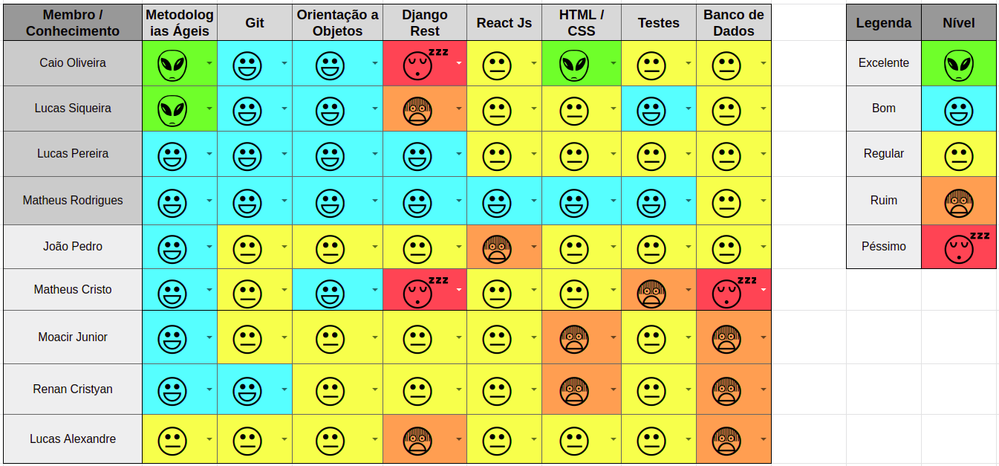

 

## 1. Resumo

 

- Período: 07/05 - 13/05
- Scrum master: Lucas Siqueira
- Product Owner: Caio Oliveira
- Devops: Matheus Rodrigues
- Arquiteto: Lucas Macêdo

 

## 2. Sprint Backlog

 

Tarefas|Pontos
--|--
|*[Lançar release notes](https://github.com/fga-eps-mds/2019.1-MaisMonitoria/issues/76) | 3
|*[Documentos do scrum master sprint 6](https://github.com/fga-eps-mds/2019.1-MaisMonitoria/issues/77) | 1
|[Criar Cenários](https://github.com/fga-eps-mds/2019.1-maismonitoria/issues/120) | 5
|[Estudar Testes Unitários ReactsJS](https://github.com/fga-eps-mds/2019.1-maismonitoria/issues/121) | 3
|[Documentos do scrum master sprint 7](https://github.com/fga-eps-mds/2019.1-MaisMonitoria/issues/122) | 1
|[Efeitos de transição de telas](https://github.com/fga-eps-mds/2019.1-MaisMonitoria/issues/123) | 5
|[Linkar Monitoria ao Perfil do Usuário que a Criou](https://github.com/fga-eps-mds/2019.1-MaisMonitoria/issues/125) | 8

Total de pontos de dividas anteriores: 4 
Total de Pontos: 25

## 3. Quadro de conhecimento antes do início da sprint

 

 

## 4. Quadro de pareamento

 

Tarefas|Responsáveis
--|--
|[Lançar release notes](https://github.com/fga-eps-mds/2019.1-MaisMonitoria/issues/76) | Caio Oliveira
|[Documentos do scrum master sprint 6](https://github.com/fga-eps-mds/2019.1-MaisMonitoria/issues/77) | Lucas Siqueira
|[Criar Cenários](https://github.com/fga-eps-mds/2019.1-maismonitoria/issues/120) | Caio Oliveira, Matheus Estanislau
|[Estudar Testes Unitários ReactsJS](https://github.com/fga-eps-mds/2019.1-maismonitoria/issues/121) | MDS
|[Documentos do scrum master sprint 7](https://github.com/fga-eps-mds/2019.1-MaisMonitoria/issues/122) | Lucas Siqueira
|[Efeitos de transição de telas](https://github.com/fga-eps-mds/2019.1-MaisMonitoria/issues/123) | Matheus Rodrigues, Moacir Junior, Renan Cristyan 
|[Linkar Monitoria ao Perfil do Usuário que a Criou](https://github.com/fga-eps-mds/2019.1-MaisMonitoria/issues/125) | Lucas Macêdo, Lucas Alexandre, João Pedro

