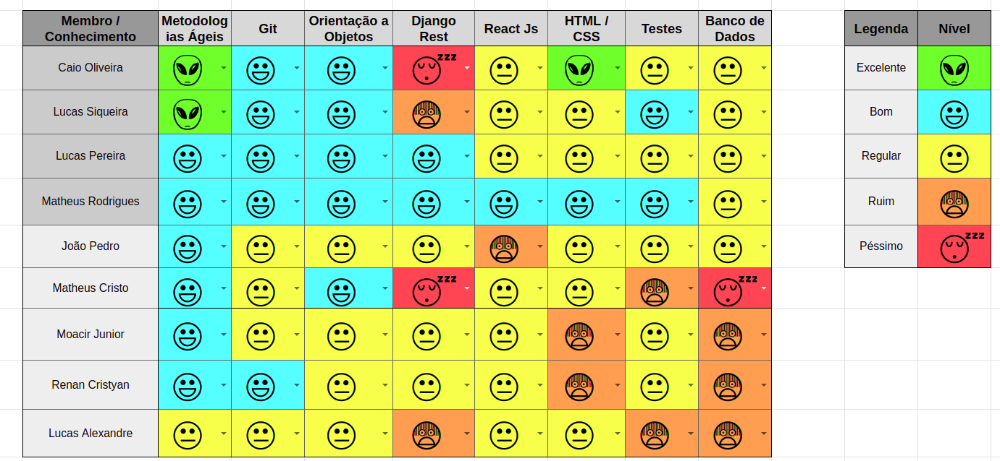
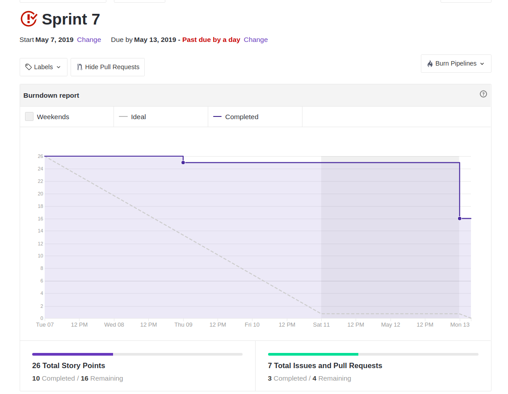
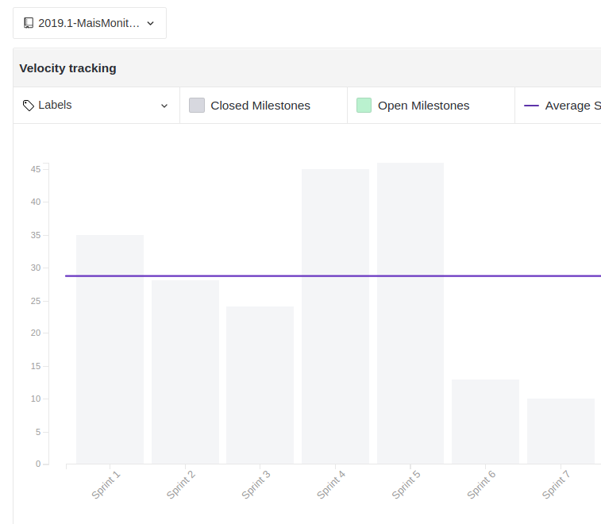
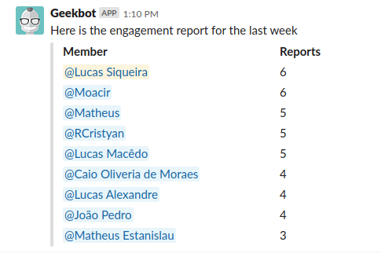

 

## 1. Resumo

 

- Período: 07/05 - 13/05
- Scrum master: Lucas Siqueira
- Product Owner: Caio Oliveira
- Devops: Matheus Rodrigues
- Arquiteto: Lucas Macêdo

 

## 2. Resultados da sprint

 

### 2.1 Fechamento da Sprint

 

Tarefas|Status|Pontos
--|--|--
|[Lançar release notes](https://github.com/fga-eps-mds/2019.1-MaisMonitoria/issues/76)| Não conlcuida | 3
|[Documentos do scrum master sprint 6](https://github.com/fga-eps-mds/2019.1-MaisMonitoria/issues/77)| Concluida | 1
|[Criar Cenários](https://github.com/fga-eps-mds/2019.1-maismonitoria/issues/120)| Não concluida | 5
|[Estudar Testes Unitários ReactsJS](https://github.com/fga-eps-mds/2019.1-maismonitoria/issues/121)| Não concluida | 3
|[Documentos do scrum master sprint 7](https://github.com/fga-eps-mds/2019.1-MaisMonitoria/issues/122)| Concluida | 1
|[Efeitos de transição de telas](https://github.com/fga-eps-mds/2019.1-MaisMonitoria/issues/123)| Não concluida | 5
|[Linkar Monitoria ao Perfil do Usuário que a Criou](https://github.com/fga-eps-mds/2019.1-MaisMonitoria/issues/125)| Concluida | 8

**Ponto Planejados:** 25

**Pontos Concluídos:** 10

### 2.2 Retrospectiva

 

|Membro|Pontos Positivos|Pontos Negativos|Sugestões de melhoria|
|---|------|-----|---|
|Lucas Siqueira| Nenhum. | Relaxamento após o fim da release 1, e a dependencia de MDS com EPS para desenvolver as issues. | Procurar ajudar os MDS a se virarem sozinhos. |
|Lucas Pereira| Conclui minha issue. | Todo mundo achando que está de ferias, gerando dividas com issues "fáceis", não se comunicando efetivamente nas issues, faltando os MDS ficarem mais espertos na hora de pesquisar e aprender a resolver os problemas. | Tentar ser mais produtivo, direcionar o esforço. |
|Caio Oliveira| Nenhum. | Todo mundo achando que está de ferias, gerando dividas com issues "fáceis", não se comunicando efetivamente nas issues. | Diminuir a dependencia entre MDS e EPS.  |
|Matheus Rodrigues| - | - | - |
|João Pedro| Nenhum. | Tive muitos a fazeres durante a semana sem ser ligados ao projeto, e faltou produtividade na realização da minha issue. |EPS dar dicas de como pesquisar para os MDS.|
|Moacir Junior| Ter aprendido algo acerca de testes do frontend. | Pareamento não efetivo, má priorização da issue, exemplos confusos para realizar a issue. | Melhorar a priorização das issue, tentar realizar pareamentos efetivos. |
|Matheus Cristo| Nenhum. | Falta de produtividade, provas de outras disciplinas junto a mal administração do tempo por minha parte. | Comunicar melhor nas issues e mais foco em relação a minhas issues. |
|Renan Cristyan| Nenhum. | Fui inprodutivo durante a sprint, não consegui realizar minha issue, não consegui me dedicar suficientemente para o projeto. | Definir melhor os pareamentos. |
|Lucas Alexandre| Aprendi a fazer testes no backend. | Provas e trabalhos de outras matérias, não tive uma produtividade boa na realização da issue, e falta de atenção com commit. | Nenhuma. |

## 3. Quadro de conhecimento ao fim da sprint

 

## 4. Burndown
 

 

## 5. Velocity

 

 

## 6. Engajamento nas dailys

 

 

## 7. Feedback do Scrum Master

 

### 7.1 Análise dos riscos

**R01 - Dificuldade com as tecnologias:**
A equipe apresentou dificuldades na realização dos testes do frontend e na compreensão de exemplos para realização da issue Efeitos de transição de telas.

As ações tomadas foram: Não fechamento da issue de estudo, e adimitimos o erro de ter colocado essa issue de efeitos de transição de tela para esta sprint, voltaremos-a para o backlog.

**R04 - Falta de comunicação:**
No inicio da sprint a equipe ainda estava dispersa e fora de ritmo, ocassionando na mal comunicação tanto nas issues quanto pessoalmente, podendo notar de forma mais visível no tópico acima, onde apesar de problemas com o bot da daily tiveram menos respostas do que deveria.

As ações tomadas foram: A equipe de EPS chamou a equipe de MDS para conversar e conscientizar que a comunicação deve ser constante e necessária.

**R07 - Entregas atrasadas:**
Tivemos 4 entregas atrasadas, ocasionadas pelos riscos ocorridos ao longo da sprint.

As ações tomadas foram: Para release notes será feito um pré-release notes posteriormente, a transição das telas ficara "congelada", o estudo dos testes do frontent vão ser prolongados e os cenários serão feitos conforme necessários ao longo do projeto.

**R12 - Pareamentos não efetivos:**
O pareamento para realização dos efeitos de transição de telas não foi efetivo, visto que tivemos o risco R14 durante a sprint.

As ações tomadas foram: Durante a sprint tentamos redistribuir as tarefas, onde o Caio Oliveira entrou na issue no lugar do Matheus Rodrigues, porém isso ocorreu muito tarde ocasionando na não conclussão da issue.

**R13 - Conflito entre entregas da sprint e de tarefas de outras disciplinas.:**
Grande parte da equipe de MDS teve entrega de FAC durante a sprint, o que fez com que eles iniciarem suas tarefas muito tarde.

Nennhuma ação foi tomada.

**R14 - Indisponibilidade de membros da equipe:**
Tivemos a indiponibilidade do membro Matheus Rodrigues no meio da sprint, devido a fatores pessoais.

As Ações tomadas foram: Realocamos o membro Caio Oliveira para ajudar na issue que estava destinada ao Matheus.

### 7.2 Análise geral

 

Foi uma sprint atipica, onde se iniciou com uma equipe ainda disperça devido ao fim da release 1 e com o decorrer da sprint um número elevado de riscos aconteceram, ocassionando em uma quantidade grande de tarefas não concluidas. O risco principal foi a indisponibilidade de um membro da equipe, pois foi a primeira vez que ocorreu e não soubemos lidar da forma mais adequada. Outro motivo da dívidas foi dependencia da equipe de MDS com EPS para realização das tarefas.

Analisando os inidicadores, o engajamento nas dailys diminuiu, porém tivemos um problema no bot das dailys do slack que não funcionou de forma devida durante dois dias da sprint. Não tivemos nenhuma melhora no quadro de conhecimento. No burndown e velocity vemos uma queda grande da produtividade da equipe, logo para proxima sprint teremos que planejar melhor as tarefas e os pareamentos.

Para a proxima sprint já estamos ciente que a indisponibilidade do Matheus Rodrigues irá continuar, logo planejaremos não contar com o mesmo durante a sprint. No planejamento da proxima sprint iremos colocar pareamentos apenas entre os MDS visando diminuir a dependencia deles para melhorarmos nossa produtividade gradualmente. 

