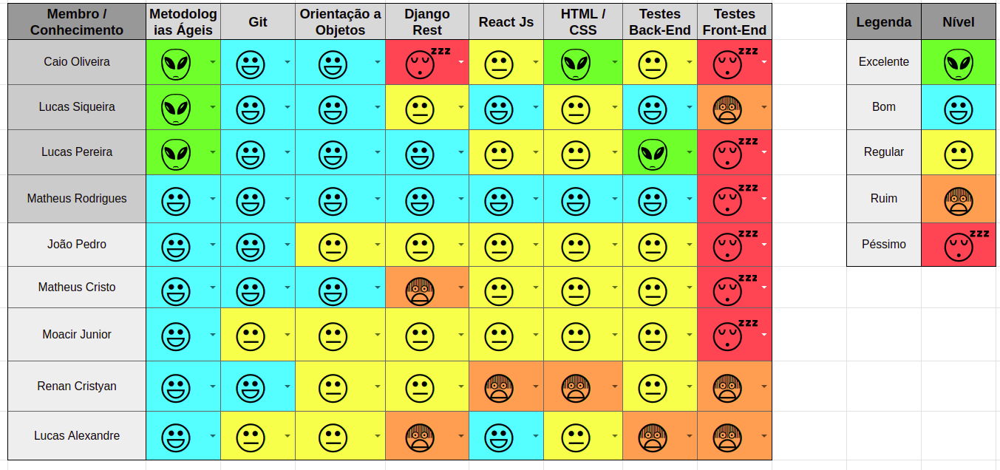
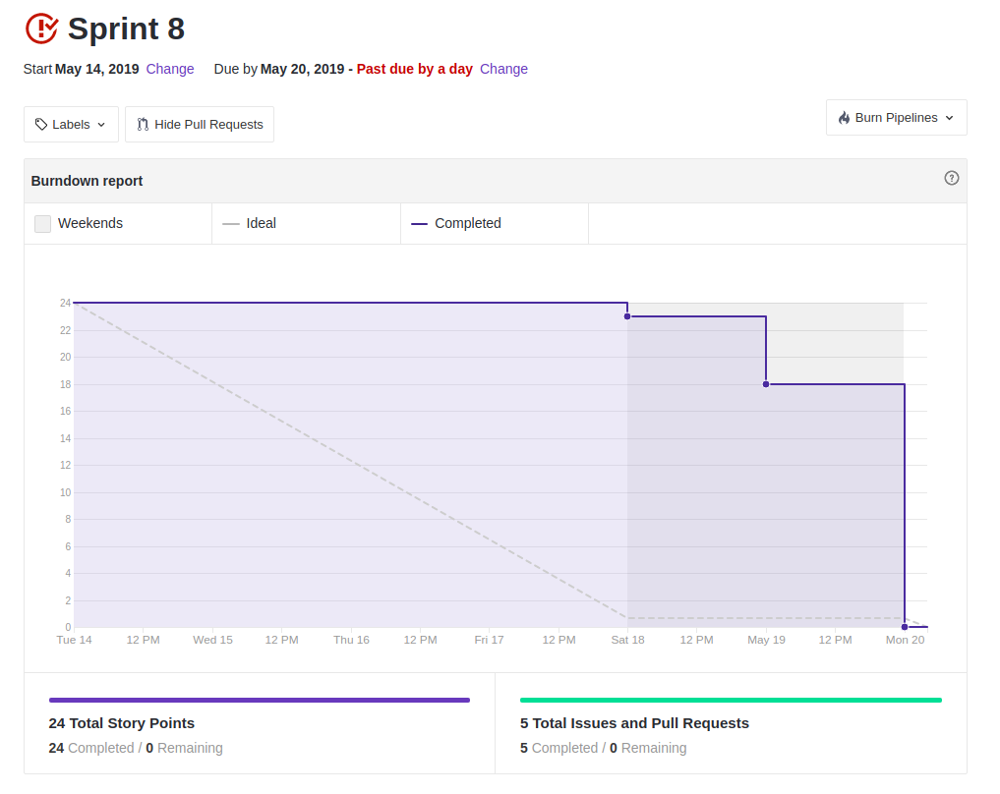
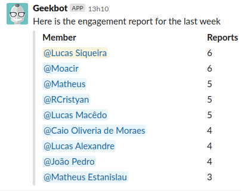

 

## 1. Resumo

 

- Período: 14/05 - 20/05
- Scrum master: Lucas Siqueira
- Product Owner: Caio Oliveira
- Devops: Matheus Rodrigues
- Arquiteto: Lucas Macêdo

 

## 2. Resultados da sprint

 

### 2.1 Fechamento da Sprint

 

Tarefas|Status|Pontos
--|--|--
|[Lançar release notes](https://github.com/fga-eps-mds/2019.1-MaisMonitoria/issues/76)| Não conlcuida | 3
|[Documentos do scrum master sprint 6](https://github.com/fga-eps-mds/2019.1-MaisMonitoria/issues/77)| Concluida | 1
|[Criar Cenários](https://github.com/fga-eps-mds/2019.1-maismonitoria/issues/120)| Não concluida | 5
|[Estudar Testes Unitários ReactsJS](https://github.com/fga-eps-mds/2019.1-maismonitoria/issues/121)| Não concluida | 3
|[Documentos do scrum master sprint 7](https://github.com/fga-eps-mds/2019.1-MaisMonitoria/issues/122)| Concluida | 1
|[Efeitos de transição de telas](https://github.com/fga-eps-mds/2019.1-MaisMonitoria/issues/123)| Não concluida | 5
|[Linkar Monitoria ao Perfil do Usuário que a Criou](https://github.com/fga-eps-mds/2019.1-MaisMonitoria/issues/125)| Concluida | 8

**Ponto Planejados:** 26

**Pontos Concluídos:** 10

### 2.2 Retrospectiva

 

|Membro|Pontos Positivos|Pontos Negativos|Sugestões de melhoria|
|---|------|-----|---|
|Lucas Siqueira| Maior independencia dos MDS. | Demora para realização dos pull requests. | Entregar os pull requests com antecedencia para fazer melhor o code review e os release notes. |
|Lucas Pereira| Os MDS foram mais independentes, e agora temos fotos no perfil do usuário. | Demora para realização dos pull requests de issues fáceis. | Entregar os pull requests com antecedencia para fazer melhor o code review e os release notes. |
|Caio Oliveira|  |  |  |
|Matheus Rodrigues|  |  |  |
|João Pedro| Aumentou o conhecimento a cerca das tecnologias, a equipe se mostrou mais focadas. | Demorou para realizar as entregas. | Tentar realizar as entregas no tempo certo |
|Moacir Junior|  |  |  |
|Matheus Cristo| Parementos efetivos, equipe mais focada, melhoria nos commits. | Nenhum. | Realizar pull requests antecipadamente. |
|Renan Cristyan| Terminamos nossas issue, fiz meu primeiro pull request. | Não ter conseguido testar nossa issue. | Tentar aprender a fazer os testes do frontend. |
|Lucas Alexandre| Terminei minha issue, nosso grupo foi mais independente em relação aos EPS. | Não conseguimos realizar os testes do frontend. | Estudar os testes do frontend. |

## 3. Quadro de conhecimento ao fim da sprint

 

## 4. Burndown
 

 

## 5. Velocity

 

 

## 6. Engajamento nas dailys

 

 

## 7. Feedback do Scrum Master

 

### 7.1 Análise dos riscos
 

### 7.2 Análise geral

 

