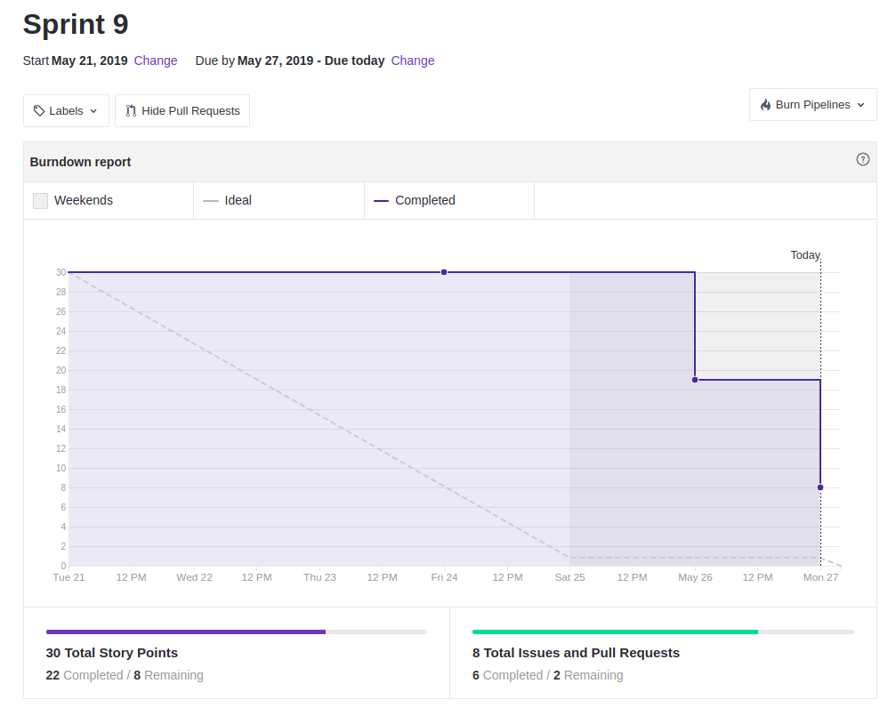
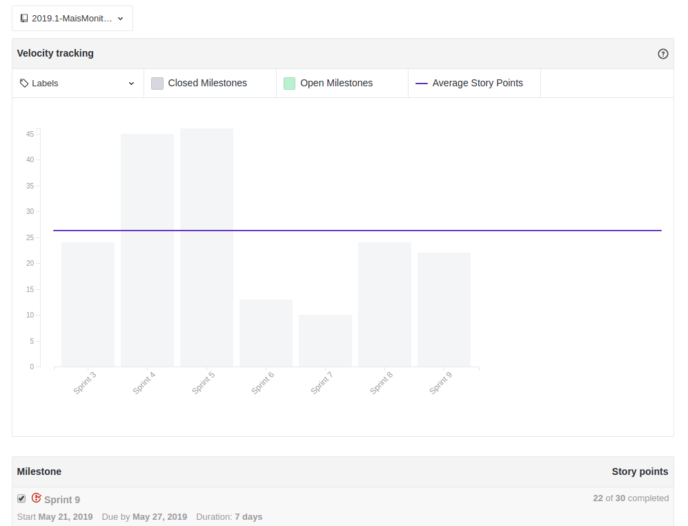
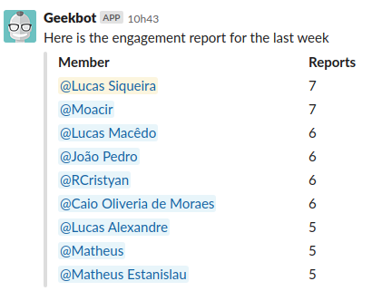

 

## 1. Resumo

 

- Período: 21/05 - 27/05
- Scrum master: Lucas Siqueira
- Product Owner: Caio Oliveira
- Devops: Matheus Rodrigues
- Arquiteto: Lucas Macêdo

 

## 2. Resultados da sprint

 

### 2.1 Fechamento da Sprint

 

Tarefas|Status|Pontos
--|--|--
|[*Lançar Release Notes](https://github.com/fga-eps-mds/2019.1-maismonitoria/issues/76)| Concluida | 3
|[Autenticação de Rotas](https://github.com/fga-eps-mds/2019.1-maismonitoria/issues/135)| Concluida | 5
|[Comunicação Entre Monitor e Aluno](https://github.com/fga-eps-mds/2019\.1-MaisMonitoria/issues/136)| Concluida | 5
|[Documentos do Scrum Master Sprint 9](https://github.com/fga-eps-mds/2019.1-MaisMonitoria/issues/137)| Concluida | 1
|[Deploy Contínuo](https://github.com/fga-eps-mds/2019.1-MaisMonitoria/issues/138)| Não concluida | 5
|[Teste de Usabilidade](https://github.com/fga-eps-mds/2019.1-maismonitoria/issues/139)| Não concluida | 3
|[Implantar no Backend Like/Favoritar Monitoria](https://github.com/fga-eps-mds/2019.1-maismonitoria/issues/140)| Concluida | 8

**Pontos Planejados:** 30

**Pontos Concluídos:** 22

### 2.2 Retrospectiva

 

|Membro|Pontos Positivos|Pontos Negativos|Sugestões de melhoria|
|---|------|-----|---|
|Lucas Siqueira| - | - | - |
|Lucas Macêdo| Os membros de MDS entregaram as histórias nos dias combinados. | Pessoal não comparecendo as reuniões, EPS deixando dívidas. | Mais responsabilidade sobre a questão das reuniões. |
|Caio Oliveira| MDS entregando historias nos dias combinados. | Dívidas da minha parte, ambiente de homolog com erros. | Nenhuma. |
|Matheus Rodrigues| Os membros de MDS então mais independentes. | Dividas. | Nenhuma. |
|João Pedro| Aumentou o conhecimento a cerca das tecnologias, a equipe se mostrou mais focada. | Demorou para realizar as entregas. | Tentar realizar as entregas no tempo certo. |
|Moacir Junior| A equipe de MDS está mais comprometida e focada. | Atraso na definição de uma das issues e os EPS deixaram algumas dívidas. | Definir mais rápido as issues e mais comprometimento de alguns membros. |
|Matheus Cristo| - | - | - |
|Renan Cristyan| A equipe de modo geral está bem mais focada. | As vezes entregamos algumas histórias fora do prazo estipulado pela equipe de EPS para realização do code review. | Tentar deixar menos dívidas e terminar as histórias no tempo certo. |
|Lucas Alexandre| - | - | - |

## 3. Quadro de conhecimento ao fim da sprint

 

## 4. Burndown
 

 

## 5. Velocity

 

 

## 6. Engajamento nas dailys

 

 

## 7. Feedback do Scrum Master

 

### 7.1 Análise dos riscos

 

**R07 - Entregas atrasadas:**
Tivemos duas dívidas: Teste de Usabilidade e Deploy Continuo.

As ações tomadas foram: Para o deploy continuo foi levantada a hipotese de mudar do travis para o gitlabCI, devido essa discurssão foi feito um estudo melhor acerca do deploy continuo utilizando o travis, a decisão será decidida pelo DevOps e será aplicada ao longo da proxima sprint. Para o teste de usabilidade o Product Owner irá realizar na proxima sprint, a ideia era para a proxima sprint realizar melhorias em cima do feedback desse teste, porém como não será possível, as melhorias serão feitas acerca do feedback do proprio time.

### 7.2 Análise geral

 

Nessa sprint as tarefas propostas foram entregues no período planejado da sprint para a realização do code review, porém tivemos dividas relativas a tarefas de EPS, uma delas que pode comprometer com a evolução do projeto, porém será feito o teste de usabilidade durante a semana, as evoluções serão feitas na proxima sprint, junto a um novo teste de usabilidade. 

Analisando os indicadores, vemos poucas melhoras no quadro de conhecimento dado que a evolução na sprint passada foi maior, a curva de conhecimento agora é elevada mais lentamente. Quanto ao velocity, apesar de diminuir os pontos entregues, a equipe de desenvolvimento não deixou dividas, logo para a proxima sprint iremos elevar o número de tarefas planejadas para conseguir determinar a produtividade máxima da equipe. Em relação ao burndown, as entregas tardias se deram devido a revisão dos pull requests e realização das alterações solicitadas, a equipe se mostrou ágil, onde durante a semana tivemos um volume de trabalho muito bom. Apesar de um número bom de respostas nas dailys, a equipe não desempenhou bem os ritos ágeis durante a sprint, tivemos 3 faltas na sprint review e algumas respostas razas nas dailys, abordaremos o tema na realização do sprint planning da próxima sprint visando acabar com esse problema.

Outro ponto importante de ser relatado, é a definição do escopo para o fim do projeto, a equipe de EPS conseguiu reduzir o escopo, adequa-lo ao tempo útil da disciplina e com o que foi discutido em sala pela professora Carla. Iremos relatar essa definição na proxíma sprint na refatoração do nosso backlog.

